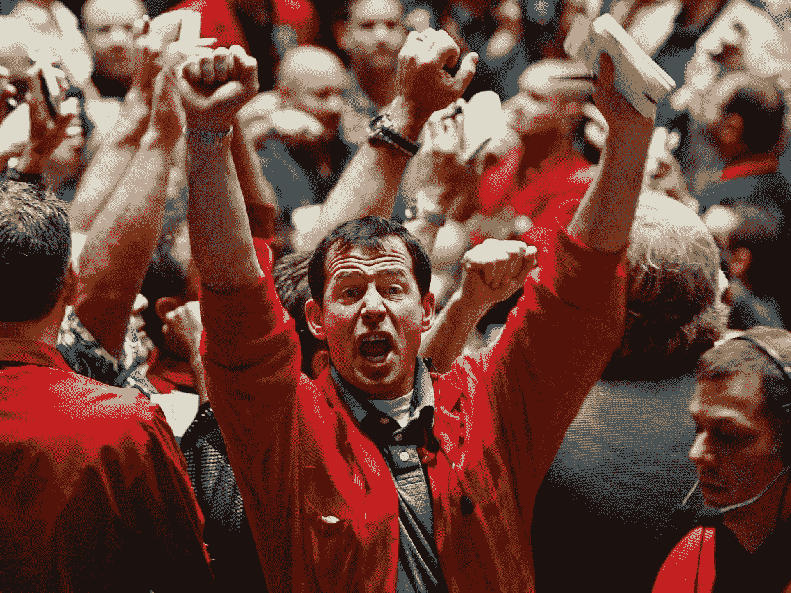

# 我生存的七条黄金法则

> 原文：<https://medium.com/coinmonks/seven-golden-rules-for-surviving-defi-c8e4242ec555?source=collection_archive---------19----------------------->

如何捂屁股？带着荣耀？

你认为什么时候是投资者的最佳时机？

你会选择第二次世界大战后的黄金时期吗？那时我们这些婴儿潮一代都出生在繁荣时期。

或者你会为 20 世纪 60 年代说句话吗？也许会造成社会分裂，但经济乐观。