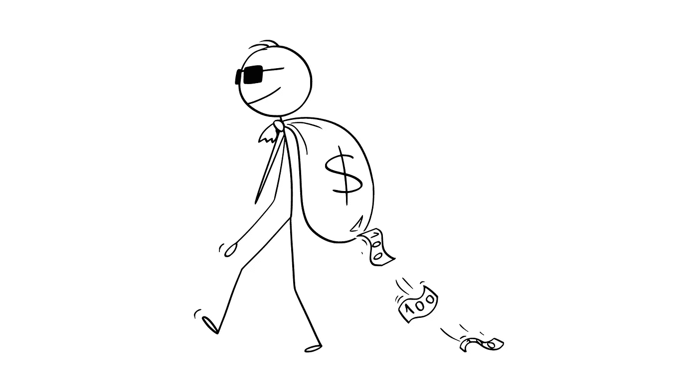

# 七个骗局正在发生…

> 原文：<https://medium.com/coinmonks/seven-scams-happening-right-now-9b3d8cc161f1?source=collection_archive---------12----------------------->

Illustration of a scammer taking people’s money, isn’t this how they look?

本周，七个专业人士被骗了很多钱，这篇文章是让你提高警惕，防止这种事情发生在你或你爱的人身上。

我是如何了解这七位专业人士的？因为我在 LinkedIn 上有 250，000 多名粉丝，他们主动向我讲述他们的故事。

我最讨厌的事情之一是看到人们被利用，尤其是当那些人很脆弱并且真的需要钱的时候。

哪些人通常会上当受骗？正如我上面所说的，那些脆弱的人迫切需要一些东西(例如，金钱、爱情、签证、工作)。

在你尖叫“加密不是骗局！！！！！!"或任何其他警报…一旦你读了整个骗局警报你就会明白。

# 🚨骗局警报#1:加密

有骗子向你承诺，如果你给他们一些钱，他们保证(记住这个词)他们会给你一定的每月回报。

他们向你展示了一个听起来合法但却不合法的计划。开始质疑一切，这一点我怎么强调都不为过。如果听起来好得不像真的，那就好得不像真的。

你可能已经看到了加密世界是多么的不稳定……像比特币和以太坊这样的货币在过去的五个月里已经下跌了 50%,没有任何保证。

这并不意味着你不应该投资加密。还有，我不是鼓励你，我自己从来没有投资过，我只是说要小心，不要把你的钱给陌生人。

据我所知，这可能是一个投资加密的好时机，因为它下跌了 50%……虽然我不知道，这是有风险的，如果我决定投资，我不会投入超过我能承受的损失。

实际上，当我投资这些资金的时候，如果我曾经投资过，我会认为它们已经失去了，它们不是为了一个人迅速获得回报，而是为了被搁置很多年。

最后一件事，对于任何想投资 crypto 的人来说，确保你的密钥(即密码)安全，因为如果你丢失了密码，没有办法找回或重置它。

重要提示:加密不是骗局，骗局是人们*保证*或承诺一定的回报，然后消失，再也不会被看到。

# 🚨骗局警报#2:外汇

类似于 crypto，不要把你的钱给承诺你全世界的人。股票市场现在正在下跌。即使是最大的公司也出现了大幅下滑。

如果有人保证他们能让你赚钱，那他们就是在骗你。他们怎么能保证他们完全无法控制的事情呢？

我不是金融分析师，所以不要把这当成金融建议，我也从未投资过股票市场；然而，这可能是一个非常好的安全的机会。

最终，大多数大公司都会反弹……没人知道需要多长时间，我们所知道的是，随着时间的推移，股票市场确实会产生积极的结果。

我提醒你，不要试图从你的任何投资中快速获利，没有一夜成功这样的事情…你可以幸运，但你也可以失去一切。

重要提示:外汇不是骗局，骗局是人们*保证*或承诺一定的回报，然后消失不见。

# 🚨骗局警报#3:爱情(关系)

我从未想过我会在 LinkedIn 上写这样的东西，原因有很多:首先，这与我的工作无关，其次，我无法相信这种人的存在。

这是如何工作的？这些骗子有假的个人资料和电话号码。他们试图用他们奢侈的生活方式给你留下深刻印象，最终一些不好的事情发生在他们身上。

到那时就太晚了，你已经在感情上投入了，不管你是否见过他们，你相信他们(或者想要)，所以你帮助他们。

他们第一次向你要钱时，有可能会把钱还给你，以赢得你的信任。第二次他们要求更多的钱，并重复同样的过程。

经验法则:永远不要把钱给你从未见过面的人。这个世界现在太疯狂了，我想说，也不要把钱给你见过面的人。

建立一种关系，了解其他人，检查他们的参考资料，了解他们的立场，他们的价值观是什么，一旦一切都检查通过，也许会考虑它。

当你把金钱和友谊或爱情混在一起时，这通常会导致灾难，所以请记住这一点…如果你想保持健康的关系，就不要把金钱带入其中，这样更安全。

我的一个亲爱的朋友是美国的副总裁，她所有的退休金都被骗了，骗局如下:骗子在一个约会网站上找到了她。他让她爱上了他。他的项目开始出现问题。

他告诉她，他住在加拿大，位于一个她无法访问的偏远安全区域(这是一个借口，这样他就不必亲自见她)。他让她坠入爱河，所以他们打算一起买房。

你可能会想象这个故事是如何发展的…只是要非常小心。我很惊讶我妻子从佛罗里达一路信任我。我们已经在一起十年了，有两个漂亮的孩子，一只狗，也住在加拿大。

重要的是:异地恋不是骗局，当双方相互信任时，异地恋还能帮助你比其他任何分心的事物更专注于你的交流，它们当然不适合每个人，但对我和我妻子很有效。

# 🚨骗局警报#4:签证(移民)

不幸的是，大多数国家无法为其居民提供高质量的生活、职业机会和安全，因此人们比以往任何时候都更希望移民国外。

加拿大、美国、英国、澳大利亚和其他一些第一世界国家都很适合居住。一些坏演员向你保证，如果你付钱，他们可以把你带到这些国家。

当他们对您的申请过程没有任何控制权时，他们怎么能这样做呢？答案是:他们没有控制权，也不能对此漠不关心。

在我继续之前，这里有一个免责声明:我不是移民律师或顾问，所以不要把这当成法律建议。我知道的原因是因为我和他们一起工作，他们教我。

有些骗子甚至要求你为一份工作支付费用，事情是这样的:这是非法的。世界上有许多专业人士认为他们可以击败移民系统。

谈到移民，请不要走捷径或试图欺骗系统。您将无法也不会在此过程中失去宝贵的时间和金钱。

各国加强了移民政策，只有那些真正有资格移民的人才能够做到这一点；不要相信你能够欺骗系统。

重要:移民律师不是骗局；事实上，如果不是因为我们的移民律师，我的家人不会移民到加拿大(我可以证明这一点)。有些人可以独自完成，但这真的很难。

# 🚨诈骗警报#5:语言考试(移民)

一些国家，如加拿大，要求您说官方语言之一，以便能够移民，甚至获得工作签证；为此你必须参加强制性的语言考试。

不幸的是，世界各地的许多专业人士把语言考试安排得太早，不知道他们是否有真正的移民机会。

相反，他们应该做的是会见移民律师(最好)或顾问，以了解哪些移民途径是可用的，并向他们推荐(如有)。

移民过程是复杂的，冒险支付数百或数千美元的语言考试在一段时间后到期可能是完全没有必要的。

此外，我还知道一些移民案例，其中管理考试的机构将人们的考试标记下来，试图让他们一次又一次地参加考试。

我的移民律师告诉我，一个管理考试的机构给一个美国英语教授打了低分，在要求一个公平的分数后，他们重新评估并改正了分数。

疫情对许多行业来说都很难，移民也不例外，这就是为什么许多机构试图让专业人士不必要地多次参加考试。

请记住，语言学院不在乎您的移民计划是否成功，也不在乎您是否有机会。

这里有另一个例子:加拿大是一个生活费用昂贵的国家。如果您没有必要的资金来支持您在加拿大的生活，您可能会被拒绝。

语言学院不关心你是否年轻，是否有资金，是否在一个需求旺盛的行业工作，是否受过足够的教育，等等。他们就是不在乎。句号。

他们的目的就是拿你的钱来评估你的语言技能，如果你在不知道自己是否有机会的情况下决定参加语言考试，那是你的损失。

你怎么知道你是否有机会？与移民律师交谈，评估你的个人资料，他们会告诉你是否有真正的移民机会。

记住，没有人能保证你走完移民程序后就能移民，即使是律师也不行……任何这样做或向你承诺的人都是骗子。

重要提示:语言考试不是骗局，因为移民加拿大和其他一些国家需要语言考试。只要确保你在合适的时候参加考试，这样你就不会浪费你的钱。

# 🚨骗局警报#6:简历或简历写作服务

让我们确保我们在一些事情上意见一致，因为这也是一个复杂的问题，世界各地的每个专业人士都应该得到清晰的认识，以防止被骗。

首先，许多专业人士在简历和 CV 不是同一类型的文档时会交替使用这两个词…它们的目的是相同的，但文档不是。

简历或履历的目的是什么？帮你搞定面试。仅此而已，不多也不少；你不会因为你的简历或履历看起来不错而获得工作机会。

第二，简历在第一世界国家不受欢迎……他们期待简历格式。当他们看到你用简历申请的时候，他们会扔掉你的申请，只需要几秒钟。

第三，大多数申请者使用简历的国家也欢迎简历；事实上，如果你申请一份合适的简历，你将很容易从人群中脱颖而出。

我可以继续下去，但我相信这足以帮助你理解我将要提出的观点，如果我认为还有什么，我会在以后补充，所以继续阅读。

当你决定付钱给一个简历撰写者(请永远不要为一份简历付钱，因为它不值得)，你付钱不是为了对你的简历感到骄傲…你付钱是为了获得面试机会。

简历撰写者的主要问题是，他们不会向你提供任何形式的保证，即使他们提供了，实际上也不是退款保证，所以你根本不受保护。

当你的新简历不起作用时会发生什么？他们会提供一两次修改，但如果还是不行，他们就会转身不理你……唯一吃亏的是你。

他们无论如何都要保留你的钱，现在你不得不去找另一个简历撰写人，不得不再次付费，或者需要自己解决问题，这样你就不会走在前面。

还有一件事我想让你知道:写简历是一门艺术和科学，但不是火箭科学，你当然不需要成为威廉·莎士比亚。

你能做的最好的事情就是理解自己写简历的过程，这样你就永远不需要依赖别人来帮你写，也不要再抱有希望、祈祷和猜测了。

简历撰写者的风险更大:他们甚至不会问你对哪些工作真正感兴趣，他们会试图根据你已经写好的内容“修改”你当前的简历。

这个问题是多方面的:首先，他们的方法是完全错误的，他们遵循的是工作描述驱动的策略，而不是工作市场驱动的策略。

这两者之间的区别似乎很微妙，但事实并非如此:前者要求你根据每一份工作描述来定制简历，而后者则明白市场需要什么。

为每一份工作发布量身定制简历是无稽之谈。有多少次你找到了最适合你的“完美”工作，而你 100%合格，定制了你的简历，却被忽视了？

这种情况时有发生……你花越多的时间来修改你的简历，实际上对你越不利，因为当你修改你的简历时，别人已经在申请了。

长话短说……如果可能的话，你可以(也应该)学会如何写自己的简历，不要再为每一份招聘信息量身定做了，因为这不仅帮不了你，还会伤害你。

重要的是:简历撰写者不是一个骗局…只要他们把你的最佳利益放在心上，并采取全面的方法。求职过程发生了很大的变化，小细节比你想象的要重要得多。

# 🚨骗局警报#7: LinkedIn 个人资料服务

任何人都可以让你的 LinkedIn 个人资料看起来闪闪发光，但问题是:它真的讲述了关于你的正确故事，让你即使没有申请也能获得更多面试机会吗？

任何在你的 LinkedIn 个人资料上工作却不了解你的简历的人都是在“给猪涂口红”——你最终会让他们感到困惑。

当雇主看你的简历时，他们会做的第一件事就是点击你提供的第一个链接(最好是你的 LinkedIn 个人资料)，如果不匹配，他们就会拒绝你。

你只能有一个 LinkedIn 个人资料，为什么你会有多个版本的简历呢？你的 LinkedIn 个人资料会与哪份简历相匹配？你知道我要去哪里…

我们经常看到的一个问题是，当招聘人员、人力资源专业人士和招聘经理寻找与你一模一样的人时，LinkedIn 的个人资料没有得到优化。

我们最初是怎么知道这件事的？因为有太多的个人资料没有显示姓名和个人资料照片…你认为他们有，但从我们的角度来看，他们实际上没有。

进一步观察，我们还发现个人资料的各个部分没有显示或看起来不完整，这使得当有人找你时，你的个人资料无法显示出来。

这与你个人资料的内容有关…你提供的相关数据越多，你在搜索结果中的排名就越靠前——我们在直播中证明了这一点。

如果有人在寻找“项目经理”,而你的个人资料中有一个项目经理，而另一个有两个项目经理，那么他们的个人资料会在搜索结果中显示得更靠前。

确实不需要用 LinkedIn 申请工作；但是，你知道还有什么社交网络被认为比这个更专业，用户更多吗？

LinkedIn 拥有超过 8 亿用户，是招聘人员和人力资源专业人士的首选平台，这是有原因的…即使你没有申请，也要让你的个人资料脱颖而出。

仅凭你在 LinkedIn 上的个人资料不会让你得到这份工作。当你申请工作时，他们仍然想看你的简历，所以他们最好讲同样的故事…确保你的故事清晰。

重要提示:LINKEDIN 教练不是一个骗局，除非他们在这个平台上没有粉丝或参与，并声称他们对这个平台了如指掌…如果是这样的话，为什么他们没有真正的粉丝呢？

# 总结这篇花了我几个小时写的长篇文章…

🍒当心任何人保证任何事情(只要你实际控制结果并做到你承诺的，保证是可以的，这就是为什么在从事任何服务之前检查人们的声誉是至关重要的)

🍒确保你与值得信赖的专业人士合作，他们提供真实的、声誉良好的人的视频证明，你可以自己联系他们，无需征得服务提供商的同意

🍒只要有可能，试着自己做事情，学习这个过程，这样你就不需要依赖别人来帮你做事情了…这可能会更慢，花费你更长的时间，但从长远来看，你会过得更好

🍒没有一夜之间的成功，所以不要拿你的存款或家人的食物来赌博，不做任何事就能赚很多钱听起来像是一个梦想，但是如果真的那么容易，那么每个人都会这样做

我不确定是否有人会读这篇文章，因为这是我在这里发表的第一篇文章，但我希望如果人们发现它有价值和有见地，他们会以某种方式与他人分享以保护他们，这是一个疯狂的世界。

如果你对我上面说的任何事情有任何问题，或者希望对我写的东西补充更多，请继续，我的意图是让人们意识到这个世界对每个人来说都是一个更加安全和公平的地方…我们都应该有一个美好的生活。

我从事职业发展方面的工作，这也是我在 medium 上写作时主要关注的内容:如何获得更多面试机会，将它们转化为工作邀请，并通过谈判获得更高、更公平的薪水(我从 1.8 万美元涨到了 22 万美元)。

我对媒体一无所知，所以希望我能找到一些友好、热情、知识渊博和慷慨的专业人士，教我如何充分利用这个平台，并以积极的方式影响世界。

热情问候，

布赖恩

我甚至不知道我们是否应该在这些文章上签名，或者做什么…标签，等等。如果任何人有任何我可以学习的文章，请在评论中分享(如果有这样的事情)或私信。❤️

P.P.S .我在 LinkedIn 上写了 2500 多篇帖子，发表了 40 篇文章，有机浏览量超过 8500 万。我将发表我的第一篇关于媒体的文章，祈祷人们也会欢迎我。

> *加入 Coinmonks* [*电报频道*](https://t.me/coincodecap) *和* [*Youtube 频道*](https://www.youtube.com/c/coinmonks/videos) *了解加密交易和投资*

# 另外，阅读

*   [Bookmap 评论](https://coincodecap.com/bookmap-review-2021-best-trading-software) | [美国 5 大最佳加密交易所](https://coincodecap.com/crypto-exchange-usa)
*   最佳加密[硬件钱包](/coinmonks/hardware-wallets-dfa1211730c6) | [Bitbns 评论](/coinmonks/bitbns-review-38256a07e161)
*   [新加坡十大最佳加密交易所](https://coincodecap.com/crypto-exchange-in-singapore) | [购买 AXS](https://coincodecap.com/buy-axs-token)
*   [红狗赌场评论](https://coincodecap.com/red-dog-casino-review) | [Swyftx 评论](https://coincodecap.com/swyftx-review) | [CoinGate 评论](https://coincodecap.com/coingate-review)
*   [投资印度的最佳密码](https://coincodecap.com/best-crypto-to-invest-in-india-in-2021)|[WazirX P2P](https://coincodecap.com/wazirx-p2p)|[Hi Dollar Review](https://coincodecap.com/hi-dollar-review)
*   [加拿大最佳加密交易机器人](https://coincodecap.com/5-best-crypto-trading-bots-in-canada) | [库币评论](https://coincodecap.com/kucoin-review)