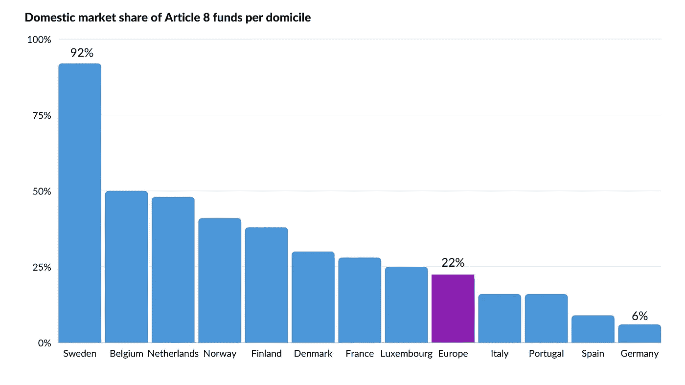
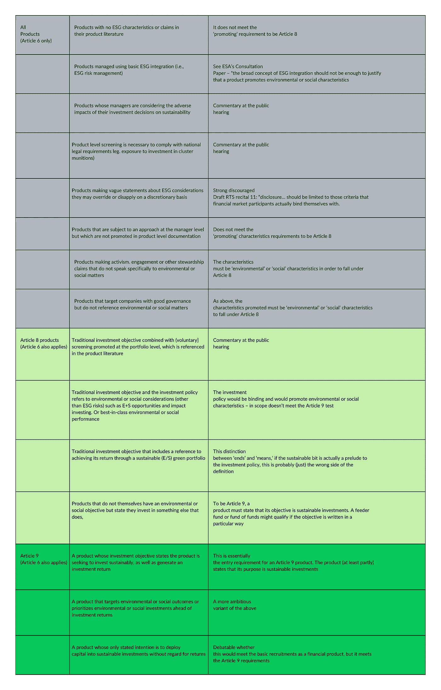

# SFDR。瑞典基金行业潜在的产品分类问题。欧盟其他国家有什么经验教训吗？

> 原文：<https://medium.com/coinmonks/sfdr-potential-product-classification-issues-in-the-swedish-fund-industry-2b33bd8c6ce9?source=collection_archive---------33----------------------->

## 作为欧盟可持续金融一揽子计划的一部分，SFDR 的目的是抵制绿色清洗，并为绿色转型分配资金。此外，它将使散户投资者、机构和私人投资者更容易做出有意识的、可持续的投资决策。

> **在阅读了瑞典基金协会的新闻稿“几乎十分之八的瑞典基金都是浅绿色产品”后，我想知道为什么瑞典很少有基金被归类为第 6 条产品——Hermes net ESG 副总监 Albin Axelsson。**

EFAMA 的 11 月份报告 2021 已经确定，欧洲其他国家在解释 SFDR 时更具防御性。下图显示了每个注册地的 SFDR 第 8 条基金的国内市场份额，以每个国家注册的 UCITS 和 AIF 的总资产净值的百分比表示。

Source: EFAMA and Morningstar

在 SFDR，有两个级别:一级(监管)和二级(技术标准)，后者尚未被欧洲议会正式通过，但将于 2023 年 1 月 1 日生效。此外，它还概述了金融市场参与者应该如何展示他们的产品说明书。

奇怪的是，与欧洲其他国家相比，瑞典的第六条基金如此之少。尽管法规是零碎的，但该行业在数据报告方面存在困难，欧盟已经推行了二级规则。

> **在我看来，瑞典官员已经将该法规解释为引入排除清单意味着该产品被认定为第 8 条产品。与此同时，欧洲其他国家将这些规定解读为，排除名单是管理和缓解可持续发展相关风险的工具，而不是评估风险的方法。**

此外，阿尔宾继续表示，答案在于，瑞典基金公司是在商业力量的驱使下将自己归类为第 8 条的。不符合要求，现在很多大的养老公司，很多基金平台都要求基金公司是一个第八条产品供他们考虑。一旦瑞典金融监管局(“FSA”)对所有这些第 8 条产品进行合规性审查，这将成为一个警告信号。

如果瑞典所有基金中有 77%将自己归类为第 8 条产品，这可能会破坏环境、社会和治理的概念以及反对绿色清洗的目的。考虑到欧洲其他国家的文章基金要少得多，瑞典的所有这些基金通过 FSA 审查的可能性极小。

“环境、社会和治理”是基于环境、社会和治理因素评估公司的可持续发展指标。自 2015 年巴黎协定以来，可持续投资出现了爆炸式增长。

人们现在可以区分三种主要的投资战略:负责任的投资、影响力投资和 ESG/环境、社会和公司治理投资。由于 SFDR 的引入，这些问题作为监管合规性问题对于金融市场参与者变得越来越重要。实现可持续投资的协调和更深入的理解需要金融市场参与者(如 AIFMs 和 UCITS、保险公司和投资公司)以及 MiFID II 下提供金融产品投资建议的金融顾问(授权公司)进行产品分类和报告。

SFDR 将要求将可持续性风险纳入投资决策过程，或酌情纳入咨询过程和旨在进行可持续投资的金融产品的透明度，包括减少温室气体排放。公司必须在签订协议前提供信息(预披露文件),并在网站和定期报告中提供信息。

根据下面的矩阵，金融市场参与者必须提供三个产品类别下的可持续发展信息，行业通常指灰色、浅绿色和深绿色产品。

Albin 建议根据这三个类别对法规进行如下解释:

**Note:** The colours above are only intended as a communication tool. They are not intended to convey legal significance.

## 然而，界限在哪里？特定产品必须包含哪些内容才能构成第 8 条基金？

(不幸的是)SFDR 对这方面所需的可持续性的数量并不十分清楚或准确。Albin 认为，上述矩阵提供了立法者打算如何根据 SFDR 对金融产品进行分类的平衡而合理的描述。

Albin 认为，许多金融市场参与者忽略了第 6 条产品是一种考虑与资产本身相关的可持续性风险的产品，并且在做出实际投资决定之前必须执行和记录尽职调查措施。

如果金融市场参与者已根据第 6 条考虑到这些因素，则可将其视为卫生因素，该基金是第 6 条产品。第 8 条和第 9 条都是如此。

根据 SFDR，第 8 条产品必须首先符合第 6 条才能被视为第 8 条产品。此外，该法规包含金融产品必须满足的两个先决条件，以符合“促销”和“实质性”方面的要求。在本次评估中，Albin 没有将第 8 条产品与 SFDR 的第 6 条和第 9 条进行比较或加权。最容易将这些产品视为专业化，而不是可持续发展本身的阶段。这是事实，尤其是在审查或评估预披露文件时。

第 8 条产品必须能够证明其将促进可持续性，例如，投资于打算在所谓的主要负面影响范围内改善的公司，例如，公司/资产打算将其范围 1、2 或 3 印象减少 x 个百分点，并结合至少一个社会目的。

为了根据第 8 条实现必要的促进和实质性，将许多人认为不可持续的部门中的资产或公司排除在外是不够的。

因此，Albin 想知道一些基金公司、银行和保险公司现在是否会像预期的那样应用 SFDR，并在 FSA 迫使他们这样做之前对他们的一些产品进行重新分类？

他认为这种情况会危及瑞典的国际声誉，因为瑞典以成为世界上最可持续发展的国家之一而自豪。现在离技术标准生效还有 7 个月的时间，要被视为浅绿色产品，您需要遵守推广要素和作为第 8 条基金的报告义务。

> 免责声明:本文档中的信息仅为方便起见而提供，并非投资建议，在考虑您的行动时可能不会依赖这些信息。我们对本文档中包含的信息的准确性或完整性不做任何陈述，也不承担更新信息的义务。本文件仅供参考。您应该仔细考虑和评估与信息相关的所有风险和不确定性，并在必要时寻求外部建议。
> 
> HERMESNET 由在英格兰和威尔士注册的 HERMESNET 有限公司管理，注册号为 13250243。

> 加入 Coinmonks [电报频道](https://t.me/coincodecap)和 [Youtube 频道](https://www.youtube.com/c/coinmonks/videos)了解加密交易和投资

# 另外，阅读

*   [3 商业评论](/coinmonks/3commas-review-an-excellent-crypto-trading-bot-2020-1313a58bec92) | [Pionex 评论](https://coincodecap.com/pionex-review-exchange-with-crypto-trading-bot) | [Coinrule 评论](/coinmonks/coinrule-review-2021-a-beginner-friendly-crypto-trading-bot-daf0504848ba)
*   [莱杰 vs n rave](/coinmonks/ledger-vs-ngrave-zero-7e40f0c1d694)|[莱杰 nano s vs x](/coinmonks/ledger-nano-s-vs-x-battery-hardware-price-storage-59a6663fe3b0) | [币安评论](/coinmonks/binance-review-ee10d3bf3b6e)
*   [Bybit Exchange 审查](/coinmonks/bybit-exchange-review-dbd570019b71) | [Bityard 审查](https://coincodecap.com/bityard-reivew) | [Jet-Bot 审查](https://coincodecap.com/jet-bot-review)
*   [3 commas vs crypto hopper](/coinmonks/3commas-vs-pionex-vs-cryptohopper-best-crypto-bot-6a98d2baa203)|[赚取加密利息](/coinmonks/earn-crypto-interest-b10b810fdda3)
*   最好的比特币[硬件钱包](/coinmonks/hardware-wallets-dfa1211730c6) | [BitBox02 回顾](/coinmonks/bitbox02-review-your-swiss-bitcoin-hardware-wallet-c36c88fff29)
*   [BlockFi vs 摄氏度](/coinmonks/blockfi-vs-celsius-vs-hodlnaut-8a1cc8c26630) | [Hodlnaut 审核](/coinmonks/hodlnaut-review-best-way-to-hodl-is-to-earn-interest-on-your-bitcoin-6658a8c19edf) | [KuCoin 审核](https://coincodecap.com/kucoin-review)