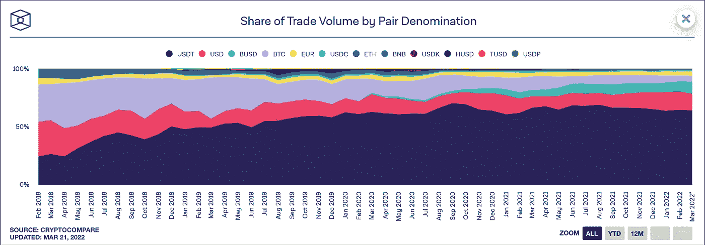

# 浅潜到 USDT 有问题

> 原文：<https://medium.com/coinmonks/shallow-dive-into-the-usdt-problematic-4d30d1ae011e?source=collection_archive---------33----------------------->

如果说现在的经济有什么教训的话，那就是凭空创造货币是有后果的。

USDT 是一种由 Tether 发行的美元支持的稳定币，在全球加密交易量中占 64.38%。

Trading of pairs containing USDT as a counterpart makes up most of the volume in the whole market

它的发明无疑有助于密码产业的繁荣，因为它使交易和交换密码变得更加容易。因为从 fiat 到 crypto 的通道可能很复杂，所以通过使用 USDT 拥有一个简单的入口点极大地参与了大众的参与。

但是，对于那些被认为能支撑 USDT 100%总估值的资产，人们对其用途的质疑已经持续了一段时间。市场和监管机构一次又一次地要求 Tether 提供一份清晰、详细的公司持股和资金使用情况摘要。

但是 Tether 的创建和早期并不容易。它的创始人甚至没有考虑过违规行为，他们不得不去寻找银行和其他金融机构来托管所有流入的现金。更别说同意使用它，投资它，分享详细的报告。离散金融机构一般不会这么做。

Tether 已经表现出缺乏透明度，但也有强烈的意愿来回答所需的标准，因为他们没有兴趣失败，看着他们的王国在一堆数字尘埃中结束。

在不对创始人的意图或动机做任何假设的情况下，我们试图观察形势并评估围绕它的一些风险。

## **为什么是现在？**

这个问题不是秘密，市场已经知道很多年了。即使在市场的零售部分意识不那么强，所有的集中交易所、大型参与者、大公司和金融机构都必须充分意识到这个问题。看起来，市场作为一个整体，对发行的代币抵押不足所引发的风险是可以接受的。

但也许市场并不信任，它可能只是没有选择。替代品的缺乏和代币的普遍接受，使得 USDT 如此便利，以至于市场可能忽略了稳定的硬币的一些不稳定的方面。

但是全球经济的宏观环境正在恶化。乌克兰战争激起的涟漪需要时间来展现，甚至需要更多时间来平息。

> 如果支持 USDT 的本已不足的资产失去价值，会发生什么？这足以摧毁市场对系绳的信任吗？

## **传统金融体系**

金融系统对无担保资产的研究已经有一段时间了。罗斯福总统领导下的美国在 1933 年放弃了金本位制。其目的是通过允许政府人为地提高货币供应量来增强政府的权力。从而允许更快的经济增长。

但是，当黑天鹅事件——这是巨大的、令人惊讶的、糟糕的事件——发生时，人们对金融机构处理这种情况的能力失去了信任，人们往往会试图将他们的资金从系统中转移出去。

由于金融体系没有足够的现金为每个人服务，这引发了连锁反应，一些人将其称为“银行挤兑”。

## **系绳情况**

市值:80 898 202 345 美元——在撰写本文时。

这意味着泰瑟应该拥有超过 800 亿美元的资产。以不同的形式:现金、债券、股票……此外，众所周知，Tether 已经向加密公司发放了大量贷款，据称总是以价值超过贷款的比特币作为抵押品。

如果 Tether 是一家美国银行，他们将在美国银行名单中排名第 41 位——按管理的总资产排序。

但它们一直不受监管，实际上也无人监管。

## **最坏的情况**

可能发生的最糟糕的情况是，由于神秘的“未指明商业票据”类别下的资产质量下降，本已不足的 Tether 国库将失去价值。

然后，人们对 Tether 偿还每个 USDT 的能力失去了信任，这使得他们出售他们的 USDT——要么以美元，要么以其他密码。如果有足够多的人这样做，Tether 将无法支付每个人，导致其价值崩溃，并随之占据加密市场的很大一块。

我们有 800 亿美元的资产作为后盾，并且非常清楚这不全是现金，我们不得不考虑，当战争和对俄制裁的影响成为现实时，支持 USDT 的其余资产将会发生什么。

围绕未来几年的宏观市场环境，USDT 提供的便利可能会受到 FUD 的挑战，甚至被推翻。

替代品正在出现，新的算法稳定币将从系绳中夺走市场份额，如果市场开始“转移”到其他稳定币，可能会产生有问题的连锁反应，让人想起“银行挤兑”。

## **系绳有话说**

*   在他们的服务条款中，他们声明“如果由于 Tether 为支持系留凭证而持有的任何储备的流动性不足、不可用或损失而导致延迟赎回或提取系留凭证，则 Tether 保留延迟赎回或提取系留凭证的权利[…]”

不确定是好是坏:在“挤兑 USDT”的情况下，围绕 USDT 的权力集中可能会提供一些稳定性。推迟或阻止撤军可能会降低灾难性崩溃的可能性。

*   "所有 Tether 代币都与相应的法定货币 1 比 1 挂钩，并由 Tether 的储备 100%支持."

这里的问题是措辞，它看起来像是说所有的 USDT 都得到支持，但事实并非如此。这是说，USDT 只受到储备的支持，不管比例是多少。这可能只是一种说法，唯一支持 USDT 的是泰瑟的储备。

真正的问题仍然没有答案:系绳的储备的性质和价值是什么？

让我们假设他们有足够的资产来支付 100%的 USDT 代币，这并不意味着这些资产是流动的或者它们的价值是稳定的。这意味着在恶劣的市场条件下，100%可能会迅速下降。

## **2B2F**

另一个值得考虑的方面是，Tether 变得如此之大，毫无疑问，市场中的大多数参与者都会在出现流动性问题时帮助他们。

没有一家加密公司——也许除了 Tether 的一些竞争对手——有兴趣看到整个市场以一种对整个行业都有风险的方式发生动摇。

另一方面，完全不可想象的是，央行不会找到严格监管像 Tether 这样稳定的债券发行者的方法。这项监管本身就可能对市场产生巨大影响，但如果它们能找到应对所有监管机构条件的方法，它很可能会加强系绳公司的地位。

瑞士城市卢加诺刚刚宣布 USDT 为其境内的法定货币。让我们希望负责人有理由信任泰瑟，并能获得比我们更多的信息。

## **总结思路**

Tether 的创始人比我们更了解 Tether。根据你的不信任程度，人们可能会认为，创建这个历史机构的人知道他们在做什么。

其他人可能认为，他们的人性缺陷战胜了他们，在完全不受监管和极度不受监督的情况下拥有所有这些现金。

可以肯定的是，提出无法证实的倾向性问题不是解决办法。理解风险并做好相应准备很重要，但不要自动相信巨大的阴谋。

预先警告就是预先武装。

## **面对这样的危机，你能做些什么来保护自己？**

*   分散你稳定的硬币持有量
*   通过购买密码来减少你对 USDT 的了解
*   不要把所有的鸡蛋都放在加密篮子里

在评论区分享一个小技巧来帮助别人吧！

## **为了更深的潜水**

目的是提高对这一问题的认识，要了解更多信息，请阅读以下文章:

*   [https://tether.to/en/transparency](https://tether.to/en/transparency)
*   [https://tether . to/en/blog/tethered-to-truth-and-transparency](https://tether.to/en/blog/tethered-to-truth-and-transparency)
*   [https://mueller berndt . medium . com/is-tether-a-black-swan-51095720 b01c](https://muellerberndt.medium.com/is-tether-a-black-swan-51095720b01c)
*   [https://www . Forbes . com/sites/francescoppola/2019/03/14/tethers-u-s-dollar-peg-is-no-longer-credential/？sh=59935c90451b](https://www.forbes.com/sites/francescoppola/2019/03/14/tethers-u-s-dollar-peg-is-no-longer-credible/?sh=59935c90451b)
*   [https://www . coin desk . com/markets/2021/05/13/tethers-first-reserve-break-shows-token-49-backed-by-unspecified-commercial-paper/](https://www.coindesk.com/markets/2021/05/13/tethers-first-reserve-breakdown-shows-token-49-backed-by-unspecified-commercial-paper/)
*   https://www . Bloomberg . com/news/features/2021-10-07/crypto-mystery-the-where-s-the-690 亿-backing-the-stable coin-tether
*   [https://www.youtube.com/watch?v=dQw4w9WgXcQ](https://www.youtube.com/watch?v=dQw4w9WgXcQ)

> *加入 Coinmonks* [*电报频道*](https://t.me/coincodecap) *和* [*Youtube 频道*](https://www.youtube.com/c/coinmonks/videos) *了解加密交易和投资*

# 另外，阅读

*   [Bookmap 评论](https://coincodecap.com/bookmap-review-2021-best-trading-software) | [美国 5 大最佳加密交易所](https://coincodecap.com/crypto-exchange-usa)
*   最佳加密[硬件钱包](/coinmonks/hardware-wallets-dfa1211730c6) | [Bitbns 评论](/coinmonks/bitbns-review-38256a07e161)
*   [新加坡十大最佳加密交易所](https://coincodecap.com/crypto-exchange-in-singapore) | [购买 AXS](https://coincodecap.com/buy-axs-token)
*   [红狗赌场评论](https://coincodecap.com/red-dog-casino-review) | [Swyftx 评论](https://coincodecap.com/swyftx-review) | [CoinGate 评论](https://coincodecap.com/coingate-review)
*   [投资印度的最佳密码](https://coincodecap.com/best-crypto-to-invest-in-india-in-2021)|[WazirX P2P](https://coincodecap.com/wazirx-p2p)|[Hi Dollar Review](https://coincodecap.com/hi-dollar-review)