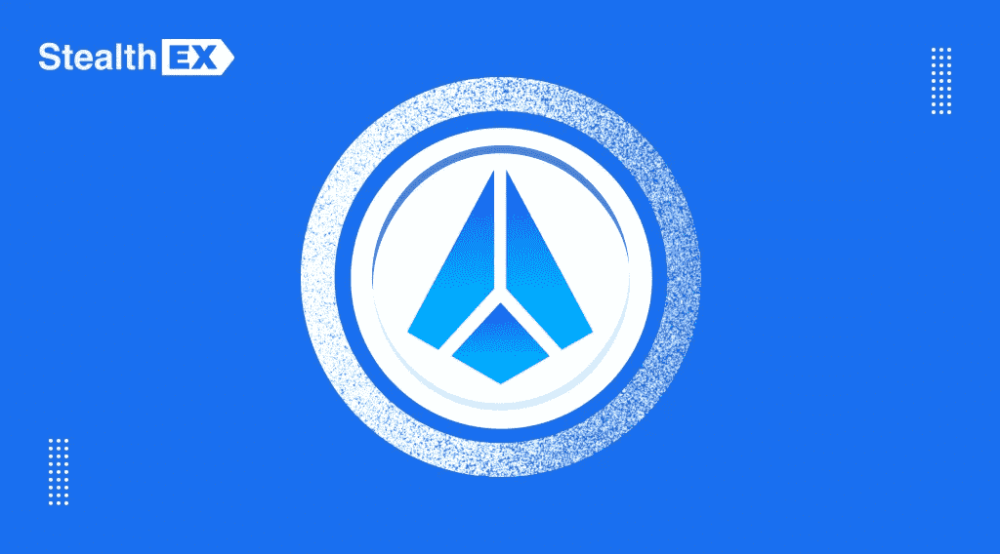

# 碎片令牌:生态系统，如何使用，碎片加密未来前景，碎片硬币价格预测，以及最佳碎片硬币交换

> 原文：<https://medium.com/coinmonks/shard-token-ecosystem-how-to-use-shard-crypto-future-prospects-shard-coin-price-prediction-and-b38a0a890daf?source=collection_archive---------28----------------------->

Shard 是一个基于 Ethereum 和币安智能链的分散的开源项目。它让每个人都能获得区块链技术提供的机会，这是推进密码货币可及性和权力下放所需要的。和互操作性。这个项目有一个本地令牌，SHARD。

# Infinity 协议

Infinity 协议是 Shard 生态系统的主要部分之一，因为它是构建 DeFi 的核心。现在，它在整个币安智能链中执行。然而，碎片硬币开发商指出，将会有更多的连锁店，包括 Ethereum、Polkadot 和 Polygon。

该方案的另一个优点是，它消除了对可信中间体的需要。它作为一套智能合同在分散的公共区块链实施。每个人都可以访问这些合同，不依赖于任何第三方。

# 碎片令牌组学

夏德有限供应 2.1 亿个代币，这降低了通货膨胀风险。其中 8000 万英镑是通过以下方式铸造的:

1.  3000 万英镑用于将所有遗留的碎片交换成比特币和以太网令牌。
2.  4400 万被锁定为在未来 4 年内线性释放，这是确保长期增长所需要的。
3.  600 万英镑用于初始计划，包括 SHARD 投资、空投和赠款。

根据夏德团队的说法，最大限额将在最初发布后的 48 年内达到，当前令牌供应的 1%将被铸造到社区管理的国库中

# 如何使用碎片硬币？

SHARD 对其持有者的主要好处是其实用性。这种密码货币有几种使用情形，包括:

1.  列入白名单。所有的密码货币都可以添加到 Infinity 平台中。唯一的要求是碎片燃烧。接下来，持有者需要投票决定某个特定的令牌是否可以出现在平台上。
2.  执政。碎片持有者决定这个令牌将如何改变。他们还可以管理协议、钱包和生态系统其他部分的更新。
3.  因提供流动性而获得额外收入。流动性提供者可以用他们的流动性令牌作为赌注。之后，他们会在 SHARD 中获得奖励。

此外，还有一个赠款计划，从 200 万英镑开始。项目所有者启动它是为了支持更多的 dApps。他们的开发是推进 Infinity 生态系统和扩展 SHARD 用例的一种方式。

# 哪里可以存放碎片令牌？

SHARD token 的创始人通过向持有者提供多功能 Infinity Wallet，确保了社区的安全。由于用户友好的界面，它允许初学者进入市场，交换代币，并在全球范围内付款。

此外，这款钱包降低了私钥带来的风险，并允许持有者访问许多数字资产。除了 SHARD，还有 BTC、ETH、USD、XRP 和其他公司。

现在 Shard 创始人只提供桌面版。然而，他们计划很快发布具有相同功能的 Android 和 iOS 移动钱包，这将让用户无需访问他们的 PC 就可以监控他们的投资组合。

# 碎片加密的未来前景

将会发布无限协议 V2。正如开发商承诺的那样，它将拥有保证金和分散指数交易、流动性订单整合，以扩大所有交易者在流动性池中的可用选项。

此外，SHARD 创始人计划推出一个 NFT 市场，这将为艺术家创造和交易独特的非资助代币提供好处。还会有带功能的 Infinity 游戏，给 SHARD 增加更多的效用。

# 碎片硬币价格预测

专家相信这一点，有一个积极的碎片硬币价格预测。至于 PricePrediction，其价格将在 2022 年底达到 0.22 美元。DigitalCoinPrice 认为，到那时，金价将超过 0.19 美元。

# 我应该买碎片币吗？

总的来说，由于独特的无限协议功能、有限的供应和扩张计划，SHARD 对长期投资者来说是有前途的。通过开发游戏和发布 NFT 市场，它将吸引更多的社区成员。

# 最好的碎片硬币交易所

[StealthEX](https://stealthex.io/) 是一个非托管的碎片硬币交易所，拥有 400 多个代币，用于快速安全的转账。只提供一般信息和购买密码在几分钟内。

如何购买碎片币？只需前往 [StealthEX](https://stealthex.io/?from=eth&to=shard) 交易所，按照以下简单步骤操作:

1.  选择兑换的货币对和金额。例如，ETH to SHARD coin。
2.  按下“开始交换”按钮。
3.  提供硬币将被转移到的收件人地址。
4.  移动你的加密货币进行交易。
5.  接受你的硬币！

非常欢迎您访问 StealthEX 交易所，看看它有多快多方便。

在 [Medium](https://stealthex-io.medium.com/) 、 [Twitter](https://twitter.com/Stealthex_io) 、 [Telegram](https://t.me/StealthEX) 、 [YouTube](https://www.youtube.com/channel/UCeES_XBesX76ge7xf1meuSw) 和 [Reddit](https://www.reddit.com/user/Stealthex_io) 上关注我们，获取 [StealthEX.io](https://stealthex.io/) 更新和关于加密世界的最新消息。

*此处表达的观点和意见仅代表作者个人。每一次投资和交易都有风险。做决定时，你应该进行自己的研究。*

*原发表于*[*https://stealthex . io*](https://stealthex.io/coin/shard)*。*

> 加入 Coinmonks [电报频道](https://t.me/coincodecap)和 [Youtube 频道](https://www.youtube.com/c/coinmonks/videos)了解加密交易和投资

# 另外，阅读

*   [OKEx vs KuCoin](https://coincodecap.com/okex-kucoin) | [摄氏替代品](https://coincodecap.com/celsius-alternatives) | [如何购买 VeChain](https://coincodecap.com/buy-vechain)
*   [币安期货交易](https://coincodecap.com/binance-futures-trading)|[3 comas vs Mudrex vs eToro](https://coincodecap.com/mudrex-3commas-etoro)
*   [如何购买 Monero](https://coincodecap.com/buy-monero) | [IDEX 评论](https://coincodecap.com/idex-review) | [BitKan 交易机器人](https://coincodecap.com/bitkan-trading-bot)
*   [CoinDCX 评论](/coinmonks/coindcx-review-8444db3621a2) | [加密保证金交易交易所](https://coincodecap.com/crypto-margin-trading-exchanges)
*   [红狗赌场评论](https://coincodecap.com/red-dog-casino-review) | [Swyftx 评论](https://coincodecap.com/swyftx-review) | [CoinGate 评论](https://coincodecap.com/coingate-review)
*   [Bookmap 评论](https://coincodecap.com/bookmap-review-2021-best-trading-software) | [美国 5 大最佳加密交易所](https://coincodecap.com/crypto-exchange-usa)
*   [如何在 FTX 交易所交易期货](https://coincodecap.com/ftx-futures-trading) | [OKEx vs 币安](https://coincodecap.com/okex-vs-binance)
*   [CoinLoan 评论](https://coincodecap.com/coinloan-review) | [YouHodler 评论](/coinmonks/youhodler-4-easy-ways-to-make-money-98969b9689f2) | [BlockFi 评论](https://coincodecap.com/blockfi-review)
*   [XT.COM 评论](https://coincodecap.com/profittradingapp-for-binance) | [币安评论](https://coincodecap.com/xt-com-review)
*   [SmithBot 评论](https://coincodecap.com/smithbot-review) | [4 款最佳免费开源交易机器人](https://coincodecap.com/free-open-source-trading-bots)