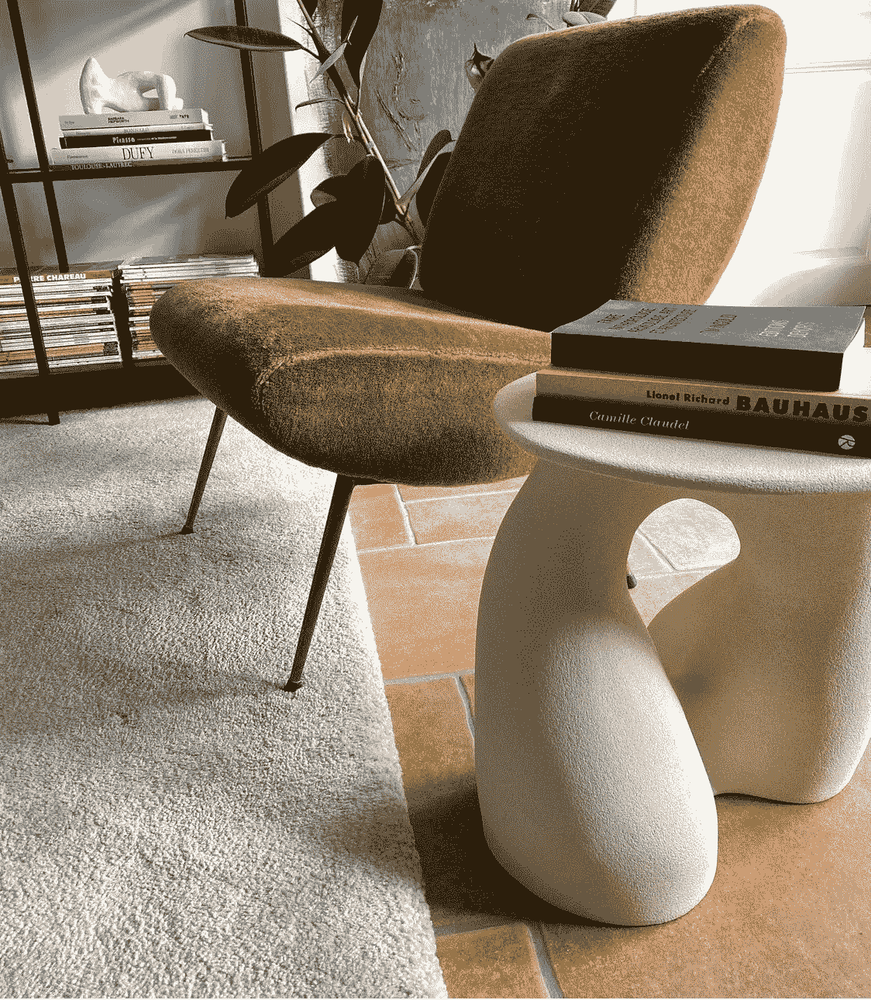
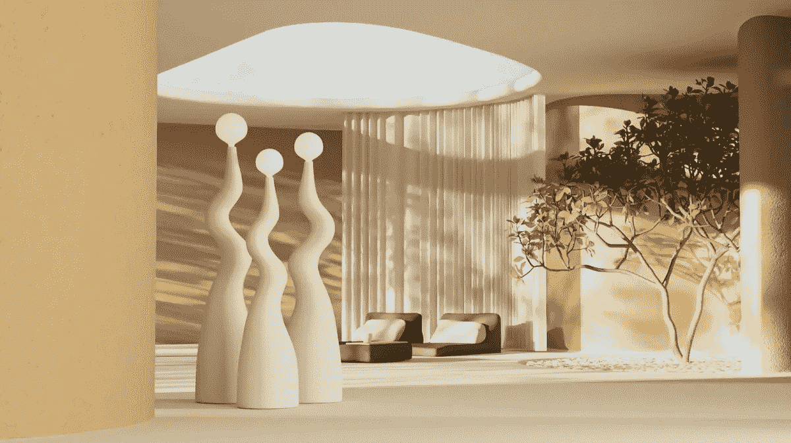
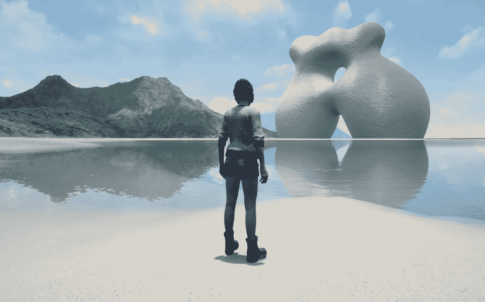

# 她为元宇宙雕塑。

> 原文：<https://medium.com/coinmonks/she-sculpts-for-the-metaverse-71326242ac2f?source=collection_archive---------41----------------------->

Hermine Bourdin 是物理世界的职业雕塑家。由于需要重新装饰室内，她开始创作雕塑作品。她的收藏家们很快就喜欢上了她想象并手工雕刻的独特灯具或桌子。

她开始思考元宇宙的概念，以及她如何探索这个新的创造性宇宙。在创建 NFT 之前，她从购买开始。她自豪地拥有一辆[克隆 X](https://clonex.rtfkt.com/) ，这是由 [RTFKT](https://rtfkt.com/) 创建的 NFT，这家公司被[耐克](https://www.nike.com/fr/?cp=24158993452_search_%7Cnike%7C10689553137%7C106491488558%7Ce%7Cc%7CFR%7Cpure%7C452529371916&gclsrc=aw.ds&ds_rl=1252249&gclid=Cj0KCQiA64GRBhCZARIsAHOLriIThGXg1gXS6eYJvvSZle1RR3-AxkeYWfGu5gCkSGjVe5bAS_vQluoaAqCBEALw_wcB)收购，现在价值不菲。

除了头像，RTFKT 还创造了“ [loot pods](https://opensea.io/collection/rtfkt-podx) ”，这是元宇宙的小公寓，NFT 克隆人 X 的主人可以提供家具。Hermine 已经开始在 NFT 重新创作她标志性的雕塑作品来装饰网上画廊，所以下一个合乎逻辑的步骤就是装饰马桶！

所以她从她所知道的开始:她的雕塑灯和桌子。她使用 Blender 工具，这使她能够在 3D 中模拟数字对象。对于她的首次亮相，她想为她的收藏家提供在现实世界或虚拟世界购买独特作品的可能性。

今天，在她的雕塑作品成功成为 NFT 作品后，她进一步推动了她的思考。她已经开始用她的最新系列“ [Métamorphoses](https://objkt.com/collection/KT1SB5TAx77jLsPAYcNwX3ypzFTVxyhtjz43) ”挑战重力定律，这些数字雕塑物体会移动、成形和变形。

事实上，最基本的本能是在元宇宙重建我们在物质世界中已经知道的东西，但赫米娜行使自由意志，让她的想象力天马行空，创造出漂浮、流动、消失和挑战不可能的雕塑和雕塑物体。

Hermine 将出席 4 月在里斯本举行的[不可替代会议](https://www.nonfungibleconference.com/)，在那里她将展示她的作品，包括一系列新的“物理”作品，即可以在物理世界中以 3D 形式观察的虚拟物体。
她还将在首席执行官 [Lucie-Eléonore Riveron](https://twitter.com/cecinestpasleo) 的带领下，参加拍卖行 [Fauve Paris](https://twitter.com/fauveparis) 的首届 NFT 艺术拍卖会“禁止拍卖”，她也是一位富有个性和创新精神的女性。

*作者 Eli Strzelecka 2022 年 3 月 3 日(推特:*[*e _ Strzelecka*](https://twitter.com/e_strzelecka)*)*

> *加入 Coinmonks* [*电报频道*](https://t.me/coincodecap) *和* [*Youtube 频道*](https://www.youtube.com/c/coinmonks/videos) *了解加密交易和投资*

# 另外，阅读

*   [3 商业评论](/coinmonks/3commas-review-an-excellent-crypto-trading-bot-2020-1313a58bec92) | [Pionex 评论](https://coincodecap.com/pionex-review-exchange-with-crypto-trading-bot) | [Coinrule 评论](/coinmonks/coinrule-review-2021-a-beginner-friendly-crypto-trading-bot-daf0504848ba)
*   [莱杰 vs n rave](/coinmonks/ledger-vs-ngrave-zero-7e40f0c1d694)|[莱杰 nano s vs x](/coinmonks/ledger-nano-s-vs-x-battery-hardware-price-storage-59a6663fe3b0) | [币安评论](/coinmonks/binance-review-ee10d3bf3b6e)
*   [Bybit Exchange 审查](/coinmonks/bybit-exchange-review-dbd570019b71) | [Bityard 审查](https://coincodecap.com/bityard-reivew) | [Jet-Bot 审查](https://coincodecap.com/jet-bot-review)
*   [3 commas vs crypto hopper](/coinmonks/3commas-vs-pionex-vs-cryptohopper-best-crypto-bot-6a98d2baa203)|[赚取加密利息](/coinmonks/earn-crypto-interest-b10b810fdda3)
*   最好的比特币[硬件钱包](/coinmonks/hardware-wallets-dfa1211730c6) | [BitBox02 回顾](/coinmonks/bitbox02-review-your-swiss-bitcoin-hardware-wallet-c36c88fff29)
*   [BlockFi vs 摄氏](/coinmonks/blockfi-vs-celsius-vs-hodlnaut-8a1cc8c26630) | [Hodlnaut 点评](/coinmonks/hodlnaut-review-best-way-to-hodl-is-to-earn-interest-on-your-bitcoin-6658a8c19edf) | [KuCoin 点评](https://coincodecap.com/kucoin-review)
*   [Bitsgap 审查](/coinmonks/bitsgap-review-a-crypto-trading-bot-that-makes-easy-money-a5d88a336df2) | [Quadency 审查](/coinmonks/quadency-review-a-crypto-trading-automation-platform-3068eaa374e1) | [Bitbns 审查](/coinmonks/bitbns-review-38256a07e161)
*   [密码本交易平台](/coinmonks/top-10-crypto-copy-trading-platforms-for-beginners-d0c37c7d698c) | [Coinmama 审核](/coinmonks/coinmama-review-ace5641bde6e)
*   [印度的加密交易所](/coinmonks/bitcoin-exchange-in-india-7f1fe79715c9) | [比特币储蓄账户](/coinmonks/bitcoin-savings-account-e65b13f92451)