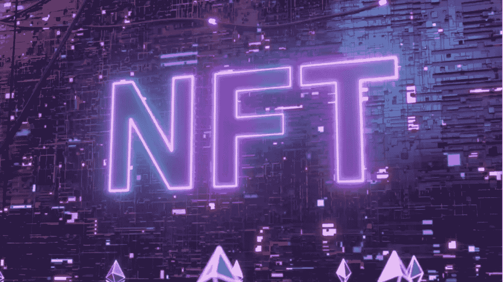
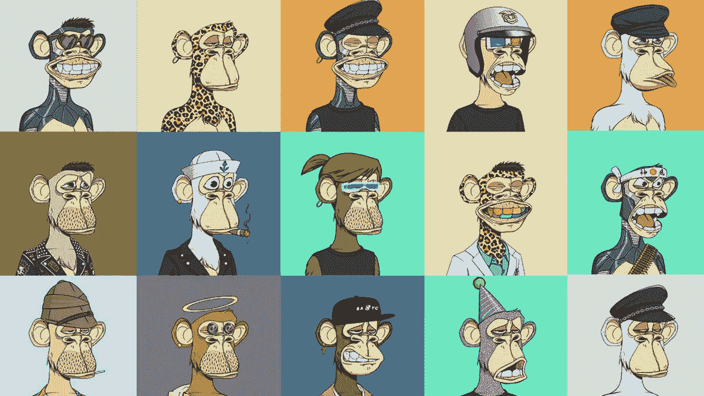
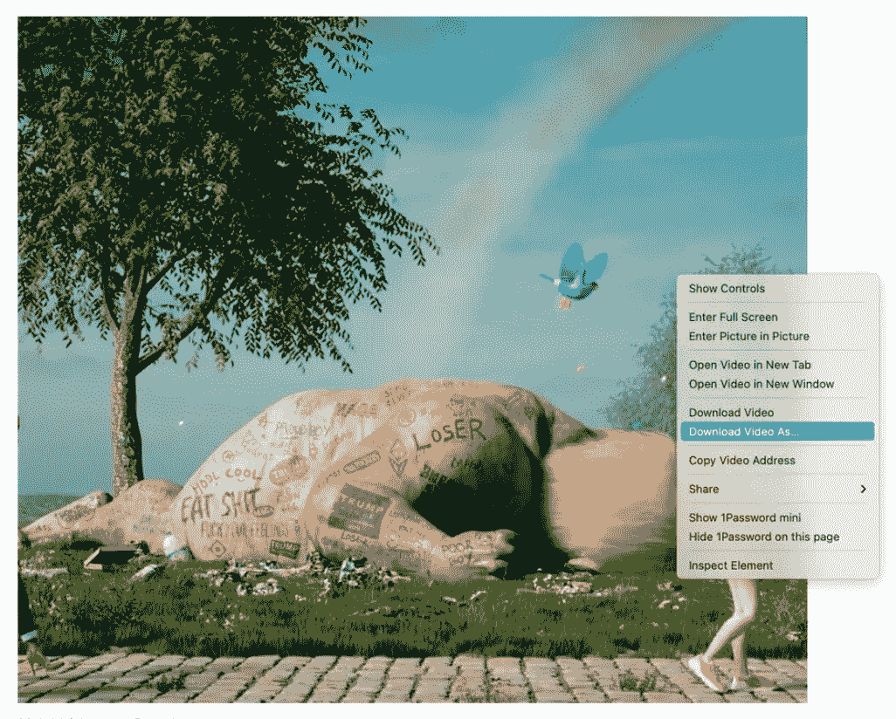

# 抛开非功能性思维的优点:它们并不像互联网描述的那样糟糕。

> 原文：<https://medium.com/coinmonks/shedding-the-good-about-nfts-they-are-not-as-bad-as-the-internet-portrays-them-af0e4cfa4c9f?source=collection_archive---------53----------------------->

Image: FlashMovie via Getty Images

NFT 是眉毛的崛起，因为它们经常被描述为代表现实世界物体的数字资产，如艺术，音乐，游戏中的物品和视频。它们经常与[加密货币](https://www.forbes.com/advisor/investing/what-is-cryptocurrency/)一起在网上买卖，并且它们通常使用与许多加密货币相同的底层软件进行编码。”——*什么是 NFT？福布斯顾问解释了不可替换代币*

文森特·多里亚是一名个体投资者，他迷上了收集 NFT，创建了自己的网站，制作了自己的 NFT 收藏，并将所有捐款捐给前往华盛顿特区的卡车司机

Image: Vincent Doria, a self-employed investor

但是人们也质疑 NFTs 和购买 NFTs 的副作用。文森特对这些关于 NFTs 的讨论给出了自己的观点，至少围绕它的名字传播了一些好处。

***是什么让 NFTs 让大家特别是你激动？***

因此，让 NFTs 如此令我兴奋的是整个收集器元素。所以我是棒球卡和电子游戏的大收藏家。所以 NFTs 的元素对很多人来说很有吸引力。还有这些东西叫做生成性 NFT。所以生殖收藏允许你做 200 层，然后你在你的电脑上生成 NFT 软件，它创建随机图像。但所有这些图像将永远是独一无二的。因为它们是不同的，所以持有它们你会得到很多好处。

Image: Bored Ape Yacht Club NFT Collection

***你说你作为收藏者收藏 NFT，其他人也一样吗，还是只是为了钱？***

所以，我喜欢收集 NFTs 但是，如果不是为了赚钱，是不会的。如果不是为了赚钱，他们就不会成为空间(nft 社区)的一部分。大部分还是很多人的底线。在地穴空间作为一个整体，每个人总是说，哦，他们爱技术和一切，但仍然有大多数人。如果不是为了赚钱，他们就不会成为空间(nft 社区)的一部分。

但是你可以从拥有 NFT 中获益。如果你拥有 NFT 的权利，你可以参加现实生活中的活动并获得福利。举个例子，纽约市的 Board Ape 游艇俱乐部举办了一个大型派对，基本上是街区派对。他们出租餐饮服务，你所要做的就是如果你有一辆 NFT，你就可以免费参加那个派对。饮料是免费的，娱乐也是免费的；基本上，一切都是免费的！

正如你所说，我看到人们为这些 NFT 支付数千美元，用于收集资金，但互联网上流传着一个关于 NFT 的笑话，即它们是骗局，因为人们可以轻松地截图而无需支付一分钱。你对此有什么看法？

我可以去蒙娜丽莎那里拍一张蒙娜丽莎的照片。这并不意味着我拥有蒙娜丽莎的所有权。你知道，以前，我在推特上并不出名，但是现在，我在推特上的 NFT 社区很出名。你总会得到一些人在你的评论中说，“看看我拥有的这个漂亮的 NFT”，这就是你的形象。他们只是巨魔，但是你知道，就像所有的事情一样，你不能拍一张照片然后拥有它。但这就是所有权的运作方式；不幸的是，NFTs，你知道，任何有人类互动的东西都会有诈骗，涉及到人们从你这里偷窃。所以，要获得所有权，就叫智能合约。智能合约是存储所有权的地方。这是存放在以太坊区块链的。没有人拥有区块链，所以如果美国失去权力，以太坊区块链不会关闭，因为世界各地成千上万的节点保持它的安全和运行。所以当你拥有一辆 NFT 时，我实际上并不持有它的代码。我的钱包作为失主存放在区块链以太坊。

Image: Yoink | Beeple

***最后，您对 NFTs 的环境问题有什么看法？***

所以，环境问题是这样的。你见过比所有的比特币和采矿理论多多少的电吗，比如说，空调杆？我确实同意它用了很多电，但我不认为它有人们写文章说的那么多。如果你看看我们为空调发了多少电，我们技术上需要空调吗？在得克萨斯州，在某些地区，我们可能会，但当你与某些事情相比，它并不像它看起来那么糟糕。但我不会贬低它。它消耗大量的电。但是你对比一下，我记得看过一篇文章，好像是“比特币和以太坊比这个国家用电多。”是的，那个国家，你知道，生活在那里的人很少。但有些人拥有这些矿山，并积极试图找到使其更加节能的方法，以赚更多的钱。

看，非功能性思维是可怕的，但是它们真的像互联网所希望的那样可怕吗？