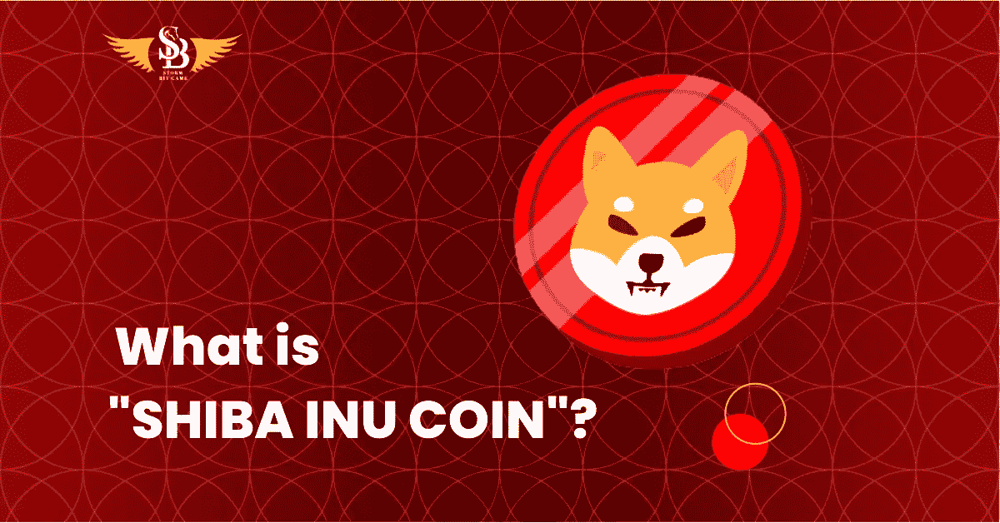

# 柴犬币狗币杀手

> 原文：<https://medium.com/coinmonks/shiba-inu-coin-the-dogecoin-killer-1190e7a33261?source=collection_archive---------67----------------------->

INU 柴币是数字货币的图像徽章，客户可以持有数百万枚。

一年前寄出的硬币正在被寻找。然而，为什么呢？我们正在讨论“十八 INU 硬币”,它交换了 SHIB，并把自己视为“狗币杀手”。奥凯补充说，最近它的价值很低，但当数字货币像币安一样交易时，它的价值大幅上升。中国商人在 SHIB 的非凡崛起中做出了重大贡献。根据 CoinMarketCap“24 小时交易量芝 INU 硬币超过 80 亿美元，市场资本总额和 110 亿美元。

在这个问题上，大多数权威人士都会同意，这是在解决数字货币商人的新聚会。本·卡塞林说，“目前，金融支持者正朝着新密码发展”，柴犬就是一个象征。INU 柴币是数字货币的图像徽章，客户可以持有数百万枚。它自己的分散交易平台 Shibaswap 与处理一起工作。就像 DOGECOIN。

什么是“十八 INU 币”？

正如大卫·赫赛奥所说，“各种各样的进步都需要一些弱点。”柴犬 Token (SHIB)，2020 年被罚下，是去中心化无约束局域建筑的一次试验。它是通过从“DOGECOIN”获取动力，使其在数字货币形式中众所周知而制成的。这是一个 ERC 20 可行的被称为“黑仔狗”。由于“Dogecoin”的名气越来越大，这一点变得更加突出。同样，通过像“REDDIT”和“TWITTER”这样的基于网络的娱乐方式，它也得到了当地大量个人的支持。最近，Vitalik Buterin 已经消耗了 Shibu Inu 的一半库存，因为在网络上流传的关于 40%象征性消耗的观点表明成本大幅上升。

阅读更多—[https://blog . sbg global . io/shiba-inu-coin-the-dog coin-killer/](https://blog.sbgglobal.io/shiba-inu-coin-the-dogecoin-killer/)

> 加入 Coinmonks [电报频道](https://t.me/coincodecap)和 [Youtube 频道](https://www.youtube.com/c/coinmonks/videos)了解加密交易和投资

# 另外，阅读

*   [如何在 FTX 交易所交易期货](https://coincodecap.com/ftx-futures-trading) | [OKEx vs 币安](https://coincodecap.com/okex-vs-binance)
*   [OKEx vs KuCoin](https://coincodecap.com/okex-kucoin) | [摄氏替代度](https://coincodecap.com/celsius-alternatives) | [如何购买 VeChain](https://coincodecap.com/buy-vechain)
*   [ProfitFarmers 回顾](https://coincodecap.com/profitfarmers-review) | [如何使用 Cornix 交易机器人](https://coincodecap.com/cornix-trading-bot)
*   [如何匿名购买比特币](https://coincodecap.com/buy-bitcoin-anonymously) | [比特币现金钱包](https://coincodecap.com/bitcoin-cash-wallets)
*   [瓦济里克斯 NFT 评论](https://coincodecap.com/wazirx-nft-review)|[Bitsgap vs Pionex](https://coincodecap.com/bitsgap-vs-pionex)|[Tangem 评论](https://coincodecap.com/tangem-wallet-review)
*   如何使用 Solidity 在以太坊上创建 DApp？