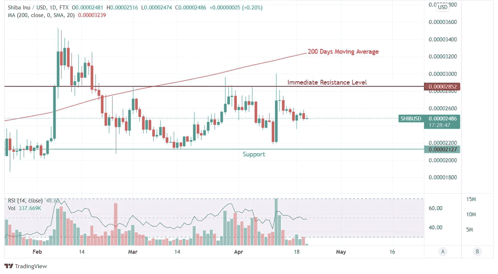

# 持续柴犬盘整；SHIB 的目标是爆发疫情。

> 原文：<https://medium.com/coinmonks/shiba-inu-consolidation-continues-shib-eyes-a-breakout-4e3e273fe8ff?source=collection_archive---------28----------------------->

Source photo TradingView.com

柴犬无非是“炒作币”。这种误解对区块链创造者的伤害似乎大于投资者。在 SHIB 区块链推出后，SHIB 发展委员会可以自由地专注于技术开发。在 2021 年互换发布后，他们现在正在研究柴犬 2 层的替代品。