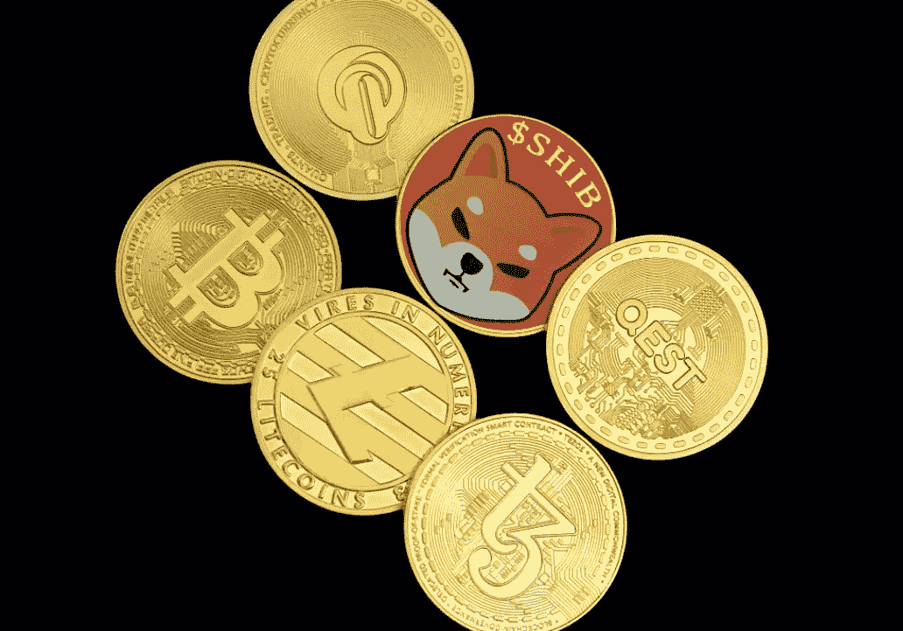

# 澳大利亚能源公司的 Shiba Inu 加密新支付选项

> 原文：<https://medium.com/coinmonks/shiba-inu-crypto-new-payment-option-for-australian-energy-company-5f47bd03e6af?source=collection_archive---------16----------------------->

Image via [Unsplash.com- Quantitatives](https://images.unsplash.com/photo-1643012426223-299a8d325548?ixlib=rb-1.2.1&ixid=MnwxMjA3fDB8MHxzZWFyY2h8Mzd8fHNoaWIlMjBjcnlwdG98ZW58MHx8MHx8&auto=format&fit=crop&w=700&q=60)

## 第一能源的客户现在可以使用 SHIB 和其他加密货币支付他们的公用事业账单

虽然柴犬(SHIB)代币目前的交易价格比历史最高价低了 75%,但它们仍然是一种受欢迎的加密货币。寻找使用案例是他们迁移的关键组成部分…