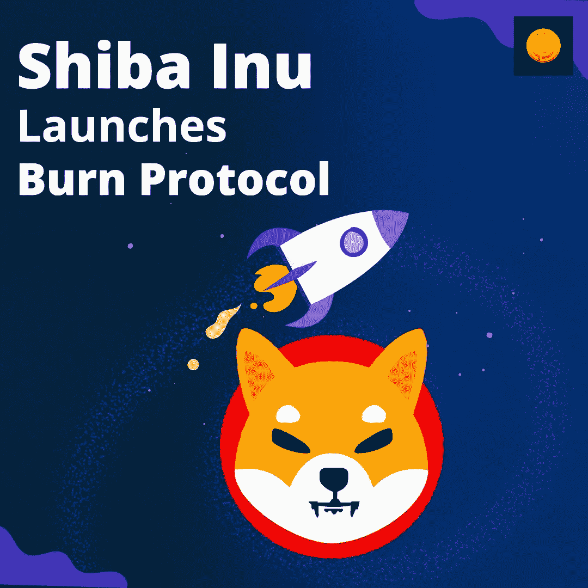

# 柴犬发起燃烧协议，以减少 SHIB 供应:未来最有可能上涨

> 原文：<https://medium.com/coinmonks/shiba-inu-launches-burn-protocol-to-shrink-shib-supply-upside-most-likely-in-future-ddf2c89dbdc8?source=collection_archive---------28----------------------->

当社交媒体上传出投资者通过投资柴犬代币一夜之间赚了数百万美元的消息时，过去的好日子可能会回来。如果你想知道柴犬基金会正在酝酿什么，准确地说，是一个新的更新。这个月，生态系统准备引进柴犬烧伤协议。新的燃烧机制启动后，与过去相比，将会有更多的柴犬燃烧在进行中。大部分烧钱机制将通过死钱包转移或完全从供应中取出代币来实现。

**会有什么后果？**

由于 Benzinga 民意调查机构表示，如果这种燃烧机制继续下去，它将把柴犬价格推高至 0.001 美元，因此人们猜测后果会更好；然而，由于柴犬和所有其他替代硬币主要取决于比特币的价格走势，这也将要求 BTC 拒绝之前的 ATHs 并创下新高。目前，为了确保烧伤机制按计划进行，柴犬基金会与 Ryoshi Vision 合作，进一步加强柴犬生态系统。

# 为什么这对 [Coindhan](https://www.coindhan.com/) 用户很重要？

这对 Coindhan 兄弟会来说可能是个好消息，因为交易所最近推出了一项大型赠品竞赛，Coindhan 的主人可以通过参加各种活动获得[柴犬](https://blog.coindhan.com/2022/04/12/shiba-inu-price-analysis-for-2022-coindhan/)空投。这可能是为了促进交换或要求朋友和熟人通过完成 KYC 加入柴犬交换，并接收柴犬以供使用。

> 加入 Coinmonks [电报频道](https://t.me/coincodecap)和 [Youtube 频道](https://www.youtube.com/c/coinmonks/videos)了解加密交易和投资

# 另外，阅读

*   [WazirX vs coin dcx vs bit bns](/coinmonks/wazirx-vs-coindcx-vs-bitbns-149f4f19a2f1)|[block fi vs coin loan vs Nexo](/coinmonks/blockfi-vs-coinloan-vs-nexo-cb624635230d)
*   [本地比特币审核](/coinmonks/localbitcoins-review-6cc001c6ed56) | [加密货币储蓄账户](https://coincodecap.com/cryptocurrency-savings-accounts)
*   [什么是保证金交易](https://coincodecap.com/margin-trading) | [美元成本平均法](https://coincodecap.com/dca)
*   [维护卡审核](https://coincodecap.com/uphold-card-review) | [信任钱包 vs MetaMask](https://coincodecap.com/trust-wallet-vs-metamask)
*   [Exness 点评](https://coincodecap.com/exness-review)|[moon xbt Vs bit get Vs Bingbon](https://coincodecap.com/bingbon-vs-bitget-vs-moonxbt)