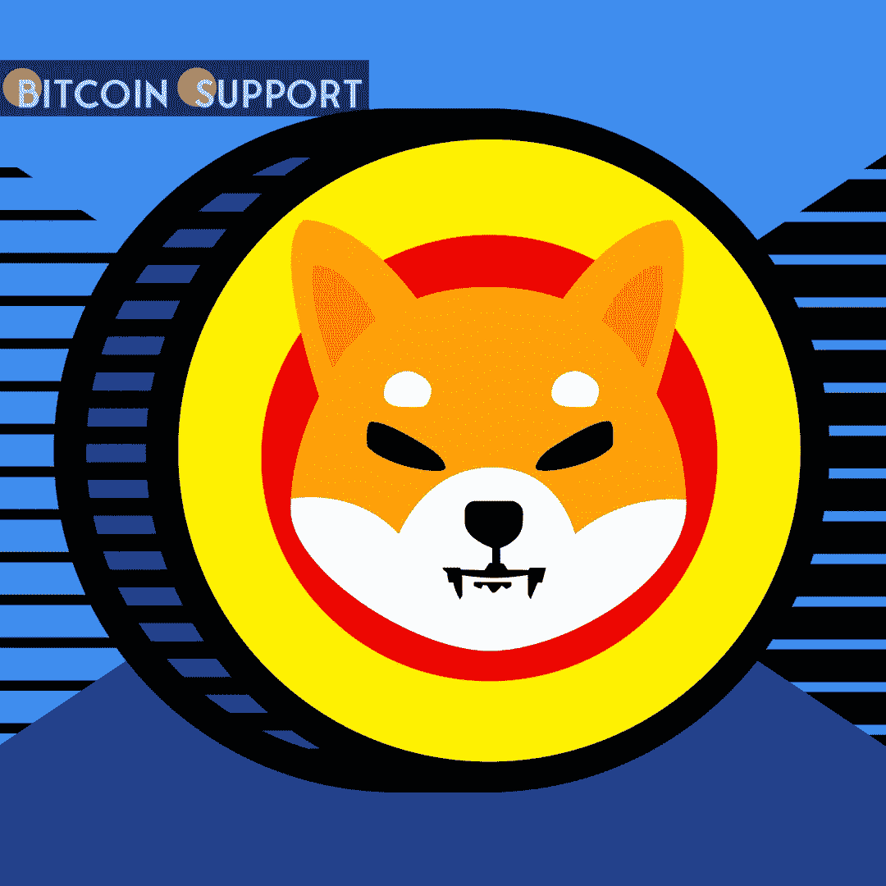

# 柴犬首席开发者说他永远不会离开；他不是亿万富翁，只是一个试图让 Shib 与众不同的普通人

> 原文：<https://medium.com/coinmonks/shiba-inu-lead-developer-says-hell-never-leave-he-s-not-a-billionaire-just-a-regular-guy-trying-ce6b8154c76b?source=collection_archive---------13----------------------->

**Visit our website:-** [**https://bitcoinsupports.com/**](https://bitcoinsupports.com/)

在 Andre Cronje 离开之后，柴犬的首席开发者草间秀重申了他对 SHIB 的支持。在多产程序员 Andre Cronje 和 Anton Neil 退出分散化金融领域的传言之后，Shiba Inu 的假名主要开发者 Shytoshi Kusama 重申了他对 SHIB 生态系统发展的承诺。

草间弥生在最近的一篇 Twitter 帖子中声称，他将继续通过开发有益的倡议为柴犬生态系统贡献自己的配额，这些倡议将帮助加密货币被认可为公用令牌而不是 memecoin。

“我想象一个大多数人感知到末日的世界。(这也是我得到的。)我不是亿万富翁(永远也不会)，我只是一个普通人，努力在糟糕的情况下做到最好。草间弥生将这种情况描述为“shibarmy”。柴犬的主要开发者表示，Cronje 和 Neil 最近的离职表明了比特币工程师面临的威胁，因为他们为开发一个去中心化的金融生态系统做出了贡献，这种生态系统可能会为每个人提供财务自由。“我不会放弃，直到我们开拓出一个新的宇宙，”化名的柴犬开发者补充说，尽管愤怒，和勒索。Kusma 的评论是在他严厉批评批评者批评该倡议最近几周未能与微软和华纳兄弟谈判关键合作之后发表的。草间弥生表示，柴犬尚未获得大型合作伙伴，因为它仍在建设中，其大部分计划仍在开发中。Neil 和 Cronje 昨天在 Twitter 上宣布，他们将结束 DeFi 和 crypto 领域的发展。悲惨的消息传出后，包括 Fantom (FTM)、Yearn Finance (YFI)、艾斯特金融(Geist)等在内的一些分散化金融加密货币的价格暴跌。与此同时，草间弥生继续走在重要的柴犬项目的前列，这些项目将把 SHIB 从一个笑话硬币转变为公用事业的象征。

正如之前报道的那样，柴犬现在正在开发一款“玩到赚”(P2E)游戏和一个刻录网关，这将限制 SHIB 的整体供应量，从而提高加密货币的价值。

**访问我们的网站:-**[**https://bitcoinsupports.com/**](https://bitcoinsupports.com/)

**免责声明:以上为作者观点，不应视为投资建议。读者应该自己做研究。**