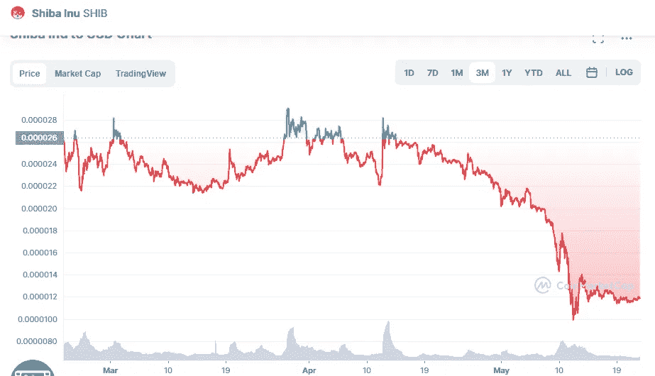

# 柴犬价格分析 5 月 22 日

> 原文：<https://medium.com/coinmonks/shiba-inu-price-analyse-22th-of-may-c74ac6111812?source=collection_archive---------6----------------------->

Source photo [Shiba Inu price today, SHIB to USD live, marketcap and chart | CoinMarketCap](https://coinmarketcap.com/currencies/shiba-inu/)

已经确定柴犬市场现在处于利空趋势。柴犬的价格不太容易受到市场波动的影响，因为市场波动看起来正在放缓。

布林带的上限是 0.00002205 美元，这是 SHIB 最大的阻力所在。布林带的下限为 0.00000739 美元，这是 SHIB 此时的坚实支撑。