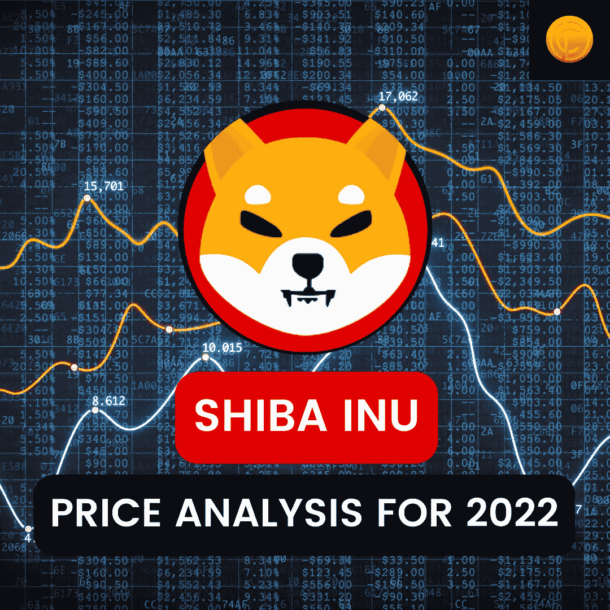

# 2022 年柴犬价格分析

> 原文：<https://medium.com/coinmonks/shiba-inu-price-analysis-for-2022-coindhan-38f5a88a0834?source=collection_archive---------3----------------------->

从技术指标来看，MA 或移动平均线显示了新的上涨势头。例如，20 日均线和 200 日均线远高于趋势线，表明上涨势头。20 天均线显示代币交易在 0.00002386 美元；而 200 天均线显示为 0.00002361 美元。这些波动远远高于趋势线，它们确实显示了未来几天的看涨势头。正如预期的那样，Fib 分析显示支撑位将在 23.6 Fib 水平形成，从而将价格固定在 0.00002427 美元。每周 RSI 值为 45.05，这表明它似乎处于中性区，我们可以预计未来将进一步上涨。马 50、马 100、马 200 购买欲望强烈。如果我们考虑到所有这些因素，我们可以肯定地预计柴犬到 2022 年底将触及 0.000030 美元。

迷因节已经开始在迷因代币上展现一些新的势头。ELONAMI 是一个同义词，用于带来由技术极客 Elon Musk 驱动的海啸等效果。结果，DogeCoin 在抽水。也就是说，由于埃隆总是被看到在他的 Twitter 手柄上发布柴犬的照片，柴犬也会这样做吗？

在今天的 [Coindhan 的](https://blog.coindhan.com/2022/04/05/tether-price-analysis-for-2022-coindhan/)加密分析中，我们将看到柴犬的技术面，以验证价格走势。我们不会强调代币的基本面。这篇文章中提到的你将要见证的一切都不是投资建议，建议你在采取行动之前先和财务顾问谈谈。说完了，我们走吧！

# [柴犬](https://www.coindhan.com/)价格分析:2022

柴犬以一个不起眼的音符开始交易，硬币以 0.00001377 美元开始交易；然而，比特币基地上市后，价格暴涨了 114%。由于这种急剧的挤兑，大多数投资者将几千美元的投资变成了数百万美元。但当前的价格预测应该是值得警惕的。目前，代币的交易价格为 0.00002024 美元，价格上涨了 6.98%。

> 加入 Coinmonks [电报频道](https://t.me/coincodecap)和 [Youtube 频道](https://www.youtube.com/c/coinmonks/videos)了解加密交易和投资

# 另外，阅读

*   [如何在 Uniswap 上交换加密？](https://coincodecap.com/swap-crypto-on-uniswap) | [A-Ads 评论](https://coincodecap.com/a-ads-review)
*   [WazirX vs coin dcx vs bit bns](/coinmonks/wazirx-vs-coindcx-vs-bitbns-149f4f19a2f1)|[block fi vs coin loan vs Nexo](/coinmonks/blockfi-vs-coinloan-vs-nexo-cb624635230d)
*   [本地比特币审核](/coinmonks/localbitcoins-review-6cc001c6ed56) | [加密货币储蓄账户](https://coincodecap.com/cryptocurrency-savings-accounts)
*   [什么是融资融券交易](https://coincodecap.com/margin-trading) | [成本平均法](https://coincodecap.com/dca)
*   [支持卡审核](https://coincodecap.com/uphold-card-review) | [信任钱包 vs 元掩码](https://coincodecap.com/trust-wallet-vs-metamask)