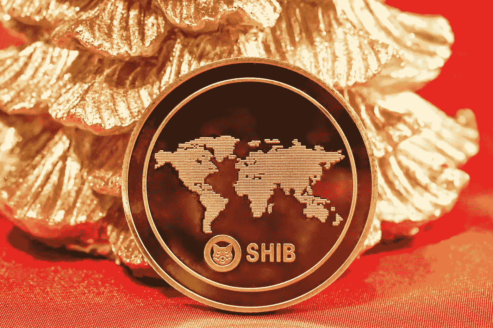

# 柴犬价格分析:SHIB 在 0.00002650 美元附近开始贬值

> 原文：<https://medium.com/coinmonks/shiba-inu-price-analysis-shib-begins-to-lose-value-around-0-00002650-4d45176f5e3b?source=collection_archive---------4----------------------->

Source photo Unsplash.com

今天的柴犬价格分析是乐观的。在 0.00002826 美元，有一个明显的阻力。
SHIB 目前的交易价格为 0.00002650 美元。
今天的柴犬价格分析表明，市场可能出现熊市，市场正在向下移动，这大大降低了 SHIB 的价格。然而，SHIB 的价格跌至 0.00002567 美元…