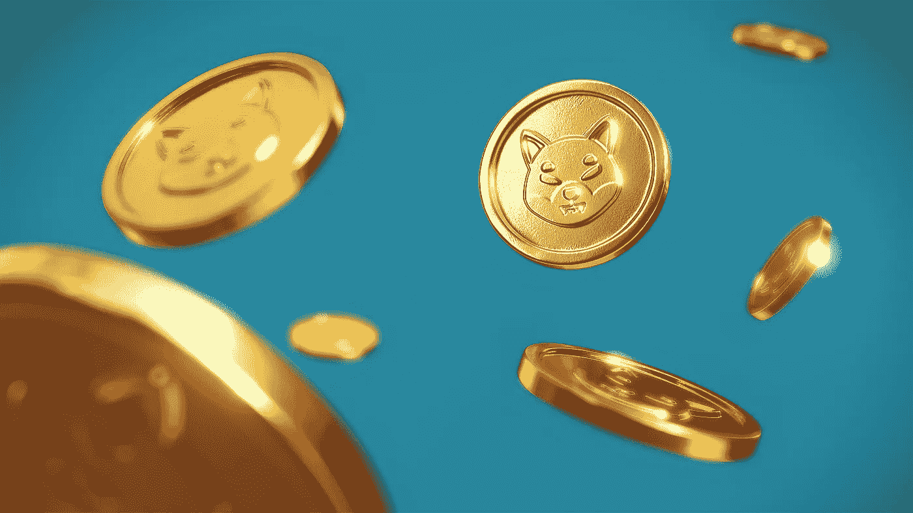

# 柴犬价格分析:SHIB 表现出稳定的趋势，为 0.00002429 美元

> 原文：<https://medium.com/coinmonks/shiba-inu-price-analysis-shib-exhibits-consistent-trends-at-0-00002429-47c2aecb166a?source=collection_archive---------29----------------------->

Source photo Unsplash.com

今日柴犬价格分析利空。在 0.00003348 美元，有一个明显的阻力。
SHIB 现在的交易价格是 0.00002429 美元。
今天的柴犬价格研究显示了负面的市场行为。然而，当市场发生变化时，多头似乎有了一些希望。结果，SHIB 价格下跌，从 0.00002566 美元跌至 0.00002444 美元；2 月 26 日…