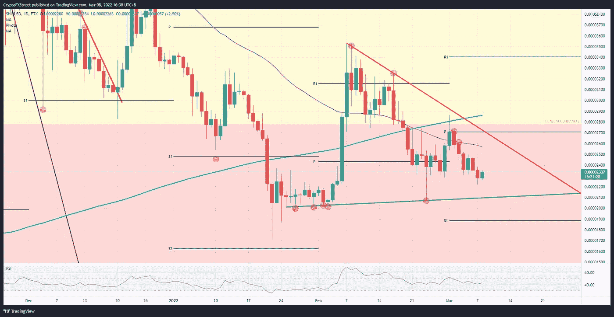

# 柴犬价格从俄罗斯-乌克兰的讨论中提取乐观迹象，目光回到 0.000024 美元

> 原文：<https://medium.com/coinmonks/shiba-inu-price-extracts-optimistic-signs-from-russia-ukraine-discussions-with-eyes-returning-to-f1a0c44f9e73?source=collection_archive---------88----------------------->

Source photo TradingView.com

柴犬价格运动仍处于更广泛的三角形中，支撑位在 0.00002100 美元附近，上行阻力在 0.00002700 美元。随着俄乌之间良好的和平谈判确立了乐观和宽慰的基调，SHIB 价格下意识地回升。
预期短期回报为…