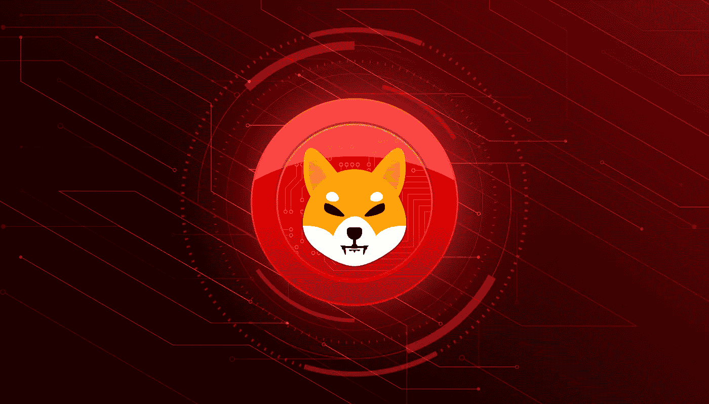
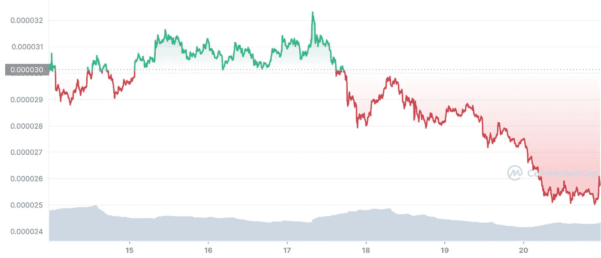
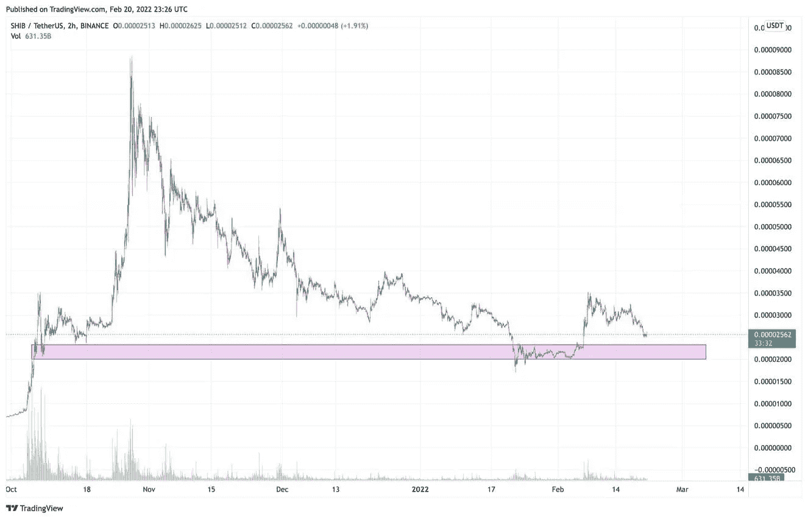
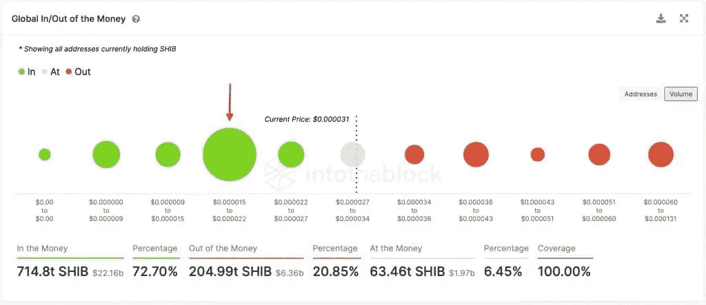
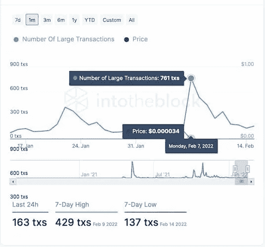

# 柴犬价格预测:SHIB 能在 2022 年创历史新高吗？

> 原文：<https://medium.com/coinmonks/shiba-inu-price-forecast-can-shib-reach-a-new-all-time-high-in-2022-62f6afcc5010?source=collection_archive---------37----------------------->

## 交易者将关注于 2021 年成名的柴犬(SHIB)能否撼动其模因地位，重返 2022 年高点。

随着越来越多的散户投资者进入市场并发现这种资产，SHIB 长期以来一直是市值前 20 名的加密货币之一，这得益于越来越多的持有者。此外，这种货币受益于它的广泛可获得性；柴犬币可以从十大加密货币交易所购买，包括币安、比特币基地、库币和北海巨妖。

加密行业中发展最快的三家加密货币交易所和交易平台 CoinGate、supported 和 VirgoCX 也将该资产列为上市资产。

此外，这种资产已经开始在现实世界中找到应用，比如在商店中用作一种支付形式，或者通过开发一种“柴犬地”元宇宙、不可替代代币(NFT)，以及通过燃烧来减少金额等等。许多其他应用增加了它的可行性和实用性。

**柴犬(SHIB)市场统计**

根据 CoinMarketCap 的统计，SHIB 现在的总市值排名第 14 位，交易价格为 0.0000257 美元，在撰写本文时下跌了 6.46%，上周下跌了 14.87%。

这种代币现在的市场估值约为 140 亿美元，但仍远低于 10 月 29 日达到的 410 亿美元，因此不清楚 SHIB 是否能在 2022 年回到这些水平。

SHIB 有可能回到 0.00008 美元的水平吗？交易员希望看到 SHIB 回到 10 月份的最高水平 0.00008 美元，许多人认为，持续燃烧的贡献将对减少 SHIB 的供应产生重大影响，从而提高其价格。

2 月 6 日至 2 月 8 日期间，柴犬价格上涨 57%，最高达到 0.0000351 美元。然而，随着 0.0000324 美元形成较低的高点，价格开始下跌。

SHIB 拥有的重要长期支撑位是 0.0000200 美元。

IntoTheBlock Global In/Out of the Money(GIOM)模型支持对柴犬价格的短期悲观预测。

根据对区块链的分析，下一个持续支持水平在 0.0000150 美元和 0.0000220 美元之间，假设该地区总共约有 134，230 个地址购买了总计 502.58 万亿的 SHIB 代币。

如果价格在上述区间下跌，这些持有人可能会收集更多的代币，这里也预计 SHIB 将在下跌期间遇到支撑。

另一方面，如果这种情况证明看跌假设是不正确的，它表明多头已经准备好了，并有可能将柴犬的价格带回 0.00004 美元以上。

2022 年 SHIB 预估价格

最后，加密货币交易员、《所有街道之狼》播客主持人斯科特·梅尔克(Scott Melker)指出，一年多的 SHIB 持有者最近增持了符合过去一个月主要积累的股票；他提到:

“他们持有一年以上的地址，最近 30 天内 SHIB 余额增加了约 32.48%。最近，对机构或鲸鱼的兴趣似乎有所增加。”

梅尔克还指出，价值超过 10 万美元的大额交易揭示了区块链的机构活动水平。

他还说:

“这些交易量在本周(2 月 7 日)大幅增加，达到几个月来的最高水平。交易总额为 3.8989 亿美元，但更有趣的是，这些交易占区块链 SHIB 总交易量的 81%。”

**结论**

由于加密货币在市场上越来越受欢迎，SHIB 可能会在 2022 年回到甚至超过其历史高点。

SHIB 在 2021 年获得了巨大的收益，当时由于市场出现了大量的投机活动，投机活动变得十分猖獗。尽管如此，价格大幅调整的可能性始终存在，尤其是考虑到最近有大量 SHIB 鲸鱼进入市场。

尽管发生了这些事件，随着市场情绪慢慢回到乐观的一面，预计新用户将在未来几年进入加密领域，随着 Robinhood 这样的尖端平台(尚未在 SHIB 上市)，meme 币拥有一切。今年有机会回到以前的高点，但这仍然是投机性的。

本文不包含任何投资建议或推荐。每一个投资和交易选择都包含风险，读者在做决定时应该进行自己的研究。

**签名金牌密码**

> 加入 Coinmonks [电报频道](https://t.me/coincodecap)和 [Youtube 频道](https://www.youtube.com/c/coinmonks/videos)了解加密交易和投资

# 另外，阅读

*   [3 商业评论](/coinmonks/3commas-review-an-excellent-crypto-trading-bot-2020-1313a58bec92) | [Pionex 评论](https://coincodecap.com/pionex-review-exchange-with-crypto-trading-bot) | [Coinrule 评论](/coinmonks/coinrule-review-2021-a-beginner-friendly-crypto-trading-bot-daf0504848ba)
*   [莱杰 vs Ngrave](/coinmonks/ledger-vs-ngrave-zero-7e40f0c1d694) | [莱杰 nano s vs x](/coinmonks/ledger-nano-s-vs-x-battery-hardware-price-storage-59a6663fe3b0) | [币安评论](/coinmonks/binance-review-ee10d3bf3b6e)
*   [Bybit Exchange 评论](/coinmonks/bybit-exchange-review-dbd570019b71) | [Bityard 评论](https://coincodecap.com/bityard-reivew) | [Jet-Bot 评论](https://coincodecap.com/jet-bot-review)
*   [3 commas vs crypto hopper](/coinmonks/3commas-vs-pionex-vs-cryptohopper-best-crypto-bot-6a98d2baa203)|[赚取加密利息](/coinmonks/earn-crypto-interest-b10b810fdda3)
*   最好的比特币[硬件钱包](/coinmonks/hardware-wallets-dfa1211730c6) | [BitBox02 回顾](/coinmonks/bitbox02-review-your-swiss-bitcoin-hardware-wallet-c36c88fff29)