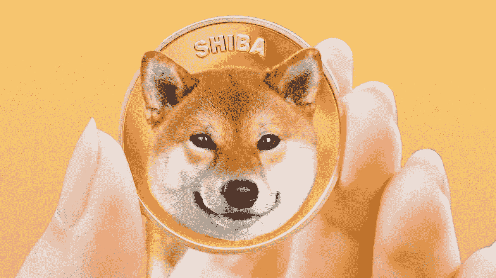

# 柴犬价格从低点回升，SHIB 日均大额交易借助使用量增加 261%

> 原文：<https://medium.com/coinmonks/shiba-inu-price-recovers-from-lows-shib-daily-large-transactions-increase-with-the-aid-of-using-608025202f8?source=collection_archive---------51----------------------->

柴犬鲸在之前的 24 小时内越来越活跃，大额交易增加了 261%。

交易量激增通常与机构投资者(或鲸鱼)的活动增加有关，他们要么买入，要么卖出。

柴犬在日线图上上涨了 25%，目前价格为 0.0000174 美元。

Etell 对前 100 名柴犬持有者的分析表明，随着 crypto whales 在最近几小时购买了数十亿只柴犬，SHIB 活跃地址激增 50%，导致大宗交易数量大幅增加，价格上涨。

在过去的 24 小时里，捕鲸者报道了两起大型柴犬收购案。

最近几个小时，在捕鲸排行榜上排名第 222 位的 ETH 鲸鱼“蓝鲸 0073”购买了 311，816，880，855 SHIB，价值 4，801，979 美元。

早些时候，区块链数据追踪器报告说，ETH whale“Bombur”增加了 60，606，002，938 SHIB，价值 1，004，847 美元。

柴犬也回到了顶级 ETH 鲸鱼购买的 10 大代币名单中。

柴犬在 5 月 10 日跌至 0.00001347 美元的低点后出现反弹。在本文发表时，SHIB 在创下 0.00001788 美元的盘中高点后，交易价格为 0.0000178 美元。柴犬指数在 0.0000134 美元的水平遇到了重要的支撑，随着 RSI 进入超卖状态，这阻止了下跌。

在市场松了一口气之际，SHIB 股市前一天遭受了重大损失，跌幅高达 20%。尽管最近暴跌，柴犬持有者继续增加。根据捕鲸业统计，目前 SHIB 持有者总数为 1146848 人。

你怎么想呢?SHIB 会反弹吗？

> 加入 Coinmonks [电报频道](https://t.me/coincodecap)和 [Youtube 频道](https://www.youtube.com/c/coinmonks/videos)了解加密交易和投资

# 另外，阅读

*   [Bookmap 点评](https://coincodecap.com/bookmap-review-2021-best-trading-software) | [美国 5 大最佳加密交易所](https://coincodecap.com/crypto-exchange-usa)
*   最佳加密[硬件钱包](/coinmonks/hardware-wallets-dfa1211730c6) | [Bitbns 评论](/coinmonks/bitbns-review-38256a07e161)
*   [新加坡十大最佳加密交易所](https://coincodecap.com/crypto-exchange-in-singapore) | [购买 AXS](https://coincodecap.com/buy-axs-token)
*   [红狗赌场评论](https://coincodecap.com/red-dog-casino-review) | [Swyftx 评论](https://coincodecap.com/swyftx-review) | [造币厂评论](https://coincodecap.com/coingate-review)
*   [投资印度的最佳密码](https://coincodecap.com/best-crypto-to-invest-in-india-in-2021)|[WazirX P2P](https://coincodecap.com/wazirx-p2p)|[Hi Dollar Review](https://coincodecap.com/hi-dollar-review)