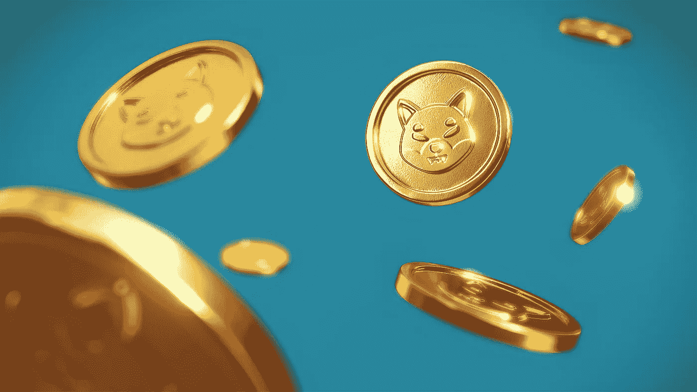

# 柴犬价格保持稳定，尽管上涨 80%仍然是可能的

> 原文：<https://medium.com/coinmonks/shiba-inu-prices-remain-stable-although-an-80-percent-increase-is-still-possible-9a23883b60d8?source=collection_archive---------52----------------------->

Source photo Unsplash.com

柴犬价格运动已经形成了亚当和夏娃模式，标志着 38%的增长。需要果断地将 0.0000329 美元阻力位转换为支撑位，才能启动到 0.0000454 美元的运行。如果日线蜡烛线收于 0.0000211 美元支撑位以下，看涨 SHIB 的论点就失效了。