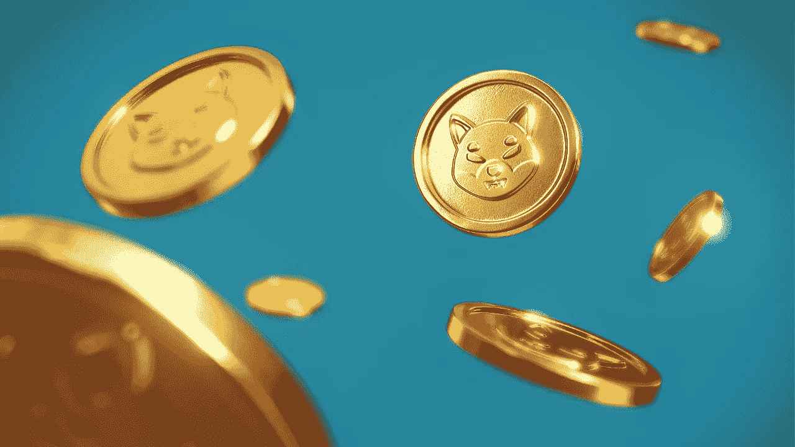

# 柴犬(Shiba 秒解说

> 原文：<https://medium.com/coinmonks/shiba-inu-shib-explained-in-60-seconds-50bce3d4f29c?source=collection_archive---------43----------------------->

柴犬开始只是一个笑话，但很快变成了一个数十亿美元的项目。

2020 年 8 月，一位名为 Ryoshi 的假名开发者启动了该项目，作为加密社区治理的一项实验，这意味着测试社区如何决定加密货币项目的变化。

柴犬不是硬币而是代币，这是一个重要的区别。加密硬币通常是建立在和依赖于自己的区块链。相比之下，加密令牌依赖于现有区块链的能力、安全性和维护。换句话说，加密令牌不拥有它所操作的区块链。

作为令牌，柴犬生活在以太坊网络上。由于柴犬使用以太坊区块链，它可以利用智能合约，做一些你在 Dogecoin 上不能做的事情，OG meme coin 是一种加密硬币，驻留在自己的区块链上。Dogecoin 与比特币相似，不具备智能合约功能。

这是什么意思？意思是说，有了柴犬，你可以做一些事情，比如把它借出去，或者在你收费的同时，让其他人和它交易。

这就是为什么许多人认为柴犬是狗狗杀手。

 [## 你准备好迎接加密经济了吗？加密派

### 每次你打开新闻，阅读报纸，或者浏览你的推特，你很可能会看到一些故事…

www.thecryptopie.com](https://www.thecryptopie.com/) 

> 加入 Coinmonks [电报频道](https://t.me/coincodecap)和 [Youtube 频道](https://www.youtube.com/c/coinmonks/videos)了解加密交易和投资

# 另外，阅读

*   [霍比评论](https://coincodecap.com/huobi-review) | [OKEx 保证金交易](https://coincodecap.com/okex-margin-trading) | [期货交易](https://coincodecap.com/futures-trading)
*   [麻雀交换评论](https://coincodecap.com/sparrow-exchange-review) | [纳什交换评论](https://coincodecap.com/nash-exchange-review)
*   最好的[加密税务软件](/coinmonks/best-crypto-tax-tool-for-my-money-72d4b430816b) | [CoinTracking 评论](/coinmonks/cointracking-review-a-reliable-cryptocurrency-tax-software-5114e3eb5737)
*   [Stackedinvest 评论](https://coincodecap.com/stackedinvest-review) | [北海巨妖评论](/coinmonks/kraken-review-6165fc1056ac) | [bitFlyer 评论](https://coincodecap.com/bitflyer-review)
*   最佳[加密借贷平台](/coinmonks/top-5-crypto-lending-platforms-in-2020-that-you-need-to-know-a1b675cec3fa) | [杠杆令牌](/coinmonks/leveraged-token-3f5257808b22)