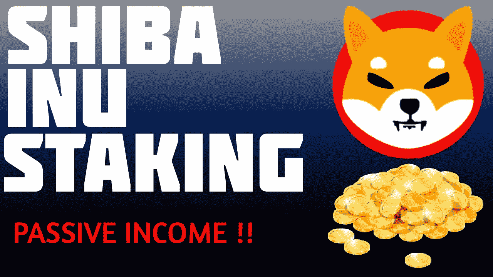
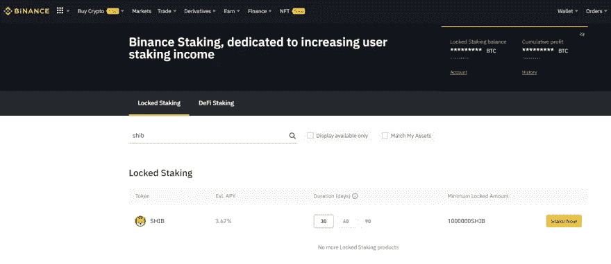
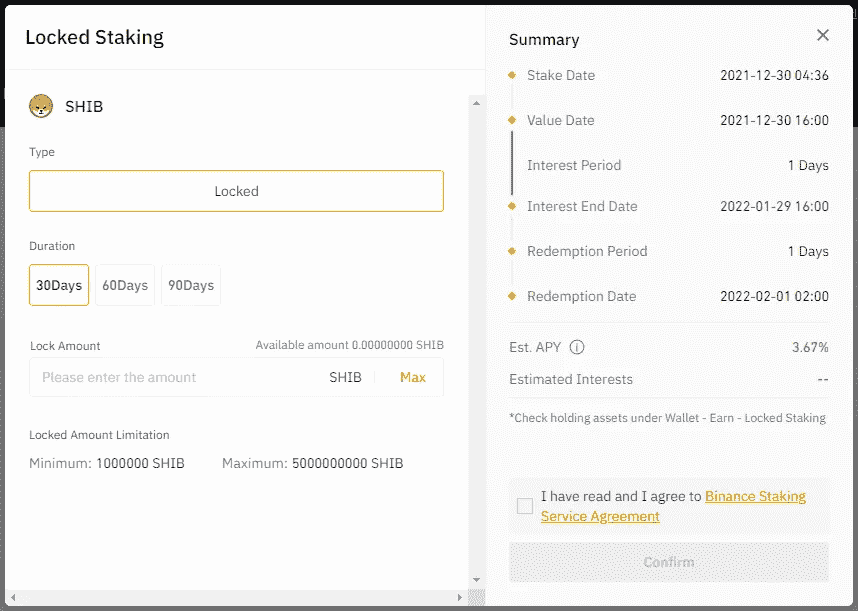
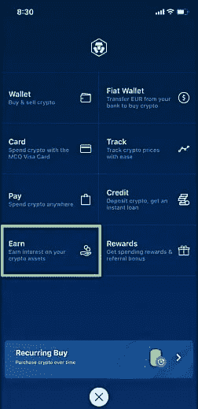

# 柴犬在 2022 年锁定加密被动收入

> 原文：<https://medium.com/coinmonks/shiba-inu-staking-for-crypto-passive-income-in-2022-82c11cc03fed?source=collection_archive---------0----------------------->

很多来找我寻求建议的人认为在加密中赚钱的唯一方法是通过交易，因为这看起来太复杂了，他们中的大多数人最终都去了别处。

用加密赚钱，超级简单，交易不是唯一的方法。这就是为什么我决定提供另一种通过赌注赚取加密收入的观点，这次解释如何在 2022 年赌注柴犬中赚取被动收入。

# 跑马圈地能赚多少钱？

赌柴犬可以给你从 3%到 5%的年化利率。你可以使用[币安](https://accounts.binance.com/en/register?ref=K5XIYGD8)或[Crypto.com](https://crypto.com/app/az7qh3qye4)来购买和下注你的柴犬币。

在 360 天内下注 1460000 Shib 将会在您的帐户中获得 73800 个额外的硬币。

对于长期持有人来说，这是一个理想的策略，因为硬币可能会在几年内升值，这意味着 **73800 x 0.1 可能会有 7380 美元的价值。**

这不是财务建议，只是让你知道一些情况和赌注如何工作。我鼓励你多研究一下硬币和这个选项。

# 我怎样才能在币安投资柴犬？

**第一步:**在这里获得一个九折优惠的币安账户[。](https://accounts.binance.com/en/register?ref=K5XIYGD8)

**第二步:**将您的账户资金用于购买柴犬或存放您的代币。

**第三步:**点击菜单中“挣”下的“赌注”。

**第四步:**在锁定桩下搜索柴犬，点击桩。

**第五步:**输入你希望下注的金额，然后点击确认。

另一个选择赌注柴犬是 Crypto.com

**第一步:**在这里获得您的 Crypto.com 帐户[。](https://crypto.com/app/az7qh3qye4)

**第二步:**购买或转让你的柴犬代币。

**第三步:**点击底部栏中间的图标。

**第四步:**选择赚取，然后立即开始赚取。

**第五步:**选择柴犬，按照说明操作。

## 帮助和支持:

我可以通过不和谐和电报帮助您解决任何问题:

不和:[https://discord.gg/kTQpdTMArN](https://discord.gg/kTQpdTMArN)

电报:[https://t.me/cryptominingadvisor](https://t.me/cryptominingadvisor)

如果你正在寻找一种方法来获得额外的投资回报，那么我建议你看看这篇文章:

# [2022 年如何购买 Crypto 折 8 折返现](/@lumabooks/how-to-buy-crypto-with-10-discount-and-8-cashback-in-2022-4488c1bde8d1)

# 加密赌注是什么意思？

赌注简单地说就是在钱包里放一种加密货币一段时间，然后从中赚取利息。你从下注中获得的奖励因你持有时间的长短而异。赌注持续的时间越长，你的回报就越高。

**赌注加密的好处**

*   这是一种从你持有的加密货币中赚取利息的简单方法。
*   你不需要任何设备来进行加密赌注，就像你需要加密采矿一样。
*   你在帮助维护区块链的安全和效率。
*   这比秘密采矿更环保。

对于寻求在 2022 年通过持有加密货币赚取被动收入的人来说，加密赌注已经成为一种有吸引力的方式。

> 加入 Coinmonks [电报频道](https://t.me/coincodecap)和 [Youtube 频道](https://www.youtube.com/c/coinmonks/videos)了解加密交易和投资

## 另外，阅读

*   [比诺莫评论](https://blog.coincodecap.com/binomo-review) | [斯多葛派 vs 3Commas vs TradeSanta](https://blog.coincodecap.com/stoic-vs-3commas-vs-tradesanta)
*   [Capital.com 评论](https://blog.coincodecap.com/capital-com-review) | [香港的加密借贷平台](https://blog.coincodecap.com/crypto-lending-hong-kong)
*   [如何在 Uniswap 上交换加密？](https://blog.coincodecap.com/swap-crypto-on-uniswap) | [A-Ads 审查](https://blog.coincodecap.com/a-ads-review)
*   [WazirX vs coin dcx vs bit bns](/coinmonks/wazirx-vs-coindcx-vs-bitbns-149f4f19a2f1)|[block fi vs coin loan vs Nexo](/coinmonks/blockfi-vs-coinloan-vs-nexo-cb624635230d)
*   [本地比特币评论](/coinmonks/localbitcoins-review-6cc001c6ed56) | [加密货币储蓄账户](https://blog.coincodecap.com/cryptocurrency-savings-accounts)
*   [什么是融资融券交易](https://blog.coincodecap.com/margin-trading) | [美元成本平均法](https://blog.coincodecap.com/dca)
*   [拥护卡审核](https://blog.coincodecap.com/uphold-card-review) | [信任钱包 vs MetaMask](https://blog.coincodecap.com/trust-wallet-vs-metamask)
*   [Exness 评测](https://blog.coincodecap.com/exness-review)|[moon xbt Vs bit get Vs Bingbon](https://blog.coincodecap.com/bingbon-vs-bitget-vs-moonxbt)
*   [如何开始通过加密贷款赚取被动收入](https://blog.coincodecap.com/passive-income-crypto-lending)
*   [BigONE 交易所评论](/coinmonks/bigone-exchange-review-64705d85a1d4) | [电网交易机器人](https://blog.coincodecap.com/grid-trading)