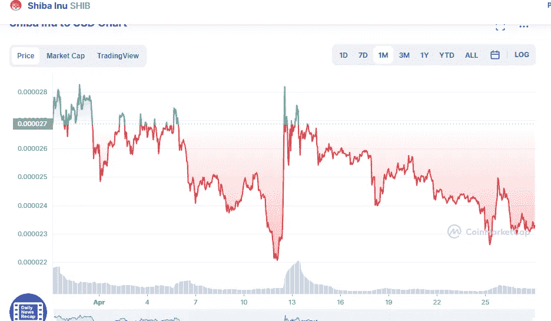

# 柴犬技术分析 4 月 28 日

> 原文：<https://medium.com/coinmonks/shiba-inu-technical-analysis-28th-of-april-8ad630f19d84?source=collection_archive---------37----------------------->

Source photo [Shiba Inu price today, SHIB to USD live, marketcap and chart | CoinMarketCap](https://coinmarketcap.com/currencies/shiba-inu/)

在之前的两周，糟糕的市场产生了 15%的修正，这有助于硬币围绕支撑的动态趋势线盘整。虽然这种支持可能会逆转，但 SHIB 价格 12.5%的上涨将使其面临悬置阻力。

每次 SHIB 价格区间反转，都表明三角形突破近了。因为…的可能性