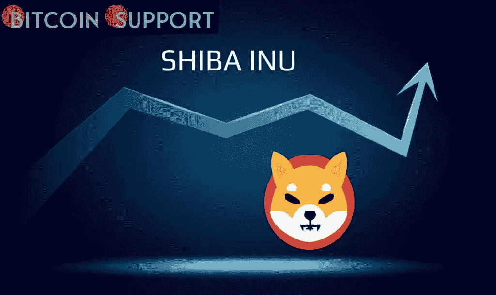
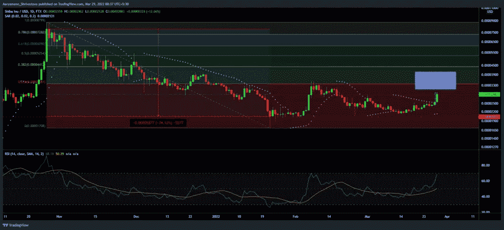
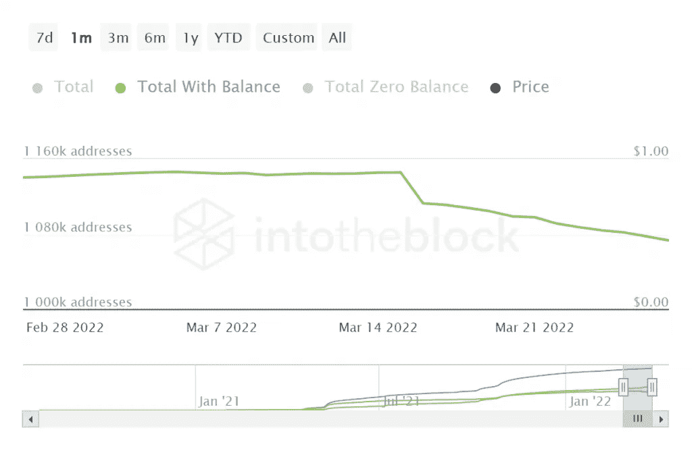
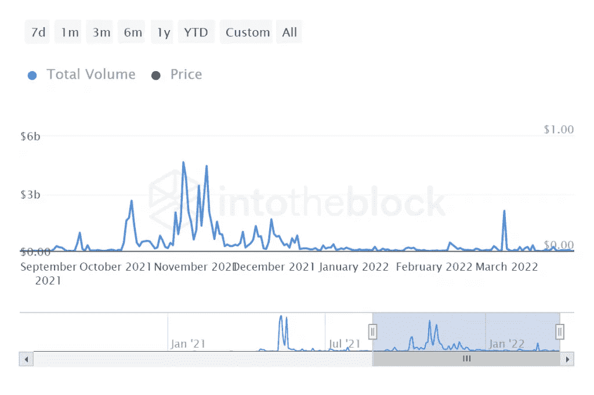

# 柴犬 21%的涨幅和“全球统治意图”

> 原文：<https://medium.com/coinmonks/shiba-inus-21-rise-and-global-dominance-intentions-56b500f7736c?source=collection_archive---------83----------------------->

**Visit our website:-** [**https://bitcoinsupports.com/**](https://bitcoinsupports.com/)

柴犬素有引发意外市场波动的名声。迷因货币今天也有类似的活动，但在发展过程中，市场看到了一个奇怪的异常现象。

**柴犬得与失**

持续的市场上涨导致今天几乎每只 altcoin 都发布了绿色蜡烛，柴犬是最近加入战局的一只。在撰写本文时，SHIB 的整体涨幅已超过 20%，此前四个小时的涨幅超过 11%。altcoin 目前的最大障碍位于 0.000003381 美元，对应 23.6%的斐波那契水平。保持价格上涨在控制之下，这个区域已经阻止了 altcoin 在几个月内达到 1 SATS。

然而，投资者应该意识到，相对强弱指数正积极趋向超买区域。突破这一点可能意味着趋势逆转，因为如果市场变得过热，可能会出现降温。

**Visit our website:-** [**https://bitcoinsupports.com/**](https://bitcoinsupports.com/)

然而，如果 altcoin 能够测试斐波那契线的支撑，它可能会见证投资者的潜在复苏。

在过去的 13 天里，该网络已经见证了超过 7 万名 SHIB 持有者的退出，因此这将是对加法的一次卷土重来。

**Visit our website:-** [**https://bitcoinsupports.com/**](https://bitcoinsupports.com/)

然而，这并没有对连锁交易或总体交易量产生太大影响，因为两者都有一段时间呈下降趋势。SHIB 今年未能有所建树，在 5000 万至 7000 万美元的较低区间徘徊。

**Visit our website:-** [**https://bitcoinsupports.com/**](https://bitcoinsupports.com/)

**策略的改变**

尽管今天出现上涨，但截至记者发稿时，柴犬投资者的减少仍在持续，鉴于 SHIB 社区对柴犬的忠诚度，尽管柴犬的价格出现了疯狂的波动，这一点是值得注意的。

说到精神错乱，柴犬最近发表了一篇博客，详细描述了他们未来的野心。当其他网络以更技术性的方式讨论他们的方法时，柴犬用愤世嫉俗的方式来说明他们“全球统治”的目标。当谈到 meme coin network 的野心时，柴犬希望完全饱和它的柴犬钱包。然而，它有雄心在不久的将来将 Shib 收藏卡牌游戏(x Playside)、Shib 时装(x John Richmond)和 Shib 食品(Welly's)带入生活。这些概念如何实现，它们将如何影响 SHIB 作为加密货币的合法性，或者它是否会像它被描绘的那样只是一种迷因币，还有待观察。

**访问我们的网站:-**[**https://bitcoinsupports.com/**](https://bitcoinsupports.com/)

**免责声明:以上为作者观点，不应视为投资建议。读者应该自己做研究。**

> 加入 Coinmonks [电报频道](https://t.me/coincodecap)和 [Youtube 频道](https://www.youtube.com/c/coinmonks/videos)了解加密交易和投资

# 另外，阅读

*   [比特币基地僵尸程序](/coinmonks/coinbase-bots-ac6359e897f3) | [AscendEX 审查](/coinmonks/ascendex-review-53e829cf75fa) | [OKEx 交易僵尸程序](/coinmonks/okex-trading-bots-234920f61e60)
*   [如何在印度购买比特币？](/coinmonks/buy-bitcoin-in-india-feb50ddfef94) | [WazirX 审查](/coinmonks/wazirx-review-5c811b074f5b)
*   [CryptoHopper 替代品](/coinmonks/cryptohopper-alternatives-d67287b16d27) | [HitBTC 审查](/coinmonks/hitbtc-review-c5143c5d53c2)
*   [CBET 评论](https://coincodecap.com/cbet-casino-review) | [库科恩 vs 比特币基地](https://coincodecap.com/kucoin-vs-coinbase)
*   [折叠 App 审核](https://coincodecap.com/fold-app-review) | [Kucoin 交易机器人](/coinmonks/kucoin-trading-bot-automate-your-trades-8cf0ca2138e0) | [Probit 审核](https://coincodecap.com/probit-review)