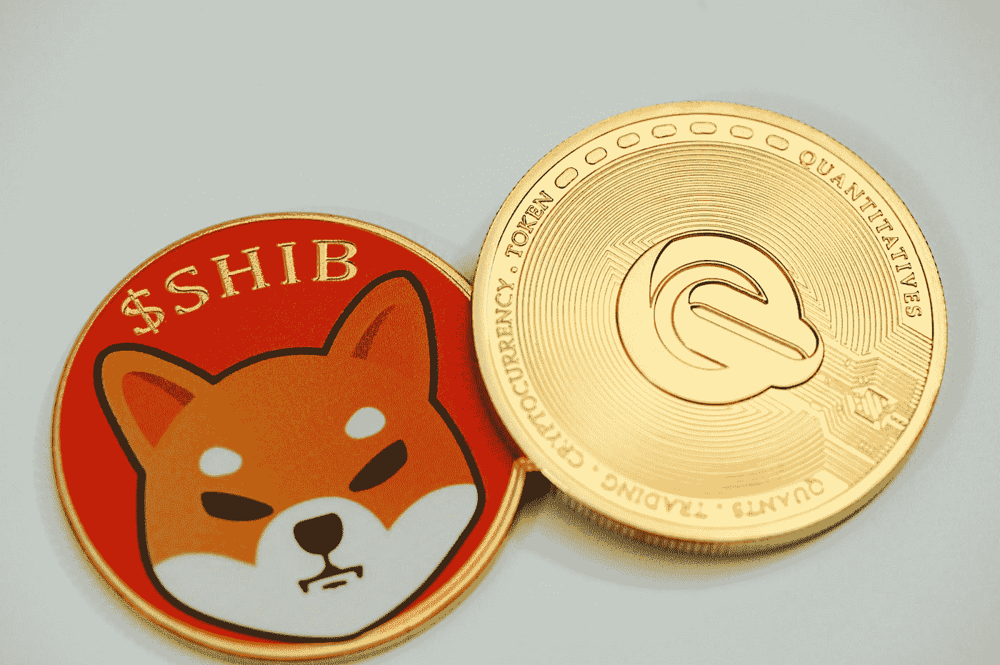

# 相比 Dogecoin，柴犬的市值太高了

> 原文：<https://medium.com/coinmonks/shiba-inus-market-value-is-too-high-compared-to-dogecoin-e1306cb85491?source=collection_archive---------31----------------------->

## Cryptos

## 鉴于其较低的使用案例水平，柴犬的市值可能会进一步下跌

Photo by [Quantitatives](https://unsplash.com/@quantitatives?utm_source=medium&utm_medium=referral) on [Unsplash](https://unsplash.com?utm_source=medium&utm_medium=referral)

*   柴犬 ( [**SHIB 对美元**](https://investorplace.com/cryptocurrency/shib-usd/) )经历了非常艰难的一年。年初至今(YTD)，截至 5 月 17 日，crypto 下跌超过 63%。事实上，自 2022 年 10 月 26 日见顶以来，柴犬价格已从 0.000080 美元跌至…