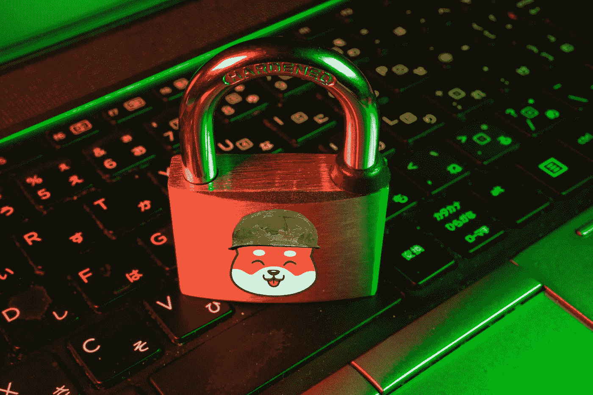

# SHIBARMY PSA -区块链安全——如何保持安全

> 原文：<https://medium.com/coinmonks/shibarmy-psa-blockchain-security-how-to-stay-safe-91f9ea00f8d7?source=collection_archive---------32----------------------->

这篇文章可能有点长，但它是值得的，尤其是如果你是一个新的加密。我已经能够用简单的规则反击和打击这些骗局。这篇文章包含了每个投资者都应该牢记的常识。与您的朋友和同事分享它，帮助他们永远不会被诈骗，并享受加密货币带来的美好时光

# 主题

1.  保护您的物理设备、种子短语和密钥
2.  智能合同漏洞
3.  最常见和最常用的骗局
4.  驾驭区块链的心态

# 保护您的物理设备、种子短语和密钥

公钥和私钥是加密货币不可或缺的一部分。它们允许你发送和接收加密货币，而不需要第三方来验证交易。这些密钥是公钥加密(PKC)框架的一部分。

您可以使用这些密钥随时随地向任何人发送您的加密货币。公钥和私钥作为一对密钥组合在一起。您的私钥必须保密。如果任何人可以访问私钥，他们也可以访问与这些密钥相关的任何加密货币。

它证明你拥有钱包，并允许你确认交易和转移你的资金。

***千万不要分享！***

## **种子短语**

种子短语是由您的加密货币钱包生成的一系列单词，让您可以访问与该钱包相关联的加密。把钱包想象成类似于加密的密码管理器，把种子短语想象成主密码。只要您有种子短语，您就可以访问与生成该短语的钱包相关联的所有加密，即使您删除或丢失了钱包。

如果有人获得你的种子短语，你失去你的密码

让我重复一遍，永远不要与任何人分享你的种子短语！

## **硬件钱包**

为了在区块链导航时更加安全，购买一个硬件钱包，这些是保存您的私钥的物理设备。

除非你用你的硬件钱包亲自确认交易，否则任何交易都不会发生，即使你的钱包受损

黑客们无能为力，因为他们无法确认交易。这确实意味着我们的硬币不是存储在硬件设备上，而是存储在公共账本或钱包上。

你的钱包和硬件设备是让你获得资金的关键，如果你的账本丢失了，只要你安全地存储了种子短语，你仍然可以获得你的硬币，这意味着加倍的安全。

## **将种子短语藏在哪里？**

不要把它们存放在保险箱里——太明显了，不要让你的种子短语存在于数字世界中，任何登录都可能受到威胁。

不要把它们存储在 dropbox
上不要把它们存储在 u 盘
上不要把它们存储在你的密码管理器上。

在你藏它们的地方要有创意。甚至考虑把它们背下来，这是你将拥有的最有价值的 16 个单词

你应该把种子短语分成几个部分。把它们分发给不同的人/地方，让除了你之外的任何人都无法访问。想想伏地魔把他的灵魂分成不同的碎片，放在魂器里永生。

## **在金属上储存种子短语**

在纸上写下你的种子短语是合法的，但不是最佳的解决方案，因为纸可以燃烧，被水和其他自然原因破坏。

把你的种子短语保存在钢上是最安全和最持久的方法之一，可以保护它免受最危险的破坏

## **你应该买哪个硬件钱包？**

最好和最常见的硬件钱包是由 Ledger 构建的，不要冒险使用鲜为人知或未经验证的硬件钱包。

不要从亚马逊或经销商和第三方市场购买，他们会在卖给你之前对设备进行妥协，总是在 https://twitter.com/Ledger[直接从制造商那里得到设备](https://twitter.com/Ledger)

# 最常见和最常用的骗局

## **假客户支持**

骗子在 Discord、Telegram、Twitter、Reddit 等网站上寻找需要帮助的人，并使用熟悉的名称和方案创建虚假账户，假装提供帮助。这可能包括假装得到支持、超过管理员或进行虚假赠送

他们将人们引向诈骗网站，要求您提供种子短语或让您连接到欺诈服务。他们还可以要求捐款或其他形式的付款，常见的是冒充您的加密团队的另一名成员，并要求快速转移资金以支付重要的事情。

## **假空投频道**

在 Telegram 上，你可以被加入一个恶意团体，假装为一个项目空投免费硬币或 NFT。这些是 100%的骗局，即使一个项目会这样做，他们也会不负责任地行事，至少可以这么说。只使用已知的网站和资源参加空投。如果你不确定，请不要做，稍后再问

## **不要盲目将钱包连接到网站**

一旦这些协议进入你的钱包，你不知道它们能做什么。始终确认您在正确的网站上，骗子可以创建看起来真实的网站，并通过恶意链接将您导航到该网站。

# **智能合约漏洞**

## **灰尘袭击**

你的钱包里有没有收到过莫名其妙的代币？找不到任何类似 CoinMarketCap 或 CoinGecko 的信息或房源？

这可能是一个灰尘攻击，你需要小心，这是一个让你与之互动的伎俩，智能合同中可能有恶意代码，会耗尽你的资金

***别动它！***

***不批准！***

***不要把它当成真实值，它是危险的！***

# **驾驭区块链的心态**

## **地址匹配吗？**

无论何时你发送交易，确保发送到正确的地址，不要偷懒，只验证地址的最后 4 位数字，即使概率很低，因为这样的错误而损失你的资金是可怕的。阅读和验证整个事情，并发送一个测试交易第一，ETH 的创始人总是这样做！

## **撤销合同**

协议被利用了。你可能会变得脆弱，在这一点上，你应该结束合同的能力与你的钱包互动。

你可以在网络和手机上使用像 https://app.unrekt.net/这样支持 ETH、BSC、HECO 和 Polygon 的应用。

或者[https://allowance.beefy.finance/](https://allowance.beefy.finance/)只支持 BSC 但是可以一次撤销多个合同。

第一步。连接您的钱包

第二步。检查权限

第三步。撤销权限

## **让你的资金远离中央交易所**

CEX 的得到黑客攻击，也可以冻结你的帐户和 KYC 你死，你不是硬币的主人，你只获得他们的第三方。

你可以从 CEX 购买硬币，以便于装载法定货币，但要尽快将它们发送到你的钱包，以成为合法的所有者。

一位智者曾经说过——“不是你的钥匙也不是你的硬币”

## **警惕“假”网站**

一旦你找到了合适的网站，在你的浏览器中把它加入书签。

利用官方网站找到官方的不和谐音、电报等的链接。

常见的假冒网站包括:

***假协议
假往来
假钱包网站***

# 保持安全

#SHIBARMY 功能:
💥- 8% #Shib 奖励
💥- 1%用于流动性
💥- 1%用于营销。

📌令牌信息:
🔸股票代码:$SHIBARMY
🔸合同地址:0x 940230 b 6 b 7 ef 1979 a28f 32196 a8e 3439 c 645 ba 49
💥将滑动设置为 11%-15%

网址:[https://shibarmybsc.com/](https://shibarmybsc.com/)

国际电报:【https://t.me/ShibarmyToken 

中国电报:[https://t.me/Shibarmy_CHN](https://t.me/Shibarmy_CHN)

德国电报:[https://t.me/Shibarmy_DE](https://t.me/Shibarmy_DE)

土耳其电报:【https://t.me/shibarmy_TR 

荷兰电报:【https://t.me/Shibarmy_NL 

https://www.reddit.com/r/ShibArmyBscToken/

推特:[https://twitter.com/shibarmybsc](https://twitter.com/shibarmybsc)

YouTube:[https://www.youtube.com/channel/UCaLMFOIqF5VHo4zVrIO_ydQ](https://www.youtube.com/channel/UCaLMFOIqF5VHo4zVrIO_ydQ)

BSCSCAN:[https://BSCSCAN . com/token/0x 940230 b 6 b 7 ef 1979 a28f 32196 a8e 3439 c 645 ba 49](https://bscscan.com/token/0x940230b6b7ef1979a28f32196a8e3439c645ba49)

> 加入 Coinmonks [电报频道](https://t.me/coincodecap)和 [Youtube 频道](https://www.youtube.com/c/coinmonks/videos)了解加密交易和投资

# 另外，阅读

*   [如何在印度购买比特币？](/coinmonks/buy-bitcoin-in-india-feb50ddfef94) | [瓦济克斯评论](/coinmonks/wazirx-review-5c811b074f5b)
*   [隐翅虫替代品](/coinmonks/cryptohopper-alternatives-d67287b16d27) | [HitBTC 审查](/coinmonks/hitbtc-review-c5143c5d53c2)
*   [CBET 评论](https://coincodecap.com/cbet-casino-review) | [库科恩 vs 比特币基地](https://coincodecap.com/kucoin-vs-coinbase)
*   [折叠 App 审核](https://coincodecap.com/fold-app-review) | [Kucoin 交易机器人](/coinmonks/kucoin-trading-bot-automate-your-trades-8cf0ca2138e0) | [Probit 审核](https://coincodecap.com/probit-review)
*   [如何匿名购买比特币](https://coincodecap.com/buy-bitcoin-anonymously) | [比特币现金钱包](https://coincodecap.com/bitcoin-cash-wallets)
*   [币安 vs FTX](https://coincodecap.com/binance-vs-ftx) | [最佳(SOL)索拉纳钱包](https://coincodecap.com/solana-wallets)
*   [比诺莫评论](https://coincodecap.com/binomo-review) | [斯多葛派 vs 3Commas vs TradeSanta](https://coincodecap.com/stoic-vs-3commas-vs-tradesanta)
*   [Capital.com 评论](https://coincodecap.com/capital-com-review) | [香港的加密借贷平台](https://coincodecap.com/crypto-lending-hong-kong)