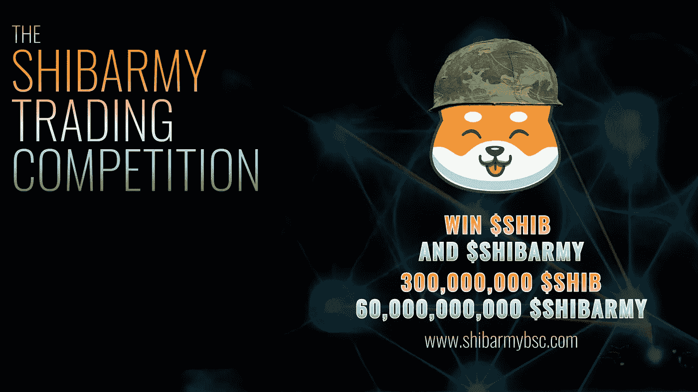
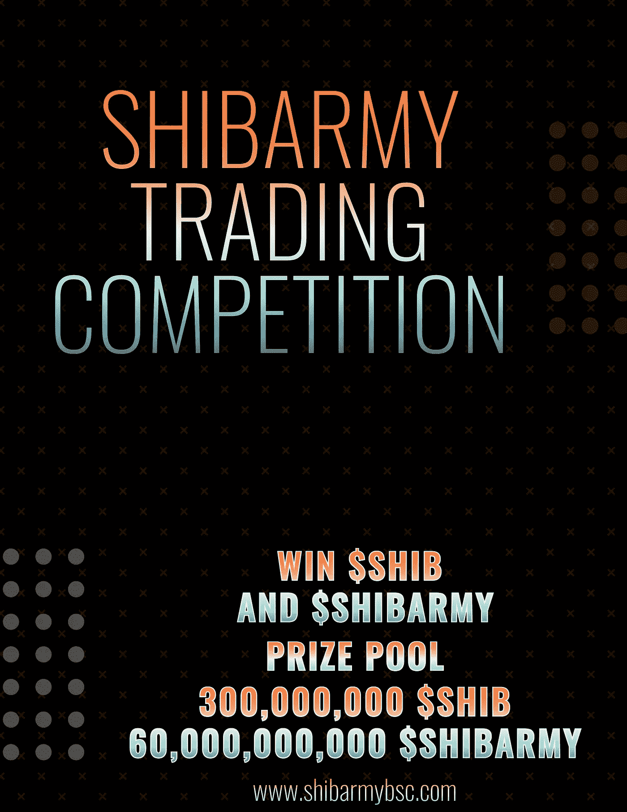

# Shibarmy 交易竞赛—通过交易赢得$SHIB 和$SHIBARMY

> 原文：<https://medium.com/coinmonks/shibarmy-trading-competition-win-shib-and-shibarmy-by-trading-74b111c4a690?source=collection_archive---------14----------------------->

## 我们想奖励持有人，给他们一个惊喜，最大数量的$SHIB 奖励。

# TL/DR

在 5 月 20 日**的**和 6 月 10 日的**之间进行 **$SHIBARMY** 的交易，就有机会在 **$SHIB** 以最大的交易量赢得大奖。参加每周一次的 **$SHIBARMY** 抽奖活动，每购买 **$SHIBARMY** 超过 50 美元就有一次机会赢得 40 亿(4，000，000，000) $SHIBARMY。**

不需要**注册**，每个人都可以通过使用 [PancakeSwap](https://pancakeswap.finance/swap?outputCurrency=0x940230b6b7ef1979a28f32196a8e3439c645ba49) 来交易我们的令牌。获胜者将获得他们用来交易的钱包。

# 在 PancakeSwap 上的 Shibarmy 交易比赛

我们为此拨款 3 亿 SHIB，目前价值约 3500 美元。比赛将持续 21 天，从 5 月 20 日**周五**格林威治时间+1 午夜开始，到 6 月 10 日周五午夜**结束。**

此外，我们将每周举行一次＄shib army 抽奖活动，每次购买＄shib army 超过 50 美元，就有机会赢得 40 亿(4，000，000，000)美元的大奖。

20，000，000，000 $SHIBARMY 的周奖金池每 7 天在 5 张个人入场券中分配。你每周只能赢一次。

# **规则**

1.  你必须使用 https://pancakeswap.finance/swap?进行交易 output currency = 0x 940230 b 6 b 7 ef 1979 a 28 f 32196 a8e 3439 c 645 ba 49
2.  赢家由 21 天内最高交易量 **$SHIBARMY** 决定。仅在 5 月 20 日星期五午夜 GMT +1 和 6 月 9 日星期四午夜 GMT +1 之间交易
3.  比赛结束时，钱包必须有正余额 **$SHIBARMY** 。**这意味着买入减去卖出> 0**
4.  该团队跟踪和审查从区块链导出的数据量，以确保公平竞争，并将在最后发布相应的信息
5.  赢家直接把他们的奖金放进他们的钱包，不需要注册，每个交易 **$SHIBARMY** 的人都可以赢

# 奖金以 SHIB 元计

总奖池 *3 亿* **$SHIB**

1.地点*1.5 亿*$ SHIB

2.放置*5000 万* **$SHIB**

3.排名*2500 万*SHIB

4 到 10。地点*1250 万* **$SHIB**

# 以美元为单位的每周奖品

50 美元以上的 5 次随机买入 40 亿美元 SHIBARMY。

有问题吗？加入我们的电报频道，我们很乐意帮忙

[https://t.me/ShibarmyToken](https://t.me/ShibarmyToken)

#SHIBARMY 功能:
💥- 8% #Shib 奖励
💥- 1%用于流动性
💥- 1%用于营销。

📌令牌信息:
🔸股票代码:$SHIBARMY
🔸合同地址:0x 940230 b 6 b 7 ef 1979 a28f 32196 a8e 3439 c 645 ba 49
💥将滑动设置为 11%-15%

网址:[https://shibarmybsc.com/](https://shibarmybsc.com/)

国际电报:[https://t.me/ShibarmyToken](https://t.me/ShibarmyToken)

中国电报:[https://t.me/Shibarmy_CHN](https://t.me/Shibarmy_CHN)

德国电报:[https://t.me/Shibarmy_DE](https://t.me/Shibarmy_DE)

土耳其电报:[https://t.me/shibarmy_TR](https://t.me/shibarmy_TR)

荷兰电报:[https://t.me/Shibarmy_NL](https://t.me/Shibarmy_NL)

https://www.reddit.com/r/ShibArmyBscToken/

推特:[https://twitter.com/shibarmybsc](https://twitter.com/shibarmybsc)

YouTube:[https://www.youtube.com/channel/UCaLMFOIqF5VHo4zVrIO_ydQ](https://www.youtube.com/channel/UCaLMFOIqF5VHo4zVrIO_ydQ)

BSCSCAN:[https://BSCSCAN . com/token/0x 940230 b 6 b 7 ef 1979 a28f 32196 a8e 3439 c 645 ba 49](https://bscscan.com/token/0x940230b6b7ef1979a28f32196a8e3439c645ba49)

> 加入 Coinmonks [电报频道](https://t.me/coincodecap)和 [Youtube 频道](https://www.youtube.com/c/coinmonks/videos)了解加密交易和投资

# 另外，阅读

*   [Capital.com 评论](https://coincodecap.com/capital-com-review) | [港加密借贷平台](https://coincodecap.com/crypto-lending-hong-kong)
*   如何在 Uniswap 上交换加密？ | [A-Ads 审查](https://coincodecap.com/a-ads-review)
*   [WazirX vs coin dcx vs bit bns](/coinmonks/wazirx-vs-coindcx-vs-bitbns-149f4f19a2f1)|[block fi vs coin loan vs Nexo](/coinmonks/blockfi-vs-coinloan-vs-nexo-cb624635230d)
*   [本地比特币评论](/coinmonks/localbitcoins-review-6cc001c6ed56) | [加密货币储蓄账户](https://coincodecap.com/cryptocurrency-savings-accounts)
*   [什么是融资融券交易](https://coincodecap.com/margin-trading) | [成本平均法](https://coincodecap.com/dca)