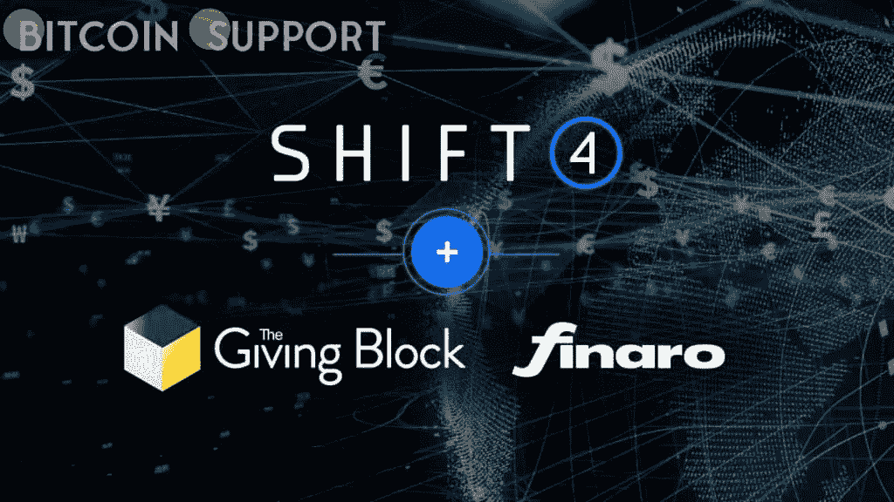

# 支付服务公司 Shift4 以 5400 万美元收购了 Giving Block

> 原文：<https://medium.com/coinmonks/shift4-a-payment-services-company-has-purchased-the-giving-block-for-54-million-a71aac56373e?source=collection_archive---------57----------------------->

**Visit our website:-** [**https://bitcoinsupports.com/**](https://bitcoinsupports.com/)

Shift4 拥有超过 200，000 个商业客户和超过 425 个软件连接。根据周二发布的投资者简报，总部位于美国的支付解决方案提供商 Shift4 宣布以 5400 万美元的现金和股票收购 Giving Block，并可能获得高达 2.46 亿美元的收益。Giving Block 是一个在线平台，接受来自 1300 多家慈善组织和慈善机构的加密货币捐赠。

根据该组织的年度报告，2018 年加密捐款总额为 6964 万美元，比 2020 年增长了 1558%。NFT 项目捐赠了其中的 1230 万美元。第一次，以太(ETH)成为捐赠的最受欢迎的加密货币，占总体积的近一半。Giving Block 上个月展示了受益于比特币捐赠的六家慈善机构的样本名单，以及慈善事业如何帮助了它们。

Giving Block 的团队对此次收购有这样的评价:

“作为一家年支付量超过 2000 亿美元的知名支付公司，Shift4 的**地位，加上我们将加密技术主流化和引领非营利部门支付创新的共同使命，使我们能够对我们想象的世界产生影响。"**

与此同时，Shift4 首席执行官 Jared Isaacman 说:

“shift 4 将继续投资 Giving Block 的成功战略，同时通过将加密贡献功能与标准卡接受功能相结合，追逐 450 亿美元的综合交叉销售机会，”该公司表示。这只是收购后 Shift4 将能够接近的 4700 亿美元非营利可寻址市场的一小部分。”为了应对俄罗斯不断升级的攻击，Giving Block 上周启动了乌克兰应急基金。至少有 10 个人道主义援助组织和全球非营利组织将从收益中受益，这些收益可以以比特币(BTC)、以太坊(ETH)和其他替代币的形式捐赠。

[https://Twitter . com/the giving block/status/1497380202242093069](https://twitter.com/TheGivingBlock/status/1497380202242093069)

**访问我们的网站:-**[**https://bitcoinsupports.com/**](https://bitcoinsupports.com/)

**免责声明:以上为作者观点，不应视为投资建议。读者应该自己做研究。**

> 加入 Coinmonks [电报频道](https://t.me/coincodecap)和 [Youtube 频道](https://www.youtube.com/c/coinmonks/videos)了解加密交易和投资

# 另外，阅读

*   [印度加密交易所](/coinmonks/bitcoin-exchange-in-india-7f1fe79715c9) | [比特币储蓄账户](/coinmonks/bitcoin-savings-account-e65b13f92451)
*   [OKEx vs KuCoin](https://coincodecap.com/okex-kucoin) | [摄氏替代品](https://coincodecap.com/celsius-alternatives) | [如何购买 VeChain](https://coincodecap.com/buy-vechain)
*   [币安期货交易](https://coincodecap.com/binance-futures-trading)|[3 comas vs Mudrex vs eToro](https://coincodecap.com/mudrex-3commas-etoro)
*   [如何购买 Monero](https://coincodecap.com/buy-monero) | [IDEX 评论](https://coincodecap.com/idex-review) | [BitKan 交易机器人](https://coincodecap.com/bitkan-trading-bot)
*   [CoinDCX 评论](/coinmonks/coindcx-review-8444db3621a2) | [加密保证金交易交易所](https://coincodecap.com/crypto-margin-trading-exchanges)
*   [红狗赌场评论](https://coincodecap.com/red-dog-casino-review) | [Swyftx 评论](https://coincodecap.com/swyftx-review) | [CoinGate 评论](https://coincodecap.com/coingate-review)
*   [Bookmap 评论](https://coincodecap.com/bookmap-review-2021-best-trading-software) | [美国 5 大最佳加密交易所](https://coincodecap.com/crypto-exchange-usa)
*   [如何在 FTX 交易所交易期货](https://coincodecap.com/ftx-futures-trading) | [OKEx vs 币安](https://coincodecap.com/okex-vs-binance)
*   [CoinLoan 评论](https://coincodecap.com/coinloan-review) | [YouHodler 评论](/coinmonks/youhodler-4-easy-ways-to-make-money-98969b9689f2) | [BlockFi 评论](https://coincodecap.com/blockfi-review)
*   [XT.COM 评论](https://coincodecap.com/profittradingapp-for-binance) | [币安评论](https://coincodecap.com/xt-com-review)