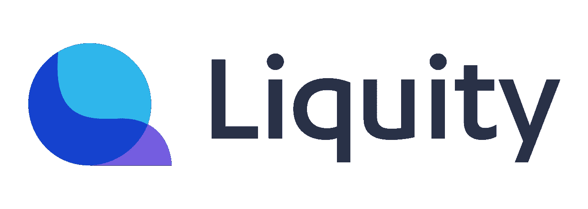
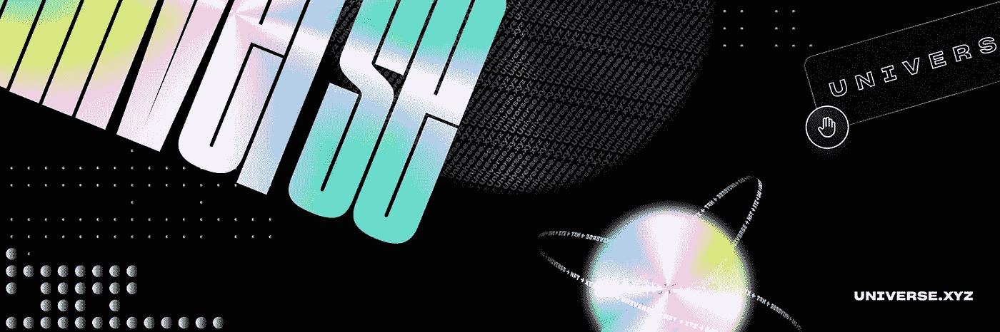

# 登月——市值低于 1 亿美元的项目

> 原文：<https://medium.com/coinmonks/shooting-for-the-moon-projects-under-100m-market-cap-986d0b12278?source=collection_archive---------66----------------------->

对于加密领域的小盘股项目来说，这是艰难的几个月，但取决于你对波动性的耐心和容忍度，现在可能是“买入下跌”的时候了

以下是一些关于在高风险、市值低于 1 亿美元的领域首先从哪里入手的想法:

挑战

*Liquity — $LQTY*

Cap =每[https://www.coingecko.com/en/coins/liquity](https://www.coingecko.com/en/coins/liquity)4200 万美元

当涉及到分散融资时，这个项目检查所有的框。甚至合同的前端也通过第三方应用程序进行了分散。

在我看来，Liquity 的真正力量来自合同的效率和天才。你可以以*0%的利息*向 ETH 借用该协议的稳定硬币 LUSD(该硬币已经稳定了近一年)

最重要的是，Liquity 提供了 110%的最低抵押品比率！

https://www.liquity.org/frontend

【https://docs.liquity.org/ 

[https://dune.xyz/dani/Liquity](https://dune.xyz/dani/Liquity)

[https://www.coingecko.com/en/coins/liquity-usd](https://www.coingecko.com/en/coins/liquity-usd)

元宇宙

*EnterDAO — $ENTR*

Cap =每 https://www.coingecko.com/en/coins/enterdao[1500 万美元](https://www.coingecko.com/en/coins/enterdao)

EnterDAO 是我在过去几个月中看到的富有成效的项目之一。这个团队坚持不懈。他们已经推出了两种产品。我喜欢他们两个，我认为他们有很大的上升空间。

#1 — LandWorks —元宇宙土地租赁市场

# 2—meta portal—“Steam for Web3”是一个独特且极其有用的应用程序，允许单点访问所有类型的 web 3 游戏/世界

[https://landworks.xyz/](https://landworks.xyz/)

[https://metaportal.gg/](https://metaportal.gg/)

[https://medium . com/enter Dao/enter Dao-white paper-27447 f 7400 c8](/enterdao/enterdao-whitepaper-27447f7400c8)

[https://dao.enterdao.xyz/yield-farming](https://dao.enterdao.xyz/yield-farming)

NFT 平台

*宇宙。XYZ——XYZ *

每 https://www.coingecko.com/en/coins/universe-xyz5400 万美元

这是一个有着疯狂潜力和勤奋团队的项目。你可以花上几天时间来看看这个估值范围内的其他项目，但我可以为你节省时间，并向你保证,$XYZ 将进入你的前 5 名。

尽管他们已经推出了两个自己的 NFT 项目(看看团队，你会看到一些其他成功推出的领导者/成员)，平台的大部分仍在进行中。

他们正在创建一个由社区驱动、以社会为中心的 NFT 中心，拥有广泛的分销和媒体工具。xyzDAO 使得这个平台成为少数几个真正去中心化的 NFT 平台之一，并且有着现实的未来。

[https://docs.universe.xyz/](https://docs.universe.xyz/)

【https://github.com/UniverseXYZ/UniverseXYZ-Whitepaper 号

【https://universe.xyz/ 

[https://opensea.io/collection/polymorphs](https://opensea.io/collection/polymorphs)

奖励:定义工具

*巴恩布里奇的聪明阿尔法——韦瑟/$邦德*

虽然我很喜欢 BarnBridge 项目，但是$BOND 令牌本身正在经历一些重大的变化，并且有一个新的 DAO 正在开发中，所以它不符合我目前推荐项目的标准。

然而，通过 BarnBridge 应用程序获得的这个工具值得一看。SMART Alpha 是我在 DeFi 中见过的最酷的财务机制之一，从安全和专业的角度来看，它非常可靠。

这太复杂了，无法在这里总结，但通过其划时代的池系统，你可以在下跌价格保护和杠杆化上涨敞口之间进行选择。查看下面的媒体链接，了解更多信息。

[https://medium . com/barn bridge/announcing-smart-alpha-5 EC 7 b 0 f 36d 89](/barnbridge/announcing-smart-alpha-5ec7b0f36d89)

 [## 巴恩布里奇

### 编辑描述

app.barnbridge.com](https://app.barnbridge.com/smart-alpha/pools) 

> 加入 Coinmonks [电报频道](https://t.me/coincodecap)和 [Youtube 频道](https://www.youtube.com/c/coinmonks/videos)了解加密交易和投资

# 另外，阅读

*   [如何匿名购买比特币](https://coincodecap.com/buy-bitcoin-anonymously) | [比特币现金钱包](https://coincodecap.com/bitcoin-cash-wallets)
*   [币安 vs FTX](https://coincodecap.com/binance-vs-ftx) | [最佳(索尔)索拉纳钱包](https://coincodecap.com/solana-wallets)
*   [比诺莫评论](https://coincodecap.com/binomo-review) | [斯多葛派 vs 3Commas vs TradeSanta](https://coincodecap.com/stoic-vs-3commas-vs-tradesanta)
*   【Capital.com】|[港加密借贷平台](https://coincodecap.com/crypto-lending-hong-kong)
*   [如何在 Uniswap 上交换加密？](https://coincodecap.com/swap-crypto-on-uniswap) | [A-Ads 评论](https://coincodecap.com/a-ads-review)