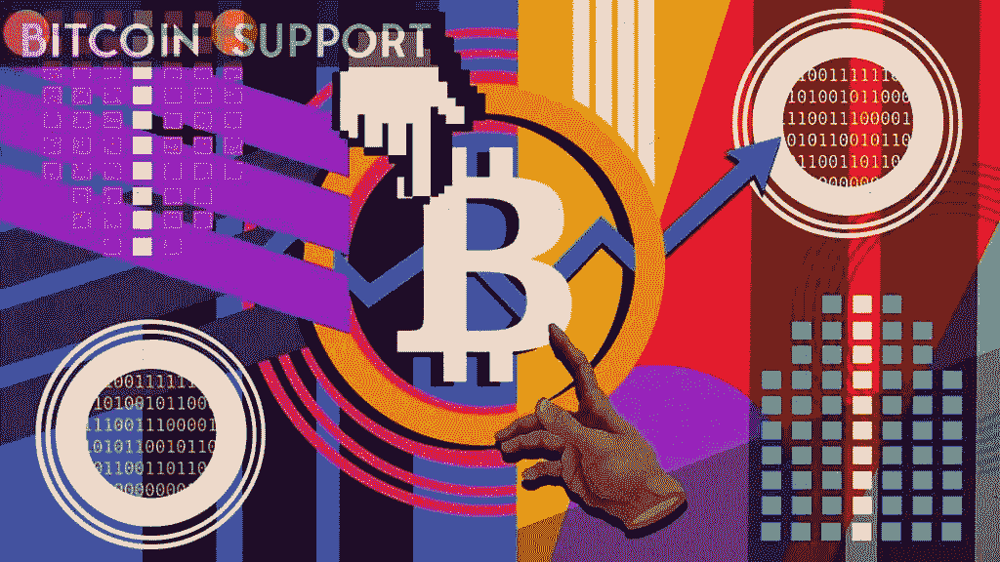
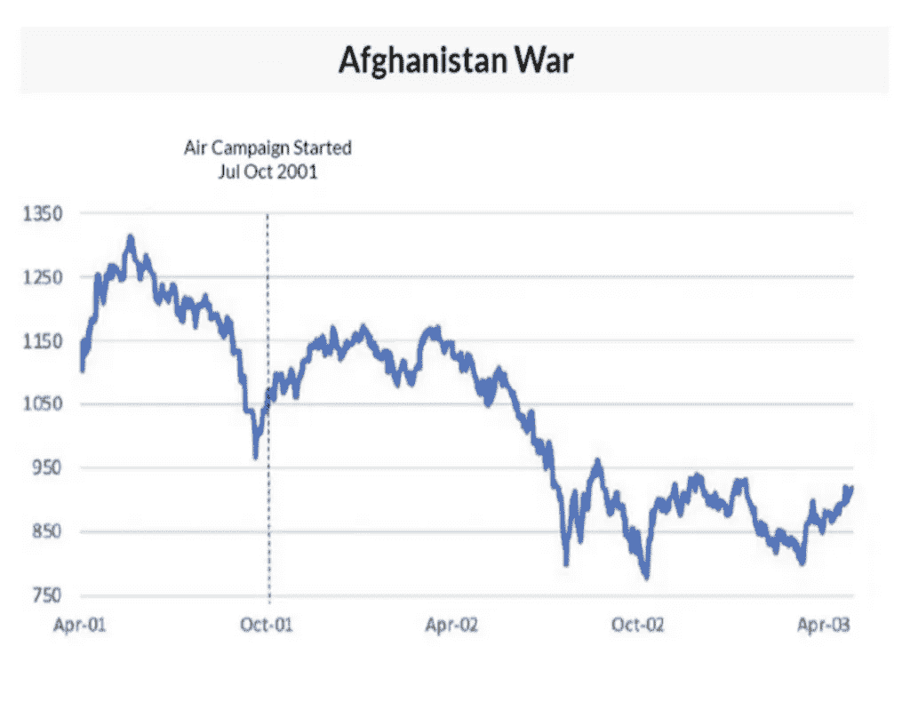

# 短期比特币反弹，抛售在 H2:标准普尔 500 冲突历史:QCP

> 原文：<https://medium.com/coinmonks/short-term-bitcoin-bounce-sell-off-in-h2-s-p-500-conflict-history-qcp-bda058792ef4?source=collection_archive---------75----------------------->

**Visit our website:-** [**https://bitcoinsupports.com/**](https://bitcoinsupports.com/)

当前的宏观经济形势与 2001 年阿富汗战争时相似，当时美国股市基准在入侵后飙升，为进一步下跌扫清了道路。根据 QCP 资本的说法，如果之前的战斗对标准普尔 500 指数的影响有任何指示作用，那么押注比特币长期反弹的多头将会失望。总部位于新加坡的 crypto trading 公司发布的一项研究显示，华尔街的基准股票指数 S & P 500 在早期头条新闻中下跌，预计在涉及一个超级大国的前五场战争中，有四场会发生军事冲突，但在敌对行动爆发后的几个月中反弹。唯一一次没有发生这种情况是在 2001 年入侵阿富汗期间。标准普尔 500 指数在入侵后的上涨在三个月内见顶，随后恢复了与互联网泡沫破裂相关的低迷，并创下了新的熊市低点。根据 QCP 的说法，这次风险资产预计会遵循类似的路径，因为今天的宏观经济基本面与 21 年前相似。在周一发布的一份研究报告中，它写道，“鉴于历史趋势，我们预计全球市场在短期内将保持支撑。”"然而，考虑到当前的宏观经济挑战，我们仍然非常谨慎."“考虑到相似性，与当前情景最相似的是 2001 年的阿富汗战争。由于网络去杠杆化，市场面临压力。2.滞胀的威胁，通货膨胀率达到 3.5%，是十年来的最高水平，”QCP 说。“在阿富汗战争期间，市场经历了为期三个月的缓解反弹，随后恢复低迷并跌破入侵后的低点。”

**Visit our website:-** [**https://bitcoinsupports.com/**](https://bitcoinsupports.com/)

虽然加密货币社区的许多人认为比特币是黄金的数字版，但历史数据表明这是一种风险投资。上周，加密货币与标准普尔 500 的 60 天相关性达到新高。自 11 月中旬以来，由于担心美国美联储将比预期更早收紧流动性以控制通胀，市场基本处于守势。两周前，当俄罗斯和乌克兰的紧张局势开始升级时，比特币已经从 11 月 10 日创下的 69，000 美元的历史高点下跌了 35%以上。

美联储和其他央行可能会因此面临更大的压力，要求其减少流动性。美联储预计将在本月将借贷成本提高 25 个基点，随后在年底前至少再加息 25 个基点。正如周一的《先行者美洲》(First Mover Americas)所报道的，高盛(Goldman Sachs)预计美联储明年将加息四次。阿富汗战争和当前冲突的一个显著区别是，当时的利率是 6.5%“这为艾伦·格林斯潘的美联储提供了很大的回旋余地，可以将利率一直下调至 1%，”QCP 说这一次，市场面临着类似的压力，但美联储已经用尽了其他宽松政策。利率只能从这里上升，美联储的资产负债表只能减少。"

**访问我们的网站:-**[**https://bitcoinsupports.com/**](https://bitcoinsupports.com/)

**免责声明:以上为作者观点，不应视为投资建议。读者应该自己做研究。**

> 加入 Coinmonks [电报频道](https://t.me/coincodecap)和 [Youtube 频道](https://www.youtube.com/c/coinmonks/videos)了解加密交易和投资

# 另外，阅读

*   [分散交易所](https://coincodecap.com/what-are-decentralized-exchanges) | [比特 FIP](https://coincodecap.com/bitbns-fip) | [Pionex 评论](https://coincodecap.com/pionex-review-exchange-with-crypto-trading-bot)
*   [用信用卡购买密码的 10 个最佳地点](https://coincodecap.com/buy-crypto-with-credit-card)
*   [百佳卡达诺钱包](https://coincodecap.com/best-cardano-wallets) | [Bingbon 副本交易](https://coincodecap.com/bingbon-copy-trading)
*   [印度最佳 P2P 加密交易所](https://coincodecap.com/p2p-crypto-exchanges-in-india) | [柴犬钱包](https://coincodecap.com/baby-shiba-inu-wallets)
*   [八大加密附属计划](https://coincodecap.com/crypto-affiliate-programs) | [eToro vs 比特币基地](https://coincodecap.com/etoro-vs-coinbase)
*   [最佳以太坊钱包](https://coincodecap.com/best-ethereum-wallets) | [电报上的加密货币机器人](https://coincodecap.com/telegram-crypto-bots)
*   [交易杠杆代币的最佳交易所](https://coincodecap.com/leveraged-token-exchanges) | [购买弗洛基](https://coincodecap.com/buy-floki-inu-token)