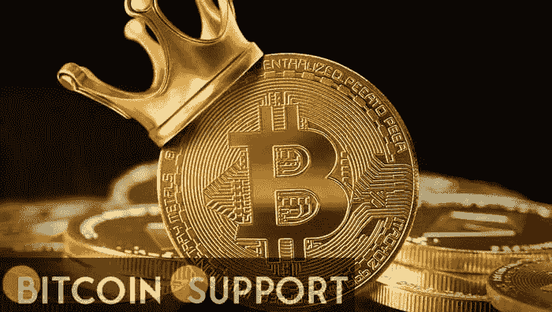
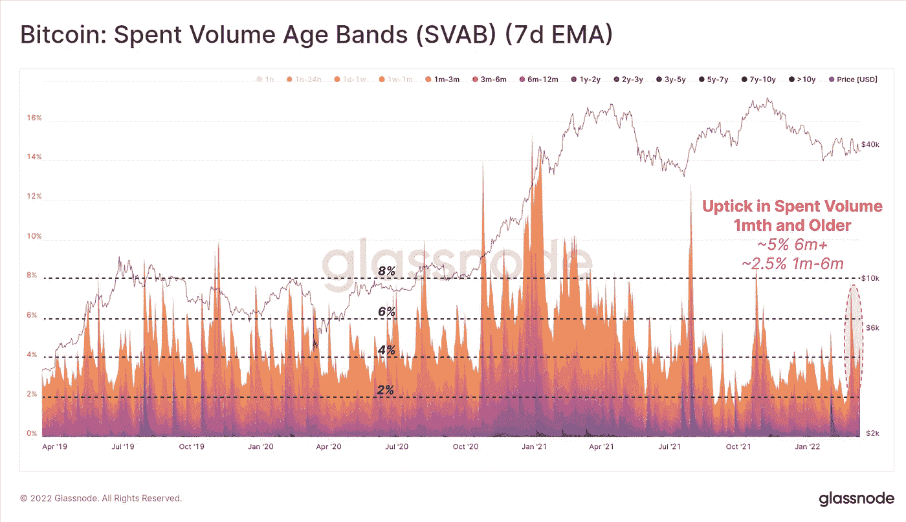
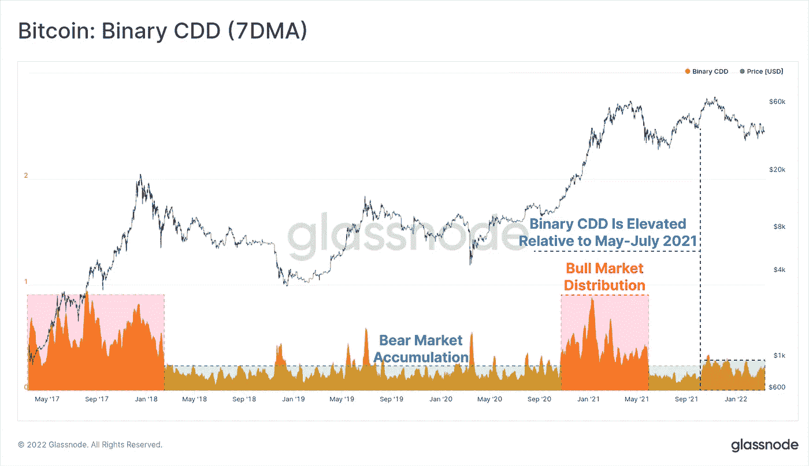
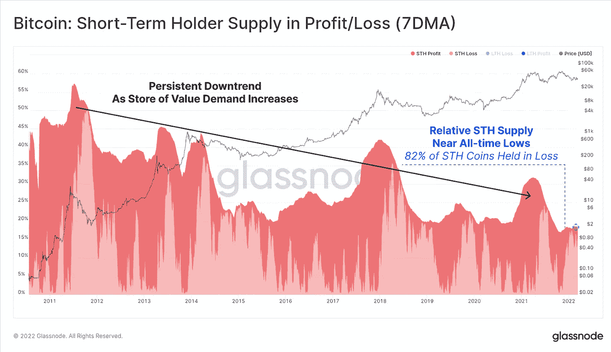

# 短期比特币买家成为长期比特币持有者

> 原文：<https://medium.com/coinmonks/short-term-bitcoin-buyers-become-long-term-bitcoin-holders-24a652101fb3?source=collection_archive---------97----------------------->

**Visit our website:-** [**https://bitcoinsupports.com/**](https://bitcoinsupports.com/)

尽管上周长期硬币销量大幅增加，但随着更多的短期供应成为长期供应，霍德林仍是推荐的方法。长期比特币投资者已经增加了他们的支出，这表明他们正在消除市场风险，但 hodling 仍然是最受欢迎的投资技术。

根据区块链分析公司 Glassnode 的数据，上周不确定的宏观经济条件可能导致长期投资者抛售增加，并动摇了一些短期持有人的投资。六个月以上的硬币贡献了上周总支出的 5%，这是自去年 11 月以来从未有过的数字。

持有硬币少于 155 天的短期持有者(STH)数量持续下降，但这并不是因为抛售。虽然出售某物更为正常，但 Glassnode 认为，目前某物供应的下降“只有在大量硬币供应处于休眠状态并达到 155 天年龄界限，成为长期持有者供应时才会发生。”只要总体抛售压力持续存在，比特币(BTC)的累积模式就不会反映熊市行为。此外，尽管目前抛售激增，但超过 75%的 BTC 流通供应已休眠至少六个月。根据 Glassnode 的说法，这表明投资者仍然主要是霍德勒。

**Visit our website:-** [**https://bitcoinsupports.com/**](https://bitcoinsupports.com/)

**长期比特币持有者上周增加了抛售**

根据 Glassnode 的数据，抛售发生在一个非常稳定的市场中，该市场避免了任何大幅波动，今年大部分时间都是区间波动。这应该是一种推迟熊市周期结束的手段。根据 CoinGecko 的说法，自去年 5 月比特币价格在 15 天内从 58，771 美元跌至 34，977 美元以来，还没有出现过大规模的退市。上一次 BTC 累积接近熊市是在 5 月份的投降事件到 10 月份。

**Visit our website:-** [**https://bitcoinsupports.com/**](https://bitcoinsupports.com/)

**BTC 积累模式仍高于熊市趋势**

STH supply 的盈亏比仍然接近 2021 年年中达到的历史低点。根据 Glassnode 的数据，目前有 82%的 STH 硬币处于亏损状态，这表明市场正接近熊市的尾声，精明的投资者将硬币冷藏起来，等待利润率提高。

**Visit our website:-** [**https://bitcoinsupports.com/**](https://bitcoinsupports.com/)

**短期持有人亏损接近历史最高水平**

正如上周《BTC 市场最新消息》所提到的，外汇外流仍很严重。上周，比特币基地经历了五年多来最大规模的退出，31，130 名 BTC 退出了该平台。这些资金外流反映出比特币作为现代投资者投资组合中的必备资产越来越受欢迎，同时也反映出人们越来越不愿意匆忙变现。

**访问我们的网站:-**[**https://bitcoinsupports.com/**](https://bitcoinsupports.com/)

**免责声明:以上为作者观点，不应视为投资建议。读者应该自己做研究。**

> 加入 Coinmonks [电报频道](https://t.me/coincodecap)和 [Youtube 频道](https://www.youtube.com/c/coinmonks/videos)了解加密交易和投资

# 另外，阅读

*   [Bitsgap 审查](/coinmonks/bitsgap-review-a-crypto-trading-bot-that-makes-easy-money-a5d88a336df2) | [Quadency 审查](/coinmonks/quadency-review-a-crypto-trading-automation-platform-3068eaa374e1) | [Bitbns 审查](/coinmonks/bitbns-review-38256a07e161)
*   [加密复制交易平台](/coinmonks/top-10-crypto-copy-trading-platforms-for-beginners-d0c37c7d698c) | [Coinmama 评论](/coinmonks/coinmama-review-ace5641bde6e)
*   [印度的加密交易所](/coinmonks/bitcoin-exchange-in-india-7f1fe79715c9) | [比特币储蓄账户](/coinmonks/bitcoin-savings-account-e65b13f92451)
*   [OKEx vs KuCoin](https://coincodecap.com/okex-kucoin) | [摄氏替代品](https://coincodecap.com/celsius-alternatives) | [如何购买 VeChain](https://coincodecap.com/buy-vechain)
*   [币安期货交易](https://coincodecap.com/binance-futures-trading)|[3 commas vs Mudrex vs eToro](https://coincodecap.com/mudrex-3commas-etoro)
*   [如何购买 Monero](https://coincodecap.com/buy-monero) | [IDEX 评论](https://coincodecap.com/idex-review) | [BitKan 交易机器人](https://coincodecap.com/bitkan-trading-bot)