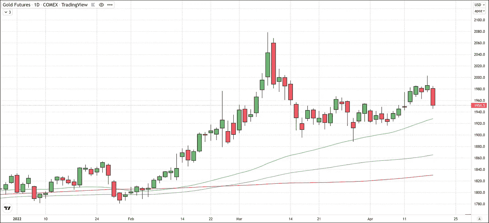
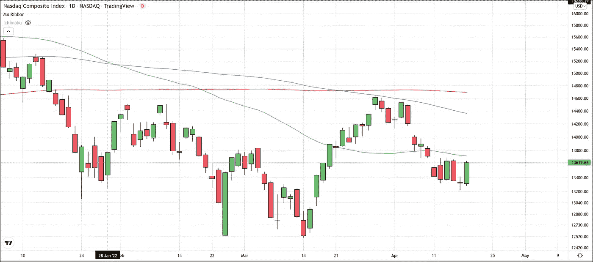
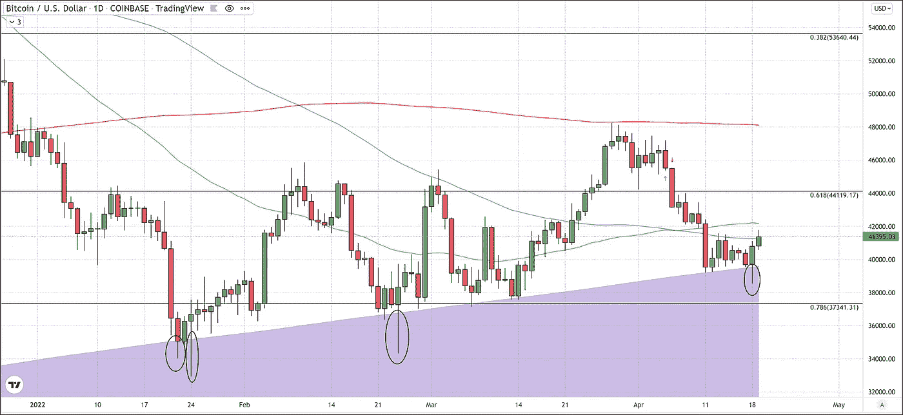

# BTC 短期反弹

> 原文：<https://medium.com/coinmonks/short-term-bounce-in-btc-98df269328d9?source=collection_archive---------66----------------------->

今天，比特币在触及 38500 美元的低点后继续上涨，然后出现了戏剧性的反弹。目前，截至美国东部时间下午 3 点，比特币的交易价格约为 41，440 美元。这相当于旗舰加密货币当天上涨了 1.65%或 700 美元，本周迄今为止上涨了 2，000 美元。

本周的上涨受到风险资产反弹的推动，纳斯达克综合指数今天大幅上涨。纳斯达克综合指数的表现超过了市值排名第一的加密公司，上涨了约 300 点，涨幅超过 2%，几乎抹去了前一周的损失。避险资产经历了相反的势头，黄金期货下跌近 2%，抹去了上周的涨幅，当天交易下跌超过 30 美元。

随着当前的通胀水平推动美联储迅速实施一轮货币紧缩政策，向正常利率靠拢，这种避险市场情绪能持续多久？我们可能看到的只是卖空者在回归潜在的避险行为之前的一次暂停或一轮获利回吐。

比特币昨天的动作还是非常关键的，其日内的回升让 600 日均线的支撑完好无损。这是 BTC 在过去三个月中第四次经历远低于 600 天均线的长期低点，然后反弹并收盘回到该支撑区域上方。在这四种情况下，BTC 第二天都取得了不错的收益。

如果比特币要避免重返 1 月份 34700 美元左右的低点，并从当前价格反弹，那么它需要保持这一水平。如果它不能守住这个区域，下一个支撑位是 37，300 美元。如果我们不能在 41，250 美元上方收盘，阻力可能仍然在 100 日均线；在此之上是位于 42，175 美元的 50 天均线。

随着所有宏观指标都指向高风险资产面临更大压力，今天的上涨可能只是一次死猫反弹。因此，过去两天比特币的上涨还不能被归类为反弹的开始，或从看跌转向看涨。我们需要突破 50 日均线才能做出这个决定。

对于任何有兴趣阅读我更多文章的人，只需点击这个[链接](https://www.thegoldforecast.com/bitcoin)。

> 加入 Coinmonks [电报频道](https://t.me/coincodecap)和 [Youtube 频道](https://www.youtube.com/c/coinmonks/videos)了解加密交易和投资

# 另外，阅读

*   [印度最佳 P2P 加密交易所](https://coincodecap.com/p2p-crypto-exchanges-in-india) | [柴犬钱包](https://coincodecap.com/baby-shiba-inu-wallets)
*   [八大加密附属计划](https://coincodecap.com/crypto-affiliate-programs) | [eToro vs 比特币基地](https://coincodecap.com/etoro-vs-coinbase)
*   [最佳以太坊钱包](https://coincodecap.com/best-ethereum-wallets) | [电报上的加密货币机器人](https://coincodecap.com/telegram-crypto-bots)
*   [交易杠杆代币的最佳交易所](https://coincodecap.com/leveraged-token-exchanges) | [购买 Floki](https://coincodecap.com/buy-floki-inu-token)
*   [3 commas vs . Pionex vs . crypto hopper](https://coincodecap.com/3commas-vs-pionex-vs-cryptohopper)|[Bingbon Review](https://coincodecap.com/bingbon-review)
*   [加密复制交易平台](/coinmonks/top-10-crypto-copy-trading-platforms-for-beginners-d0c37c7d698c) | [如何在 WazirX 上购买比特币](/coinmonks/buy-bitcoin-on-wazirx-2d12b7989af1)