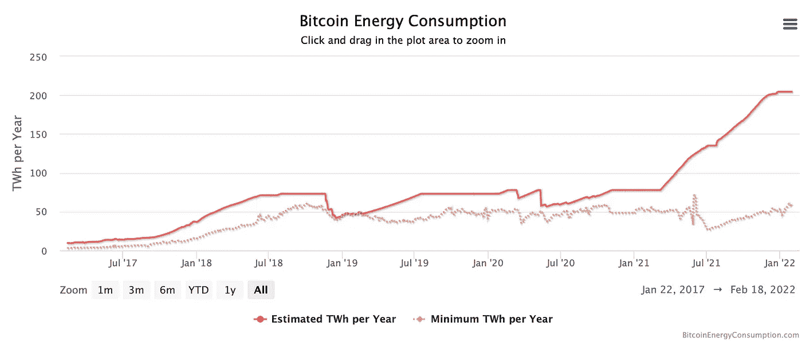
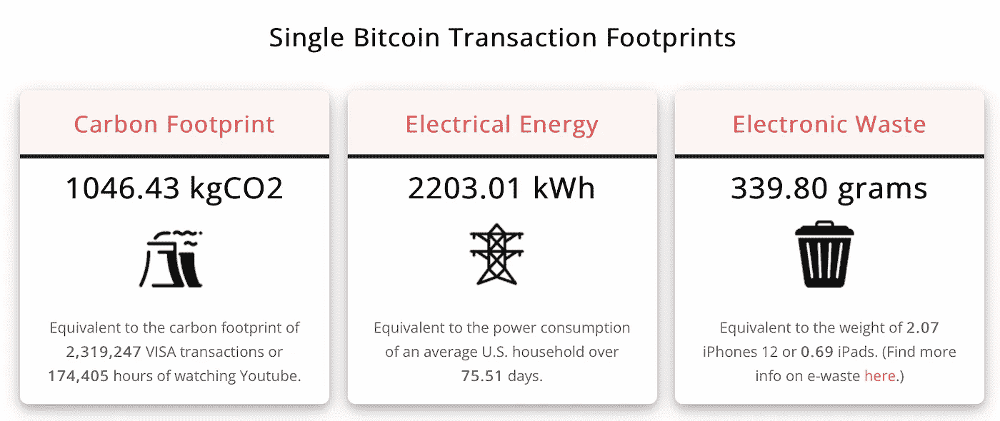
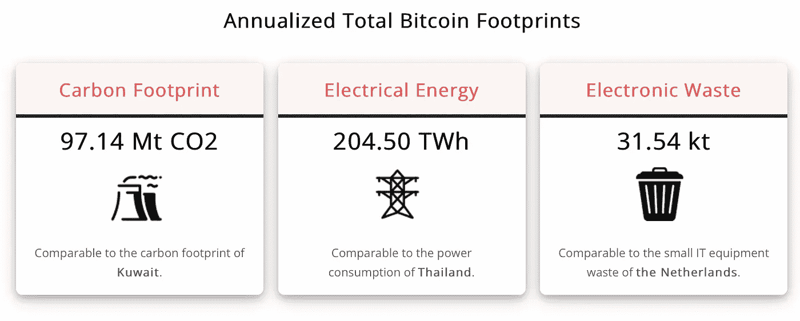
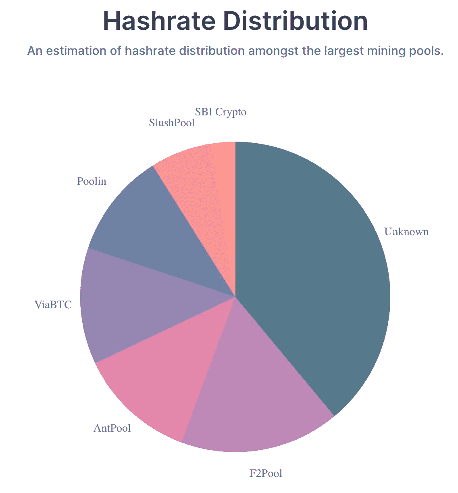
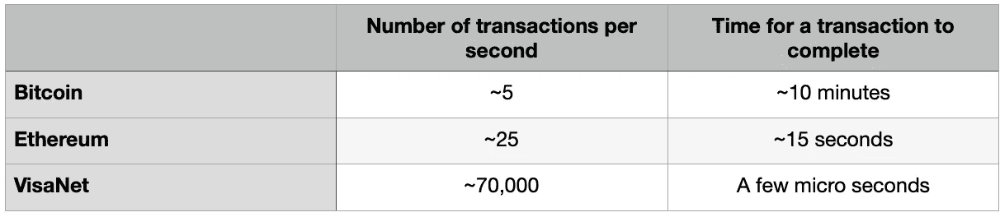

# 以太坊和比特币区块链的缺点

> 原文：<https://medium.com/coinmonks/shortcomings-with-ethereum-and-bitcoin-blockchains-9a7b3438bda2?source=collection_archive---------14----------------------->

在完成我的 DeFi 介绍系列文章后，我想把我的一些钱投资到以太坊区块链上臭名昭著的分散流动性池中，以赚取存款利息。我想在流动资金池中投资 100 美元(是的，我很穷)，而我被要求为存入这 100 美元支付的交易费是令人难以置信的 300 美元。

现在，分散的协议被制定出来，把资金带给普通人，减少中间代理人的数量。然而，对于普通人来说，100 美元的存款收取 3 倍的交易费似乎并不划算。区块链以太坊的交易费用与交易中转移的以太量不成比例。如果我想在流动性池中投资 10，000 美元，交易费可能仍在 300 美元左右。因此，在当前的情况下，并非所有人都能从分权中获益。

不仅仅是高昂的交易费用，以太坊和比特币还面临着其他重大问题。

**工作证明-**

如果你了解比特币，你可能知道比特币开采所消耗的巨大能量。根据剑桥替代金融中心(CCAF)的数据，比特币目前(截至 2021 年 5 月)每年消耗约 110 太瓦时——占全球电力生产的 0.55%，或大致相当于马来西亚或瑞典等小国的年度能源消耗，因为其共识机制需要大量的 CPU 周期——证明有效。保持协议的分散和不可信是一个沉重的代价。

以下是摘自[数码漫画](https://digiconomist.net/bitcoin-energy-consumption/)的片段

大多数人会说这些能量可以分配到更好的事情上，我同意。问题不仅仅是使用的能源数量，而是这个世界上有多少人能够获得如此多的能源来开采加密货币。就我个人而言，我再也负担不起在笔记本电脑里挖掘比特币了。由于需要大量的能量和计算能力，比特币的大部分矿池被少数富有的玩家控制。

下面的饼状图是从[这个](https://www.blockchain.com/charts/pools)来源借来的。

正如你在上面的图表中看到的，排名前 4-5 的私人玩家可以相互勾结，对比特币网络发起 51%的攻击，因为他们拥有所需的计算能力，并危及网络的安全。(虽然没那么容易，但理论上是可能的)

**交易时间和每秒交易次数-**

不仅仅是高昂的交易费用，以太坊区块链网络还面临着高交易时间和低交易吞吐量的问题。解决问题的解决方案的基本要求是提供比现有解决方案更好的解决方案。因此，如果比特币或以太坊等加密货币想要取代主流支付，它们必须至少与当前的集中支付网络一样快。VisaNet 是一个有 50 年历史的电子支付系统，其表现远远好于世界上两大加密货币。VisaNet 不是分散的。

显然，比特币和以太坊目前的状态无法与现有的支付机制竞争。

**巨大规模的节点-**

单个以太坊节点占用的空间量目前为 690Gb。在个人笔记本电脑或移动设备上运行单个节点是不可行的。目前有几个解决这个问题的方法，您可以只存储块的默克尔树，而不是在您的机器上运行完整的节点，但是这些方法不允许节点完全参与生态系统。

然而，这些问题并不新鲜——它们和区块链本身一样古老，而且这些问题并不妨碍区块链作为一种技术的进步。在我写这篇博客的时候，以太坊正致力于部署利益证明——一种替代工作证明的共识机制，它将消耗更少的能量，并允许每个人进行验证(验证是采矿的利益证明的对等物)。在 Eth 2.0 中，以太坊区块链将被分片，以减少设备中容纳区块链节点所需的空间，并增加每秒的事务数量。在我们即将到来的系列中，我们将详细讨论以太坊链的扩展以及以太坊社区计划如何解决这些问题。许多令人兴奋的事情即将到来，敬请关注！

本文原载于[blockchainseasy . in](https://blockchainiseasy.in/)
https://blockchainseasy . in/缺点-与-以太坊-与-比特币-区块链/

> 加入 Coinmonks [电报频道](https://t.me/coincodecap)和 [Youtube 频道](https://www.youtube.com/c/coinmonks/videos)了解加密交易和投资

## 另外，阅读

*   [去中心化交易所](https://coincodecap.com/what-are-decentralized-exchanges)|[Bitbns FIP](https://coincodecap.com/bitbns-fip)|[Bingbon 评论](https://coincodecap.com/bingbon-review)
*   [用信用卡购买密码的 10 个最佳地点](https://coincodecap.com/buy-crypto-with-credit-card)
*   [加拿大最佳加密交易机器人](https://coincodecap.com/5-best-crypto-trading-bots-in-canada) | [Bybit vs 币安](https://coincodecap.com/bybit-binance-moonxbt)
*   [阿联酋 5 大最佳加密交易所](https://coincodecap.com/best-crypto-exchanges-in-uae) | [SimpleSwap 评论](https://coincodecap.com/simpleswap-review)
*   购买 Dogecoin 的 7 种最佳方式
*   [最佳期货交易信号](https://coincodecap.com/futures-trading-signals) | [流动性交易所评论](https://coincodecap.com/liquid-exchange-review)
*   [用于 Huobi 的加密交易信号](https://coincodecap.com/huobi-crypto-trading-signals) | [Swapzone 审查](/coinmonks/swapzone-review-crypto-exchange-data-aggregator-e0ad78e55ed7)
*   最佳[密码交易机器人](https://coincodecap.com/best-crypto-trading-bots) | [购买索拉纳](https://coincodecap.com/buy-solana) | [矩阵导出评论](https://coincodecap.com/matrixport-review)
*   [Coldcard 评论](https://coincodecap.com/coldcard-review) | [BOXtradEX 评论](https://coincodecap.com/boxtradex-review)|[unis WAP 指南](https://coincodecap.com/uniswap)
*   [比特币基地评论](/coinmonks/coinbase-review-6ef4e0f56064) | [德里比特评论](/coinmonks/deribit-review-options-fees-apis-and-testnet-2ca16c4bbdb2) | [FTX 评论](/coinmonks/ftx-crypto-exchange-review-53664ac1198f)