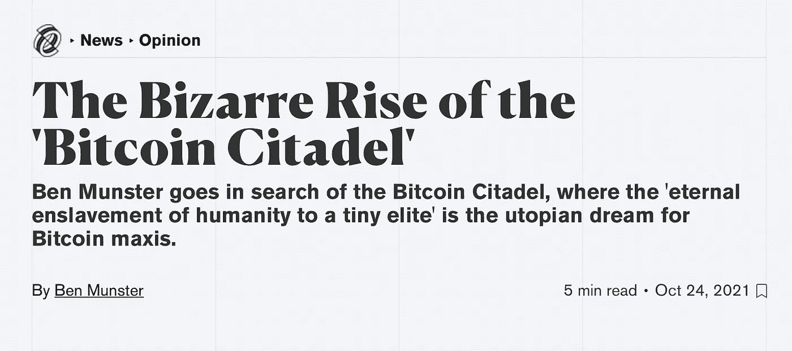
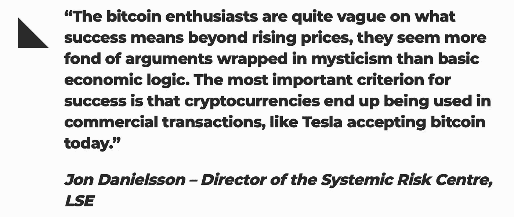

# 我们应该害怕比特币贵族吗？

> 原文：<https://medium.com/coinmonks/should-bitcoin-aristocrats-do-violence-to-themselves-cdc2c0c315c9?source=collection_archive---------11----------------------->

Source: [https://elements.envato.com/fr/king-with-his-sword-J54A6F](https://elements.envato.com/fr/king-with-his-sword-J54A6F)

我们仍然要问自己这个社会的极端加密货币化的问题。当然，我们的鼻子在里面，当然，我们的思想在车把上，但是这不应该阻止我们想要对我们周围发生的事情保持客观。

分权金融并非一切皆白。不，很明显，事实上也不全是黑色的。这个问题必须问清楚:今天的比特币持有者是明天的百万富翁吗？由于比特币是一种有限的商品(2100 万比特币，而不是额外的硬币)，这在数学上限制了持有者的数量，不是吗？

所以，在明天的世界里，超级富豪将是那些拥有比特币的人，其余的人将会很悲惨(即使他们有美元？)

# 比特币贵族有哪些？

伦敦经济学院的学者乔恩·丹尼尔松在优秀的[经济政策和研究中心](https://voxeu.org/article/what-happens-if-bitcoin-succeeds)发表了[一篇文章](https://voxeu.org/article/what-happens-if-bitcoin-succeeds)，描绘了一个“比特币贵族”不情愿地创造了一个极端不平等的世界的未来，他认为比特币持有者是当今的新贵族吗？基本上，他的观点是，如果比特币成为最高货币(在比特币货币至上的意义上)，那么比特币制造者将成为一个*不健康经济的贵族。*封闭而矛盾的资本主义，美国人无中生有的致富梦变成了纯粹的异端邪说。

是的，这是一个财阀政治，比特币原本是为了让所有人的金融民主化。那太可惜了。

一个惊人的反乌托邦，因为那些拥有大量密码的人和其他人之间的差距可能太大了，他们(还)不知道这是什么。

你可以在这里读这篇文章，或者在那里听播客。我不想说，但约翰·丹尼尔松也是“加密货币没有意义”一文的作者……我是不是在说，我是不是什么都没说？

在一个简单的场景中，后者可能成为其他人的金融“主宰”。然而，如果不是因为钱包更鼓，其他人将一无所有。如果后者又蠢又蠢又贱又贪婪，会怎么样？

他们将不惜一切代价保护所谓的“比特币城堡”，这是一种终极城堡，比特币统治者将在这里全力捍卫他们的比特币，以保持世界的统治者地位。

Source: [https://decrypt.co/84125/the-bizarre-rise-of-the-bitcoin-citadel](https://decrypt.co/84125/the-bizarre-rise-of-the-bitcoin-citadel)

他解释说，今天的比特币所有者将成为“世界上最富有的人”，他们“可以与统治帝国几个世纪的国王和皇帝相媲美”。他们将真正拥有所有的钱。他们可以买任何他们想要的东西。没有很多。与如今通过养老基金和共同基金等拥有资产的众多人相比，这只是一小部分人。”

约翰·丹尼尔松提出的非常有趣的一点是，除了作为“早期采用者”这一简单事实之外，这种领主制没有其他附加值。他们没有其他优点，也不会寻求帮助改善系统，而只是享受他们的富裕状况。作者是对的，我们不得不承认。

source: [https://beincrypto.com/bitcoin-aristocrats-pose-danger-to-new-adopters/](https://beincrypto.com/bitcoin-aristocrats-pose-danger-to-new-adopters/)

提交人补充说，他们不会对社会做出任何贡献，政府将被迫保护自己，并尽可能多地攻击他们。然后他得出致命的结论，比特币的价格将会为零，因为政府会禁止它…

事实上，正如 Emmanuel Young 在 Beincrypto 的文章中总结的那样，“虽然丹尼尔松的评论可能会被认为是批评性的，但实际上，他只是敦促社区关注“建设”，而不是获得“…如此正确…

这正是推动辩论需要理解的信息。我们不能忘记，贪婪的背后是比特币和加密货币，这是可以改善我们世界的真正技术。

## 我们有责任成为抵抗贵族的堡垒，尽管我们是不由自主的。这取决于我们(拥有比特币的人)是否屈服于支配他人的本能。

# 这种悲观的情景和比特币贵族们怎么办？

这篇文章或许令人沮丧，它只关注比特币，而没有从整体上考虑技术的巨大进步。用例与用法已经脱离了纯粹的金融，例如，非金融交易只是一个例子。

只沉湎于比特币，只在这里看到未来的贵族，是眼界大减……你不觉得吗？

> 加入 Coinmonks [电报频道](https://t.me/coincodecap)和 [Youtube 频道](https://www.youtube.com/c/coinmonks/videos)了解加密交易和投资

## 也阅读

 [## 杠杆代币[多头代币]终极指南

### 杠杆化令牌是具有杠杆化风险敞口的 ERC20 令牌，不考虑保证金、要求、管理…

medium.com](/coinmonks/leveraged-token-3f5257808b22)  [## 最佳加密交易所| 2021 年十大加密货币交易所

### 编辑描述

blog.coincodecap.com](https://blog.coincodecap.com/crypto-exchange)  [## 2021 年最佳加密交换平台| CoinCodeCap

### 如果我们看看今天的场景，许多加密货币交换平台提供了广泛的功能和深度…

blog.coincodecap.com](https://blog.coincodecap.com/best-swap-platforms)  [## 10 大最佳网上赌场[2021] |赢取免费 BTC | CoinCodeCap

### 编辑描述

blog.coincodecap.com](https://blog.coincodecap.com/best-online-casinos)  [## 2021 年最佳加密借贷平台| 6 大比特币借贷平台

### 获得比特币和其他加密货币的最佳贷款利率

medium.com](/coinmonks/top-5-crypto-lending-platforms-in-2020-that-you-need-to-know-a1b675cec3fa)  [## 2021 年 6 大最佳硬件钱包|顶级加密硬件钱包[更新]

### 最好的加密货币硬件钱包是绝对必要的。我们将在 NGRAVE、Ledger Nano X 和…

medium.com](/coinmonks/the-best-cryptocurrency-hardware-wallets-of-2020-e28b1c124069)  [## 2021 年最佳免费加密交易机器人

### 2021 年币安、比特币基地、库币和其他密码交易所的最佳密码交易机器人。四进制，位间隙…

medium.com](/coinmonks/crypto-trading-bot-c2ffce8acb2a)