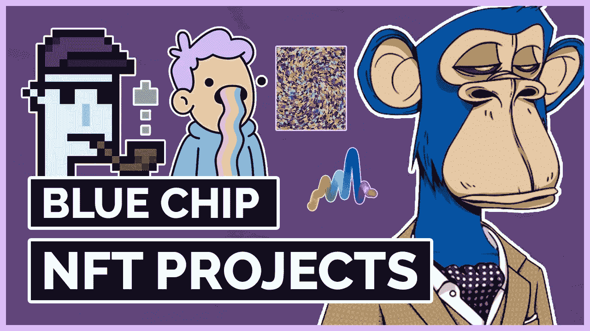

# 公司应该投资非技术产业吗？

> 原文：<https://medium.com/coinmonks/should-companies-invests-in-nfts-6132bb98ce45?source=collection_archive---------45----------------------->

How much would you pay for this jpeg?

首先是社区，然后是名人，现在是公司。

有一个钱包可以装下价值 1000 万美元的非金融资产。

MoonPay 是一家加密支付公司，成立于 2018 年。

贾斯汀比伯、阿什顿·库彻、史努比·道格和格温妮丝·帕特洛投资了他们。

随着 Tiger Global、Coatue 和其他大型机构投资者向他们砸钱，他们的估值高达 34 亿美元。

现在看看这个:

"上周六，Moonpay 以 265 Eth 或 759，000 美元的价格收购了 Bored Ape #9921 . "

"根据稀有工具公司的统计，目前，Moonpay 是无聊猿的第 28 大持有者，其账户价值至少为 3685.7589 瑞士法郎或 10504412 美元。"

他们拘留了 15 名 BAYC。

" Moonpay 还持有 16 件其他物品(没有柯达)，三只变异猿和一份 M1& M2 变异血清."

所以我不得不问:

为什么一个合法的公司会去买 NFT？

难道非正规金融工具不是投机性的、非理性的、低价值的、不稳定的准投资品，只受到那些在把午餐钱投入加密系统时主要大喊“stonks”和“yolo”的散户投资者的青睐吗？

MoonPay 的创始人有没有可能是 BAYC 特许经营权背后的宇迦实验室的秘密投资者？

会不会是非上市公司最终突破了机构投资者的防线？

有没有可能蓝筹非上市公司最终被市场视为一种稳定、可靠的投资类型？

How many blue chip NFTs do you own?

为什么 MoonPay 的董事会允许该公司向 NFTs 投资 1000 万美元并承担风险？

我能想到几个原因:

a)随着时间的推移，蓝筹股 NFT 的价格稳步攀升，证明是值得投资的。

不过，这只是一个很短的时间，所以它仍然有相当大的风险。

B) BAYC 实际上是蓝筹股中的佼佼者，主导着市场。

但这是加密的，几天之内一切都可能出问题，谁知道呢。

BAYC 背后的公司已经筹集了 4 . 5 亿美元，价值 40 亿美元，并且有一些重工业巨头支持他们，提高了他们的合法性。

d)1000 万美元对于月薪来说只是九牛一毛。

不管是不是小钱，原则才是最重要的。

e)也许他们想使用 BAYC 的版权并从中获得一些收入？

这是一个有趣的概念，业主可以从 NFTs 中生产商品和其他东西，并从中赚取收入。

f)他们想传达一个信息。

作为加密世界中的加密公司，拥有像 BAYC 这样的蓝筹股、知名和极其受欢迎的 NFT 将为他们购买合法性，使他们成为名人和杰出人士专属社区的一部分。

那么…是时候买辆自行车了？

虽然大多数散户投资者和像我这样的普通人肯定被价格压得喘不过气来，但也许是时候让有钱的公司开始考虑拥有一些非金融资产了？

你怎么看，公司应该拥有蓝筹 NFT 吗？

-

公司应该投资蓝筹非上市公司吗？

-

# startups # business # startupx # growth # success # social media # culture # entrepreneur # strategy # eth #比特币#加密货币# bayc # NFT # getrich # airdrop # branding # master card # line # revolution # web 3

> 加入 Coinmonks [电报频道](https://t.me/coincodecap)和 [Youtube 频道](https://www.youtube.com/c/coinmonks/videos)了解加密交易和投资

# 另外，阅读

*   [3 商业评论](/coinmonks/3commas-review-an-excellent-crypto-trading-bot-2020-1313a58bec92) | [Pionex 评论](https://coincodecap.com/pionex-review-exchange-with-crypto-trading-bot) | [Coinrule 评论](/coinmonks/coinrule-review-2021-a-beginner-friendly-crypto-trading-bot-daf0504848ba)
*   [莱杰 vs n rave](/coinmonks/ledger-vs-ngrave-zero-7e40f0c1d694)|[莱杰 nano s vs x](/coinmonks/ledger-nano-s-vs-x-battery-hardware-price-storage-59a6663fe3b0) | [币安评论](/coinmonks/binance-review-ee10d3bf3b6e)
*   [Bybit Exchange 审查](/coinmonks/bybit-exchange-review-dbd570019b71) | [Bityard 审查](https://coincodecap.com/bityard-reivew) | [Jet-Bot 审查](https://coincodecap.com/jet-bot-review)
*   [3 commas vs crypto hopper](/coinmonks/3commas-vs-pionex-vs-cryptohopper-best-crypto-bot-6a98d2baa203)|[赚取加密利息](/coinmonks/earn-crypto-interest-b10b810fdda3)
*   最好的比特币[硬件钱包](/coinmonks/hardware-wallets-dfa1211730c6) | [BitBox02 回顾](/coinmonks/bitbox02-review-your-swiss-bitcoin-hardware-wallet-c36c88fff29)
*   [BlockFi vs 摄氏度](/coinmonks/blockfi-vs-celsius-vs-hodlnaut-8a1cc8c26630) | [Hodlnaut 审核](/coinmonks/hodlnaut-review-best-way-to-hodl-is-to-earn-interest-on-your-bitcoin-6658a8c19edf) | [KuCoin 审核](https://coincodecap.com/kucoin-review)