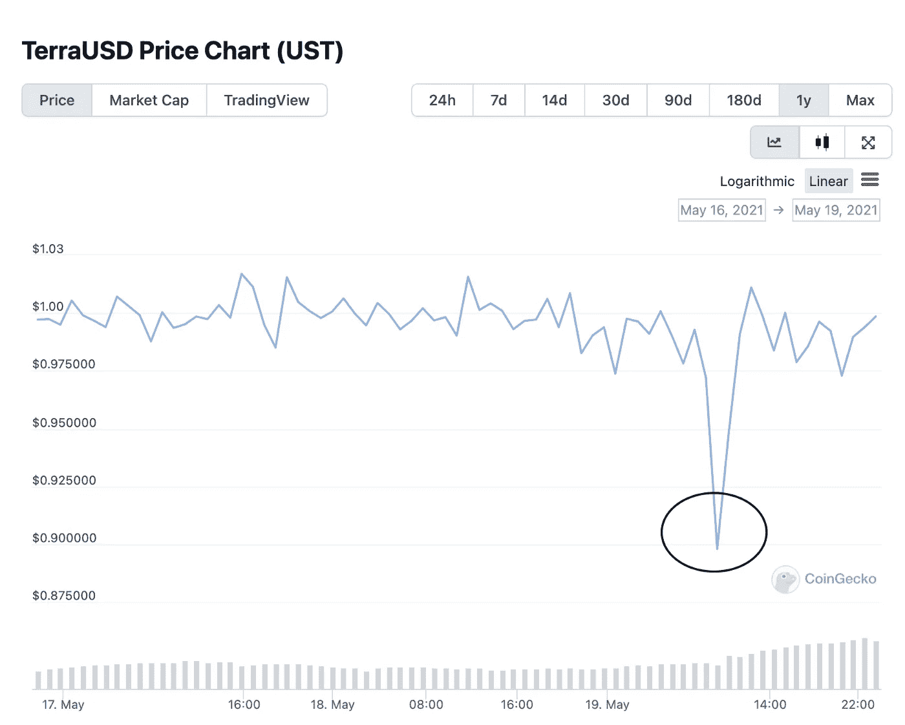
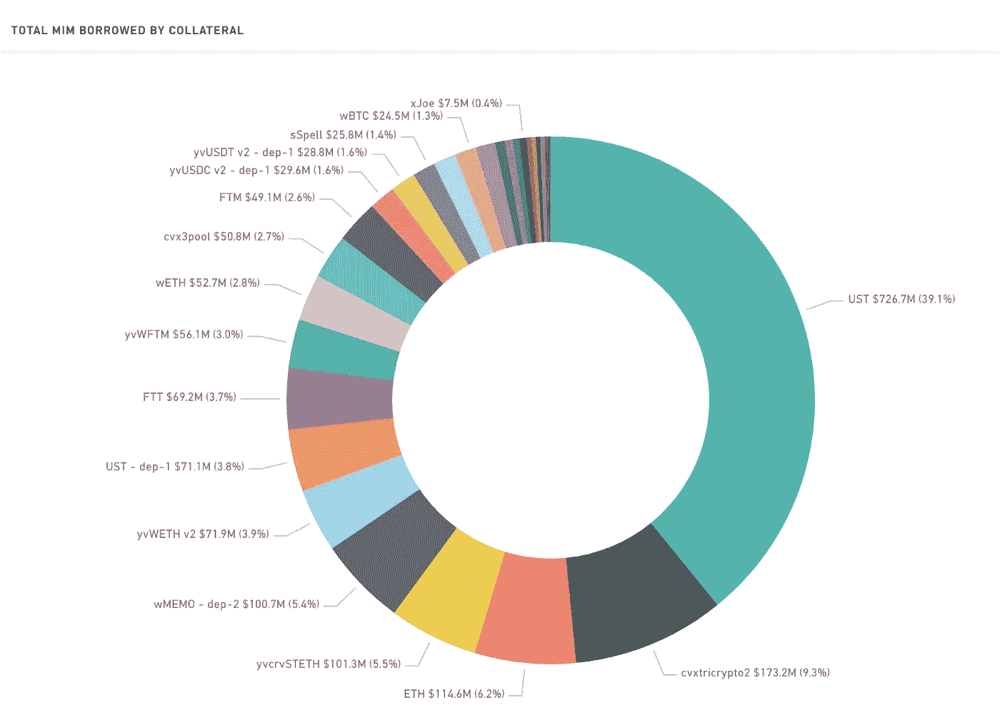
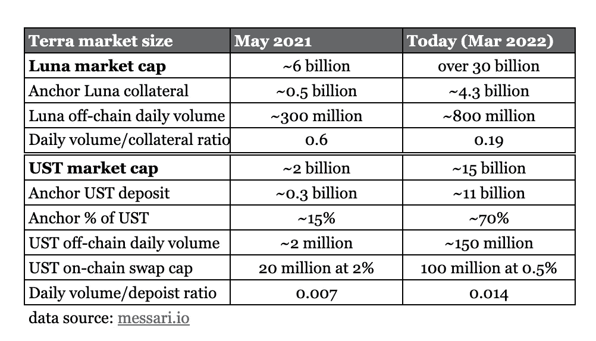

# 锚定协议中的存款人应注意 UST 脱钩风险吗？算法 stablecoins 设计是真的稳定还是脆弱？

> 原文：<https://medium.com/coinmonks/should-depositors-in-anchor-protocol-pay-attention-to-ust-de-peg-risk-8b59849d75bf?source=collection_archive---------1----------------------->

在上一篇[帖子](/algotune/20-yield-lunacy-or-brilliance-part-2-deep-dive-into-anchor-protocols-business-model-97f863dca2e)中，我们讨论了主要参与者如何在 Anchor 的生态系统中互动，以及他们参与的动机——最重要的是储户 19.5%的年利率和借款人获得借款报酬。

这个世界上有免费的午餐吗？19.5%的年利率是无风险的吗？在高效资本流动的世界里，更高的回报与更高的风险相关。鉴于锚协议提供的超高收益率，存款人和借款人承担了多大风险？在这篇文章中，我们试图从每个玩家的角度谈论风险，并希望通过这样做，我们可以提供一个锚协议利弊的全面看法。

# 存款人和 UST 脱钩风险

储户面临的最大风险是 UST 脱钩，因为储户在本金和利息支付上都持有 UST。如果 UST 对美元大幅贬值，高 APY 可能不足以抵消贬值带来的损失。值得强调的是，1:1 的 USD 美元挂钩汇率实际上在过去几次失去(定义为偏差超过 0.5%)，最显著的一次发生在 2021 年 5 月(偏差超过 5%)和 2022 年 1 月(偏差不到 1%)。每次 UST 失去联系汇率制，它都会设法迅速反弹(通常在几天内)。迄今为止，由于《议定书》通过微调挂钩机制的一些参数迅速采取了行动，它表现出了非常强的复原力。问题是——这种韧性能持续吗？挂钩机制是否存在设计风险？我们能从过去的事件中学到什么？存款人能做些什么来降低风险？

设计风险——概括一下(正如我们在本系列的[第一部分](/algotune/deep-dive-into-anchor-protocols-business-model-part-1-b0d02c522cf#8727)中讨论的)，UST 是一个算法分散的稳定核心。它得到了月神的支持，月神是 Terra 区块链的本土象征。该机制设计是为了激励个人在挂钩偏离时参与套利活动:(1)当 UST 交易超过 1 美元时，用户可以从链外交易所购买 luna，通过链内协议燃烧 Luna 以铸造新的 UST(支付少量掉期费用)，并在链外市场以溢价出售 UST，将差价收入囊中作为利润；(2)当 UST 交易低于 1 美元时，用户可以从链外交易所购买 UST，通过链上协议燃烧 UST 以铸造新的卢纳(支付少量掉期费用)，并出售卢纳以获得更多的 UST 并获利。基本上，套利者通过减少/增加 UST/UST 的供应量，帮助将美元/美元的汇率固定在 1:1。从这个意义上说，它是真正分散的，因为没有一个中央机构来保护联系汇率。

# 铁/泰坦

> Terra 不是以这种算法方式运行的唯一协议。“稳定铁币”就是其中的一种，而“稳定铁币脱钩”事件是迄今为止密码界最臭名昭著的“稳定铁币”危机之一——就连精明的投资者和企业家马克·库班也因此蒙受了损失。为了理解 UST 的脱钩风险，我们认为有必要研究一下铁是如何失败的。与 UST 类似，IRON 是一种算法分散的 stablecoins，由它的本地令牌 Titan 和 USDC 支持——一种中央化的菲亚特支持的 stablecoin。燃烧、铸造和挂钩机制也类似于 UST，但不是由一种类型的令牌(UST 的月亮)支持，而是由一篮子(~75%) USDC 和(~25%)泰坦支持。该机制自推出以来一直运行良好，直到 2021 年 6 月 16 日挂钩汇率突然崩溃。原生的 toke TITAN 在短短 24 小时内从 64 美元暴跌至接近零，总价值蒸发了 20 亿美元。怎么发生的？根据设计，当铁的交易低于 1:1 挂钩时，用户可以购买铁，燃烧它并获得 75%(比例可以改变)的 USDC 和 25%的新铸造的泰坦，出售泰坦以实现利润。铁的购买力(TITAN 的抛售压力)应该会支持铁(压制 TITAN)并推动挂钩回到 1:1。但是那天泰坦价格出了点问题。输入协议的价格被延迟，因为它使用了过去 10 分钟的时间加权平均价格(TWAP)。由于泰坦价格快速下跌，实时价格(来自交易所)远低于协议使用的 TWAP，导致无利可图的套利机会。为了简单起见，想象你在烧铁时应该得到 0.25 美元的泰坦，但是协议只给了你 0.24 美元，因为它使用了更高的泰坦价格，因此令牌更少。做上述套利交易已经无利可图。支持铁市场的动机因此消失了，更糟糕的是，错误的比率使得在市场上出售铁有利可图。简而言之，TITAN 的快速价格下跌和协议中有缺陷的设计导致了恐慌的“银行挤兑”，而自我实现的人类行为进一步加剧了这一问题，从本质上打破了挂钩，将 TITAN 推向了零。
> 
> 有趣的是，特拉·区块链(uses 露娜)使用了不同的神谕机制。取代使用 TWAP 价格，特拉区块链激励特拉验证者/节点参与对神谕的投票:(1)节点提交价格数据，例如来自链外集中交易所的卢纳/美元、卢纳/USDT 和 USDT/美元价格；(2)节点对 Luna 价格的投票；(3)只要有 2/3 以上的参与节点提交价格，就达成共识；(4)UST/月神烧伤/薄荷交换费作为奖励发放。验证者可能会因为遗漏甲骨文投票或提交错误的价格数据而被削减(惩罚)。价格数据每隔 5 个区块(每个区块大约需要 6 秒)在链上提交一次，因此大约需要 30 秒才能刷新价格——与 IRON/TITAN 的 10 分钟 TWAP 相比，这仍然是一个显著的改进。我们将在下一篇文章中详细介绍先知投票的工作方式和相关的风险。

几乎每个算法稳定币都有自己的设计缺陷。这同样适用于 UST，并导致 2021 年 5 月的暂时脱钩。那么 2021 年 5 月发生了什么？背景是加密市场的极度波动，比特币在一个月内下跌了近 50%，仅一天就暴跌了 30%。Luna 遭受了更严重的抛售——同期从 16 美元跌至 4 美元(缩水 75%)。UST 在抛售期间基本保持不变，直到 2021 年 5 月 18 日突然走低，在接下来的两天里，它跌至 0.9(见下图)，然后稳定并反弹回 1。有三个主要原因促成了这一举动。第一，Luna 的价格下跌引发了对 Anchor 协议的大量清算。据估计，在此期间，Luna 的价值超过 3 亿美元(当时 Luna 的市值为 60 亿美元)。从露娜到 UST (burn Luna，mint UST)的大量清算和赎回推动 UST 折价交易。第二，从设计上讲，套利机制应该介入，以保护联系汇率制度。然而，作为套利者是要付出代价的——链上掉期息差。该协议旨在处理 2%利差的 2000 万美元掉期交易，如果交易量超过这一水平，利差将呈指数增长。在取消挂钩的当天，掉期交易量超过 8000 万美元，将掉期息差推至约 8%。利差如此之大，以至于套利者参与捍卫联系汇率不再有利可图。最后，市场参与者开始对卢娜和 UST 失去信心，因为当时挂钩机制似乎不起作用。持怀疑态度的所有者卖掉了他们的卢纳/ UST 股份，等待更多的澄清，推动价格下跌。这是典型的算法稳定币设计的反身性特征，在市场压力和流动性问题期间导致“银行挤兑”式的极端波动。Luna 价格逐渐稳定，赎回量减少，掉期息差正常化，套利者回来将挂钩汇率推回到 1。

data source: [https://www.coingecko.com/](https://www.coingecko.com/)

总之，2000 万美元的链上赎回上限的设计是脱钩事件的主要原因，Luna 价格的大幅下跌加速了这一行动。随后，一项将链上赎回上限提高至 1 亿美元、利差为 0.5%的提案获得通过( [Prop 90](https://agora.terra.money/t/liquidity-parameters-2/1175) )，以缓解这一问题。

# 链内与链外流动性

为什么一开始就有 2000 万美元的赎回上限？原因是防止甲骨文套利操纵。卢纳/UST 有两个流动性池——链上掉期市场和链外第三方交易所，如 Kucoin、Curve 等。链上流动性需要低于链外流动性，以防止套利操纵。否则(如果链内>链外)，鲸鱼可以通过以下方式操纵甲骨文价格，获得无风险利润:

1.  使用少量资金抬高链外 Luna 价格->提高 Luna oracle 价格
2.  以更高的月神价格燃烧月神->薄荷 UST 链(大量)
3.  使用少量资金销售 Luna 外链->降低 Luna oracle 价格
4.  燃烧 UST ->薄荷露娜链在较低的露娜价格(与步骤 2 相同的数量)
5.  以更多的露娜结束
6.  只要链外流动性较低，就重复上述步骤

当卢纳/UST 首次推出时，链外流动性很小，因此需要一个赎回上限，以防止上述操纵。现在，链外流动性显著增加，因此最初的 2000 万赎回上限也需要扩大，以匹配链外流动性的扩大。

# 德根盒杠杆

> 另一次最近的偏离发生在 2022 年 1 月。尽管这种偏离与前面提到的相比没有那么严重，但它仍然值得讨论，因为它揭示了生态系统的复杂性。在我们进入细节之前，我们需要谈谈 Abracadabra 和 Degenbox。Abracadabra 是一个 DeFi 借贷平台，允许用户使用有息加密货币作为抵押，借用平台的原生 stablecoins MIM(神奇的互联网货币)。Degenbox 是专为 UST 设计的战略。简而言之，Degenbox 允许 UST 所有者通过借入 MIM(使用澳元作为抵押品)来增加额外的杠杆，以利用 Anchor 中提供的 20% APY。用户可以决定他们想要使用多少杠杆，最激进的用户可以使用 6.7 倍的杠杆来获得近 120%的 APY(约 19.5% x 6.7 减去费用)。流程是这样的:(1)把 UST 放在德根盒里，15%留作储备；(2)UST 的 85%被桥接到 Terra 并沉积到锚上；(3)接收 aUST(计息资产)并将其桥接回 Degenbox(4)使用 aUST 作为抵押来铸造 MIM(5)卖掉 MIM，在 DEX 中得到 UST(比如在 curve MIM-UST 池中)；(6)将额外 85% UST 放回 Degenbox 中并重复。最大杠杆= 1/(1–85%)= 6.7x 倍。
> 
> *120%的 APY 绝对不是免费的。由于 Degenbox 策略采用了高杠杆率，只有一小部分 UST 抛售(偏离挂钩)会导致投资者的澳元抵押品清算，这可能会抹去投资者的全部本金，并导致抵押品清算时 UST 的进一步抛售——这是一个典型的负反馈循环。*

那么 2022 年 1 月发生了什么？2022 年 1 月 27 日，Twitter 上一位受欢迎的分析师透露，DeFi project Wonderland 的首席财务官和欺诈性 QuadrigaCX(加密交易所)的联合创始人实际上是同一个人。Abracadabra 与 Wonderland 相关联，因为它们是由同一个团队运行的项目。这条推文发布后，MIM 立即面临巨大的抛售压力。抛售也波及到了 UST，因为 MIM 被 UST 大量抵押(如上所述)。由于 UST 的抵押品价值与 UST 的市值相比仍然相对较小，因此脱钩很快就发生了逆转。在撰写本文时，7 . 3 亿美元的 UST 抵押品(见下图)被用于借入 MIM(占 UST 150 亿美元市值的 4%,占 Anchor UST 存款总额的 7%)。顺便提一下，上个月有人提议进行一项投票来禁止 MIM Degenbox，但是遭到了拒绝。

source: [https://abracadabra.money/](https://abracadabra.money/)

# 摘要

在我们下一篇文章继续讨论借款人之前，让我们总结一下到目前为止我们讨论的内容。储户面临的主要风险是 UST 脱钩。如果再次发生脱钩，可能是由以下原因造成的:(1)加密货币的崩溃，(2)Terra/Luna 协议中的任何设计缺陷，(3)建立在 Terra 生态系统之上的外部项目，以提高 UST 风险敞口。

今天，尽管其他加密货币从最近的峰值下跌了 30-40 %,但 Luna 价格交易接近历史新高。Luna 的市值已超过 300 亿美元，而去年 5 月 UST 遭遇最严重抛售时为 60 亿美元。Luna 的链外流动性因此显著增加。自去年 5 月以来，UST 的市值增长了 7 倍。Anchor 的存款和借款总额增长了 40 倍，超过了 UST 的市值。Anchor 的存款价值目前占 UST 市值的 70%以上。这些告诉我们什么？Terra/Luna 在一年内将自己从一条小鱼变成了一条大鲸鱼。上一次当 UST 汇率低于 0.9 时，由于资金池规模相对较小，套利者没用多长时间就将盯住汇率带回了 1。今天它要大得多，也复杂得多，有许多策略是建立在锚或 Terra 之上的。如果 Luna 价格突然暴跌，是否会引发 Anchor 的巨额抵押品清算，从而进一步推高 Luna 价格？它会引发比 2021 年 5 月更大规模的 UST 赎回吗？链上互换流动性能解决这个问题吗？否则，如果掉期息差过高，该协议如何依靠套利者来捍卫盯住汇率？在协议设计中，我们是否遗漏了任何可能导致级联 UST 崩溃的风险参数？协议如何在最极端的环境下灌输信心？套利者追求利润，他们可以很容易地转手，成为 UST 的净卖家。如果套利者可以卖空 UST，并以更低的价格回购，他们为什么要捍卫联系汇率？下面我们提供了一个表格，将今天的 Terra/Luna/Anchor 市场规模与一年前进行比较。

source: algotune.com

让我们引用 Ryan Clements 博士的论文中的一段来结束这篇文章。我们认为它很好地概括了 UST 生态系统的潜在脆弱性。认为 20%收益率无风险的储户要注意了！

“算法稳定点天生脆弱。这些试图利用金融工程、算法和市场激励来锁定参考资产价格的无抵押数字资产根本不稳定，而是处于一种永久脆弱的状态。迄今为止的反复努力都是为了保持稳定的钉住汇率，有些已经灾难性地失败了。这篇文章认为，算法稳定积分从根本上来说是有缺陷的，因为它们依赖于三个因素，而历史已经证明这三个因素是不可能控制的。首先，它们需要一个支持运营稳定性的需求水平。第二，它们依赖具有市场激励的独立行为者进行价格稳定套利。最后，他们需要始终可靠的价格信息。”——来自瑞安·克莱门茨博士

特别是对 UST 来说，3 个因素是(1)对 UST 和卢纳的持续需求，(2)套利者有足够的动机来捍卫 UST 挂钩，(3)甲骨文卢纳价格要准确。我们不一定认为像铁一样脆弱，因为似乎有更多现实生活中的用户案例，比如支付领域的柴和合成证券领域的 Mirror，它们将支撑和 Luna 的价值。总的来说，我们认为和以及戴的钉住机制更为稳健——无论是法定抵押还是抵押担保——并且有着更长的成功历史。UST 只存在了 1.5 年，我们将继续密切关注联系汇率机制如何演变。(在撰写本文时，一项新的[提议](https://agora.terra.money/t/bitcoin-reserve-pool/5259)刚刚发表在 Terra 的研究网站上，旨在部署比特币储备以捍卫 ust 盯住美元的政策。如果实施的话，它可能会大大改变挂钩机制。在以后的文章中，我们肯定需要回到这个话题。)

# 参考

[1]铁/泰坦脱钩分析[https://medium . com/coin monks/Analysis-of-the-Titan-fall-be 747 ab 6b 841](/coinmonks/analysis-of-the-titan-fall-be747ab6b841)

[2]关于算法稳定性的论文

> 加入 Coinmonks [电报频道](https://t.me/coincodecap)和 [Youtube 频道](https://www.youtube.com/c/coinmonks/videos)了解加密交易和投资

# 另外，阅读

*   [霍比审核](https://coincodecap.com/huobi-review) | [OKEx 保证金交易](https://coincodecap.com/okex-margin-trading) | [期货交易](https://coincodecap.com/futures-trading)
*   [网格交易机器人](https://coincodecap.com/grid-trading) | [Cryptohopper 审查](/coinmonks/cryptohopper-review-a388ff5bae88) | [Bexplus 审查](https://coincodecap.com/bexplus-review)
*   [7 个最佳零费用加密交易平台](https://coincodecap.com/zero-fee-crypto-exchanges)
*   [氹欞侊贸易评论](https://coincodecap.com/anny-trade-review) | [火币保证金交易](/coinmonks/huobi-margin-trading-b3b06cdc1519)
*   [分散交易所](https://coincodecap.com/what-are-decentralized-exchanges) | [比特 FIP](https://coincodecap.com/bitbns-fip) | [Pionex 评论](https://coincodecap.com/pionex-review-exchange-with-crypto-trading-bot)