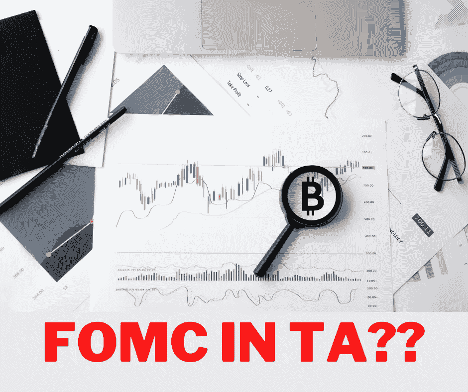

# 交易密码时，我应该考虑 FOMC 会议吗？

> 原文：<https://medium.com/coinmonks/should-i-consider-fomc-meetings-while-trading-cryptos-f4cbae9507fc?source=collection_archive---------33----------------------->

它们真的是重要的指标吗？

Designed by [Author](https://www.quora.com/profile/Sudarsan-Karki-SuperSudar)

当谈到交易密码时，并不缺少指标来使用。

从移动平均线到艾略特波浪分析，有很多指标是加密交易者每天使用的。

但是，它们都是技术分析指标。