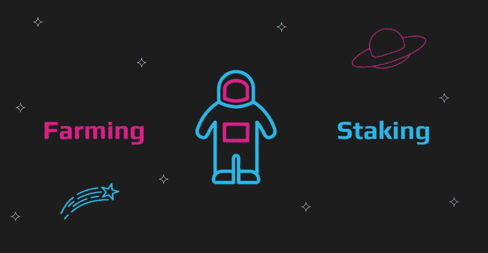

# 我应该耕种还是应该下注？可能都是？

> 原文：<https://medium.com/coinmonks/should-i-farm-or-should-i-stake-may-be-both-994a993b826f?source=collection_archive---------39----------------------->

随着过去几年加密货币的大规模扩张，赚取被动收入的协议成为人们关注的焦点。打桩和耕作是两种最流行的协议。赌博和农业的主要区别在于它在区块链上演的一幕。赌注是更简单的行为，将 X 种加密货币锁定 Y 段时间，以赚取奖励，如网络费用。另一方面，农业是一种更复杂的基于策略的方法，农民利用分散融资中的最佳流动性池来实现回报最大化。所以，秘密农业 vs 赌注？让我们来学习区别！

# 什么是加密赌注？

赌注是锁定加密货币一段确定或不确定的时间以获得奖励的行为。Staked 加密货币是当今许多大型区块链使用的典型的利益一致机制证明，并且是验证和保护网络上每个块的主干。

通常，赌注加密货币会被你选择的验证器锁定。你押的加密货币代表了验证者池的一定比例。如果你的下注金额相当于资金池的 7%，你将获得 7%的奖励。

赌注的回报基于网络费用，但每个平台可以根据其目标提供不同的收益和 APY。现在可以在中央交易所使用加密货币。

# 加密赌注是如何工作的？

加密货币赌注是复杂的[赌注证明](https://ethereum.org/en/developers/docs/consensus-mechanisms/pos/)机制的一部分，其中验证器是根据某些指标(如赌注)随机选择的，以验证即将到来的区块。然而，成为验证者通常需要在网络的本地令牌中预先有大量的流动性。

例如，以太坊验证者需要锁定 32 个以太坊才能成为验证者，费用超过 90，000 美元。由于这个原因，利害关系证明允许所有令牌持有者向他们选择的验证器贡献更少量的令牌，以使他们的令牌工作。

当您将代币提交给某个验证者时，您将根据您的贡献获得一定比例的奖励。然而，你也有责任面对他们的后果。*砍人事件*可以发生，以惩罚验证者的不良行为，比如过长的离线时间。削减事件可以*削减*一定比例的固定金额的赌注加密货币，适用于验证者以及你，委托者。

# 最佳赌注列表

并非所有令牌都是可堆叠的，因为许多大型网络(如比特币和以太坊)都运行在工作共识机制的证明上。以下是一些值得下注的最佳令牌:

**许多“赌注”协议现在只是对用户的锁定激励，可能不会有助于证明赌注机制，例如 stablecoins。*

*   [**$CRO**](https://swapzone.io/currencies/cronos) **穿越 Crypto.com**

通过他们的卡或 DeFi 平台股份持续提供 10-12%的回报。

*   [**USDC**](https://swapzone.io/currencies/usd-coin) **通过 Celsius 或 Nexo 借贷平台**

竞争利率高达 17%的 APY。

*   [**$DOT**](https://swapzone.io/currencies/polkadot) **上交易所或 Polkadot.js**

持续提供两位数的利率。

请记住:在集中交易所使用加密货币意味着你不能完全控制你的加密资产。在交易所下注通常意味着他们在其他地方使用你的资金，而直接在来源下注意味着它被用于股权证明机制。

# 什么是秘密农业？

秘密农业，也称为产量农业，是通过利用 dApps 在 DeFi 上投资资产来产生回报。种地和跑马圈地的区别就在于地点。只有在 DeFi 流动性池中，利用分散的交易所，才有可能进行产量农业。

耕作类似于赌注，因为密码被提供给流动性池，而回报将被授予。然而，收益农民在追求最高收益时往往更加积极，通过借贷协议，将一个池中的流动性用于另一个池中。要成为一个成功的高产农民，你必须有一个合理的策略，并注意不断变化的报酬率。

# 秘密农业是如何运作的？

产量农业通过使用智能合同发挥作用，这是 DeFi 生态系统的基础。农民将不断利用不同的借贷市场，在当时最好的池中获得最大收益。

收益农民将把他们的加密资产存入一个流动性池，该池为其用户运营一个分散的借贷和交易市场。当用户与市场互动时，他们支付费用，这些费用被传递给流动性提供者。在这种情况下，收益者会收到一封感谢你提供流动性的感谢信。

市场是*自动做市商，*DeFi 中流动性池的支柱，因此，收益农民。

奖励范围可以是提供给资金池的同一对代币、网络费或独特的代币，以及作为早期流动性提供者的区块链。对于需要流动性的后起之秀区块链的早期成功而言，高产农民往往是间接的关键。

# 最佳加密农业平台列表

与传统的打桩不同，高产农业需要不断更新的复杂策略，以适应周围的环境。所以，最好的*养殖平台*简直就是你最享受的去中心化交流。分散交易是收益农民将流动性注入不同农场的方式。

最好的加密养殖平台是具有最高流动性的 dex，例如:

*   [Uniswap](https://swapzone.io/currencies/uniswap)
*   
*   **[**SushiSwap**](https://swapzone.io/currencies/sushiswap)**

****

# **秘密农业与赌博**

**简单地说，秘密耕作与赌注应该被视为被动与主动。传统的赌注可能非常被动，让你的加密货币发挥作用，而不必接触它。另一方面，高产农业需要持续关注，以最大限度地提高产量。**

**产量农业可以为最好的战略家提供更高的回报，但是需要更多的前期资金和时间投入。与此同时，你可以下注非常少量的加密货币，零时间投资。**

**最后，赌注可以在一个集中的平台上完成，风险最小化。另一方面，你只能在分散的金融领域进行收益农场，那里充斥着退出骗局和聪明的合同漏洞利用。那些想从事高产农业的人必须了解其中的风险。**

****

# **在哪里可以以最优惠的利率获得最好的代币？**

**[Swapzone](https://swapzone.io/) 汇总所有交易所 600 多种加密货币资产的最佳汇率，为您带来最佳汇率。是时候在这里获得一些赌注硬币来被动赚取了！**

**在你做任何事情之前，导航到我们的网站[这里](https://swapzone.io/)。**

1.  **选择你的搭档。**
2.  **输入您愿意兑换的金额，然后等待右侧弹出的报价。提示:您可以使用底部的过滤器来过滤您希望使用的特定汇率或汇率。**
3.  **选择适合自己的优惠。请记住:您可以根据您要查找的内容，按速率、速度或评级进行过滤。**
4.  **一旦你有了想要接受的提议，点击 ***交换*。****
5.  **确认兑换后，请务必仔细输入您的详细信息。您需要提供:接收兑换的硬币或代币的钱包地址，以及您提供的硬币或代币的钱包地址，以防需要退款。**
6.  **确认信息无误后，点击 ***进行兑换*** *，*即可完成交易。**

> ***加入 Coinmonks* [*电报频道*](https://t.me/coincodecap) *和* [*Youtube 频道*](https://www.youtube.com/c/coinmonks/videos) *了解加密交易和投资***

# **另外，阅读**

*   **[Bookmap 点评](https://coincodecap.com/bookmap-review-2021-best-trading-software) | [美国 5 大最佳加密交易所](https://coincodecap.com/crypto-exchange-usa)**
*   **最佳加密[硬件钱包](/coinmonks/hardware-wallets-dfa1211730c6) | [Bitbns 评论](/coinmonks/bitbns-review-38256a07e161)**
*   **[新加坡十大最佳加密交易所](https://coincodecap.com/crypto-exchange-in-singapore) | [购买 AXS](https://coincodecap.com/buy-axs-token)**
*   **[红狗赌场评论](https://coincodecap.com/red-dog-casino-review) | [Swyftx 评论](https://coincodecap.com/swyftx-review) | [CoinGate 评论](https://coincodecap.com/coingate-review)**
*   **[投资印度的最佳密码](https://coincodecap.com/best-crypto-to-invest-in-india-in-2021)|[WazirX P2P](https://coincodecap.com/wazirx-p2p)|[Hi Dollar Review](https://coincodecap.com/hi-dollar-review)**
*   **[加拿大最佳加密交易机器人](https://coincodecap.com/5-best-crypto-trading-bots-in-canada) | [库币评论](https://coincodecap.com/kucoin-review)**