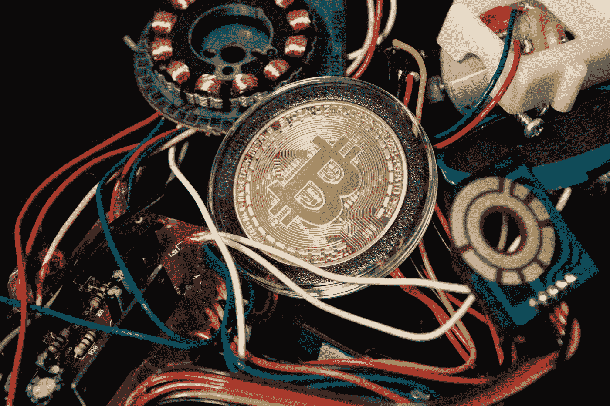

# 怎样才能降低比特币的能耗？

> 原文：<https://medium.com/coinmonks/should-the-bitcoin-protocol-be-modified-to-reduce-consumption-81f209db280c?source=collection_archive---------43----------------------->

Source photo Unsplash.com

是否有可能通过修改协议来最小化比特币的能源使用？这是因为有很多因素可能会影响它。事实上，衡量比特币的环境影响是不可能的。对这种技术的担忧被夸大了，是基于错误的假设和对其工作原理的误解。就比特币协议而言，你很可能是在…