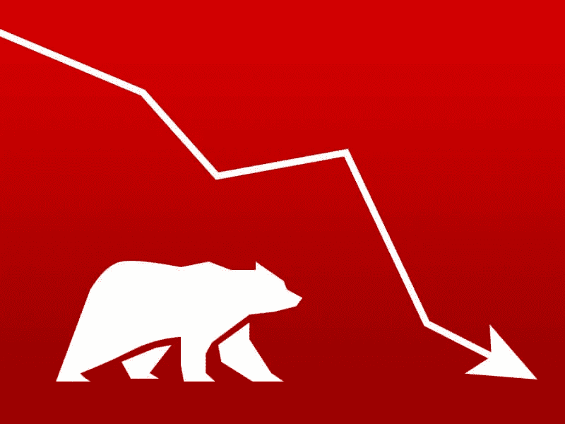

# 你现在应该投资加密空间吗？

> 原文：<https://medium.com/coinmonks/should-you-be-investing-in-crypto-space-right-now-81246bfc430a?source=collection_archive---------71----------------------->

# 秘密坠落

密码市场经历了艰难的一年。比特币的价格已经从 1 月份的 19000 美元跌至今天的 4000 美元左右。许多其他加密货币也纷纷效仿。

这是因为从韩国到中国，监管机构在全球范围内打击了加密交易所和 ico。此外，新法规正在美国生效，这将使投资者更难匿名交易加密货币。除此之外，脸书禁止在其平台上发布 ico 和加密货币广告，这意味着一些公司的广告被从全球最大的社交媒体平台上删除，削弱了它们的增长潜力。

尽管如此，加密货币仍处于起步阶段——这意味着如果你愿意用你的钱冒险，未来几年还有很大的增长空间。然而，今年的密码市场是多么的不稳定:

自去年 11 月达到最高点以来，比特币和以太坊已经下跌了约 57%。自 1 月份以来，Cardano 的市值已经损失了大约 75%，而作为加密生态系统中的一颗新星，Solana 的市值也下降了大约 80%。

Altcoins 和 Stablecoins 都受到这个坏消息的困扰，不仅仅是 LUNA。然而，如果你仍然怀疑是否应该投资比特币和其他加密货币，这里有一些关于为什么应该和不应该投资的辩论。

**加密的未来**

加密货币仍然具有高度的投机性，目前还不清楚它们是否会从这次衰退中反弹，或者它们是否会在未来出现。许多专家认为加密货币前景广阔，但过去的表现并不表明未来的结果。

所以，如果你要投资，明智的做法是承担适当的风险。

尽管一些专家认为加密货币具有长期可行性，但重要的是要记住它仍然具有高度的投机性和波动性。最近 LUNA 的崩溃很好地提醒了这一事实。

**你应该投资吗？**

你是否决定投资 crypto 取决于几件事，包括你的长期前景和财务状况。加密应该被视为一项长期投资，而不是一种快速致富的方式。然而，如果你相信一种特定加密货币的增长潜力，那么在价格较低的时候投资这种货币可能是值得的。

但如果你想快速赚钱，这项投资可能不适合你。如果你正在努力清理账单，或者还没有足够的应急基金，你可能想在投资前先关注这些优先事项。

**最后的想法**

最后，你的风险承受能力是个人的，所以花点时间想想你能承受多大的波动。即使着眼于长期，短期价格下跌仍会带来刺痛。如果你知道如果价格下跌 50%或更多，你会睡不好觉，加密货币不适合你。

加密货币可能是一项潜在有利可图的投资，但并不适合所有人。在市场周期的底部购买 crypto 是从低迷中获利的一种方式，但是理解这种投资的风险是很重要的。

> 加入 Coinmonks [电报频道](https://t.me/coincodecap)和 [Youtube 频道](https://www.youtube.com/c/coinmonks/videos)了解加密交易和投资

# 另外，阅读

*   [印度加密交易所](/coinmonks/bitcoin-exchange-in-india-7f1fe79715c9) | [比特币储蓄账户](/coinmonks/bitcoin-savings-account-e65b13f92451)
*   [OKEx vs KuCoin](https://coincodecap.com/okex-kucoin) | [摄氏替代品](https://coincodecap.com/celsius-alternatives) | [如何购买 VeChain](https://coincodecap.com/buy-vechain)
*   [币安期货交易](https://coincodecap.com/binance-futures-trading)|[3 comas vs Mudrex vs eToro](https://coincodecap.com/mudrex-3commas-etoro)
*   [如何购买 Monero](https://coincodecap.com/buy-monero) | [IDEX 评论](https://coincodecap.com/idex-review) | [BitKan 交易机器人](https://coincodecap.com/bitkan-trading-bot)
*   [CoinDCX 评论](/coinmonks/coindcx-review-8444db3621a2) | [加密保证金交易交易所](https://coincodecap.com/crypto-margin-trading-exchanges)
*   [红狗赌场评论](https://coincodecap.com/red-dog-casino-review) | [Swyftx 评论](https://coincodecap.com/swyftx-review) | [CoinGate 评论](https://coincodecap.com/coingate-review)