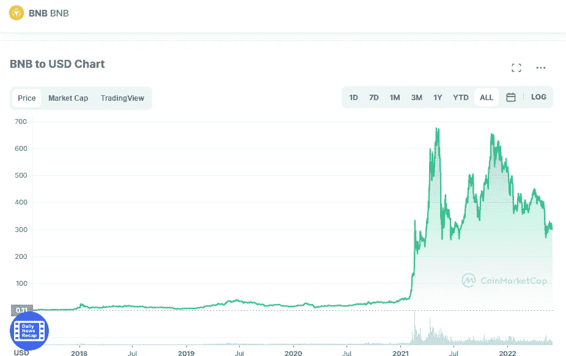

# 你应该在 2022 年 6 月买币安币(BNB)吗？

> 原文：<https://medium.com/coinmonks/should-you-buy-binance-coin-bnb-in-june-2022-b72abfb32234?source=collection_archive---------17----------------------->

Source photo [BNB price today, BNB to USD live, marketcap and chart | CoinMarketCap](https://coinmarketcap.com/currencies/bnb/)

币安硬币(BNB)是由世界上最大的加密货币交易所币安发行的加密货币。目前，CoinMarketCap 报告 24 小时交易量为 170 亿美元。与一家现实世界中的大公司的关系为币安硬币的工程师们提供了很多创新的余地。此外，代币的通缩结构将有助于其长期保值。