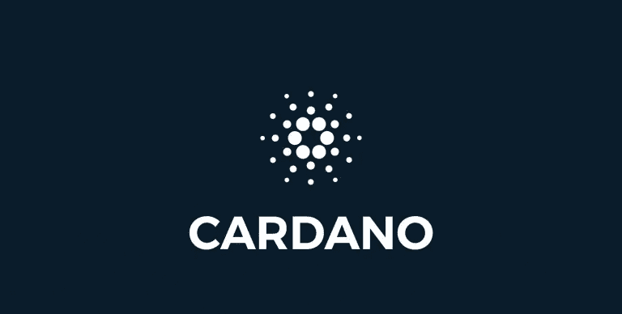

# 该不该买卡达诺(ADA)？

> 原文：<https://medium.com/coinmonks/should-you-buy-cardano-ada-ef984af46397?source=collection_archive---------35----------------------->

卡尔达诺现在是个好选择吗？今天我将总结一些事实，并在最后给出我的看法。

首先简单介绍一下卡尔达诺:

Cardano 是第 1 层区块链，这意味着它已经为要在其系统之上构建的其他应用程序构建了基础层。Cardano 于 2017 年推出，其明确的使命是成为领先的第 1 层，并在…