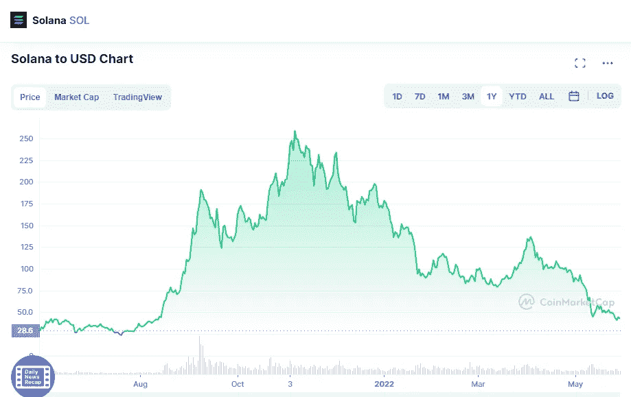

# 今天应该买索拉纳(SOL)和沙盒(SAND)吗？

> 原文：<https://medium.com/coinmonks/should-you-buy-solana-sol-and-the-sandbox-sand-today-fd6392b86cbe?source=collection_archive---------5----------------------->

# 茄属植物

Source photo [Solana price today, SOL to USD live, marketcap and chart | CoinMarketCap](https://coinmarketcap.com/currencies/solana/)

Solana 是一个技术平台，使智能合同能够相互交流。智能合约可以用于各种各样的事情，从 NFT 市场和 DeFi 到区块链游戏。

有了这个平台，构建分散式应用程序(DApps)变得前所未有的简单。可扩展性也是一个目标…