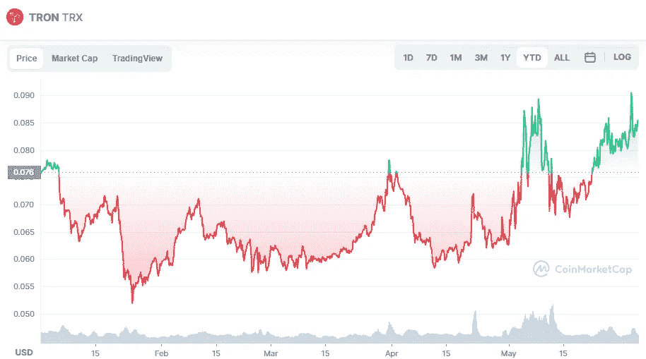

# 6 月份该不该买创(TRX)加密货币？

> 原文：<https://medium.com/coinmonks/should-you-buy-tron-trx-cryptocurrency-in-june-15c95bab4abf?source=collection_archive---------26----------------------->

Source photo [TRON price today, TRX to USD live, marketcap and chart | CoinMarketCap](https://coinmarketcap.com/currencies/tron/)

自 2017 年成立以来，Tron 一直是一个分散的区块链平台(dApps)。运行这些应用程序而不需要中央服务器或中介(如代理)是可能的。该平台又快又便宜，可能是更成熟的竞争对手的可行替代方案..

这使得 Tron 远远优于其他大型分散应用平台，如…