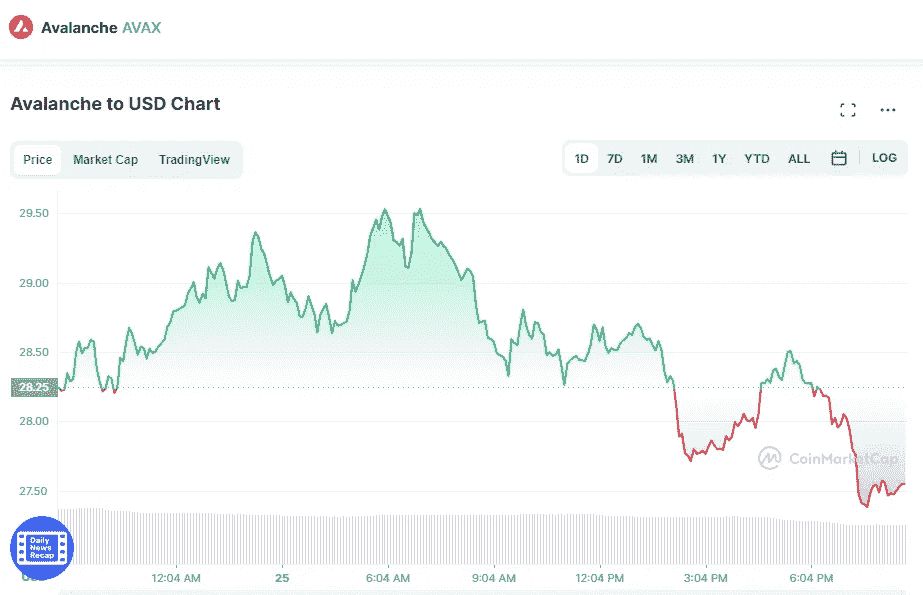

# 你现在应该投资 Avalanche 吗？

> 原文：<https://medium.com/coinmonks/should-you-invest-in-avalanche-avax-right-now-2fdb6ca5aaae?source=collection_archive---------22----------------------->

Source photo [Avalanche price today, AVAX to USD live, marketcap and chart | CoinMarketCap](https://coinmarketcap.com/currencies/avalanche/)

分散式应用(Dapps)和专用区块链网络都可以运行在第一层区块链 Avalanche 上。区块链的目标是在确保可伸缩性的同时，将事务处理量提高到每秒 4，500 次以上。

c 链和 P 链是 Avalanche 上三个链中的两个。Avalanche 的每个链都有独特的功能，不像比特币和…