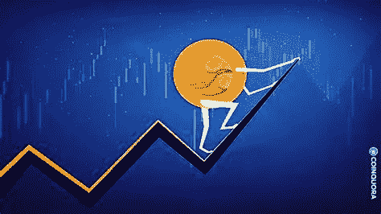

# 你应该投资 Terra Luna 2.0 吗？

> 原文：<https://medium.com/coinmonks/should-you-invest-in-luna-2-0-193eec6e79fc?source=collection_archive---------12----------------------->

Source photo [luna 2.0 — Bing images](https://www.bing.com/images/search?view=detailV2&ccid=rC5a7MC%2b&id=149E6DB699EEDE591ADFC455D76BA8E75FFB5D21&thid=OIF.peODDcSlGFV%2fzm2biqoH0w&mediaurl=https%3a%2f%2fcoinquora.com%2fwp-content%2fuploads%2f2022%2f06%2fLUNA-2.jpg&cdnurl=https%3a%2f%2fth.bing.com%2fth%2fid%2fR.ac2e5aecc0be0d8f0711c2ec6b0bf995%3frik%3d%26pid%3dImgRaw%26r%3d0&exph=411&expw=730&q=luna+2.0&simid=7027186906263&FORM=IRPRST&ck=A5E3830DC4A518557FCE6D9B8AAA07D3&selectedIndex=2&ajaxhist=0&ajaxserp=0)

# Luna 2.0 有什么新特性？

那么，露娜 2.0 到底是什么？月神 2.0 令牌是臭名昭著的月神币的后续，月神币是 Terra 第一个生态系统的组成部分。当一个“黑天鹅”事件在 2022 年 5 月发生在最初的 Terra 区块链时，Luna 2.0 成为了选择的象征。这个新的 Terra 网络完全独立于旧的 Terra 区块链，后者…