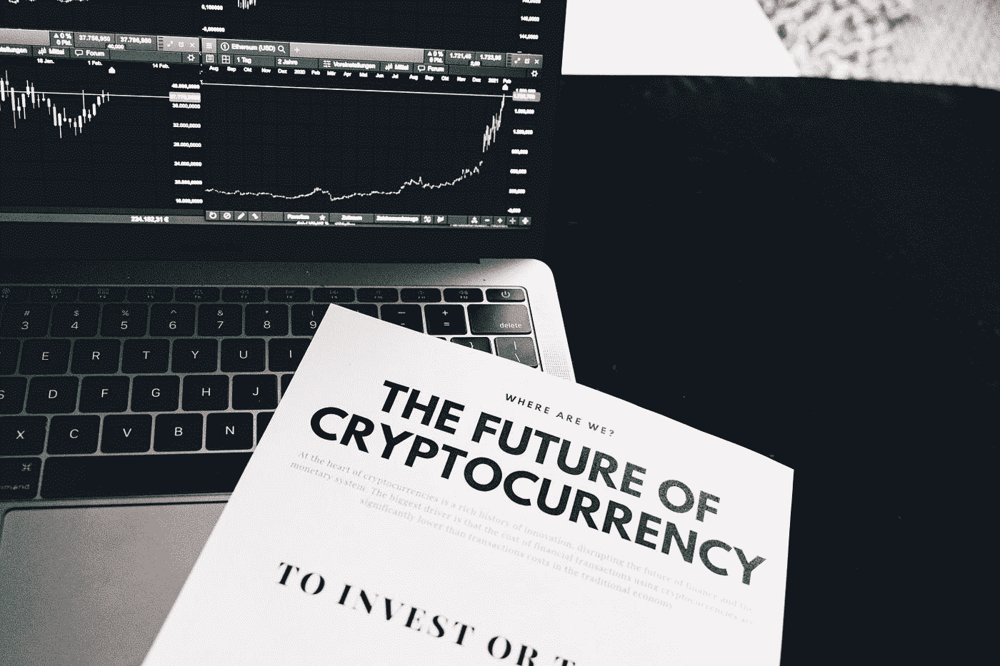

# 你应该把钱存在银行还是投资于加密？

> 原文：<https://medium.com/coinmonks/should-you-keep-your-money-in-the-bank-or-invest-in-crypto-ab885731c973?source=collection_archive---------14----------------------->

# 你应该把钱存在银行还是投资于加密？

你应该把钱存在银行还是投资于加密？

当谈到风险和回报时，把钱存在银行和投资加密货币是截然相反的。

银行储蓄账户有联邦存款保险公司的保险，价值稳定，而加密货币投资没有担保，也没有内在价值支持。

即使是通常被认为不稳定的股票市场，也是由要求每个季度白纸黑字报告实际收益的公司组成的。另一方面，加密货币是由希望、投机和谣言推动的。

然而，这并不是说用储蓄或密码投资是“坏”或“好”。相反，当你选择投资这些资产类别中的任何一个时，你应该意识到你得到了什么或者没有得到什么。

[立即开始在 Bitcoininvestmentrex 投资加密，从您的加密中赚取 30% — 50%的利润](https://bitcoininvestmentrex.com/)

**你的风险承受能力是多少？**

你的风险承受能力可以马上告诉你应该投资银行储蓄账户还是加密货币。如果你可以处理拥有一项可能在相对较短的时间内下跌 50%、75%甚至更多的投资，那么加密货币可能是你可以接受的风险。

另一方面，如果当你的投资下降了 5%时，你晚上都睡不着觉，那么你就应该把钱存在储蓄账户里。

有了储蓄账户，你确切地知道你会得到什么:一笔安全、有保险的、价值不会改变的银行投资。

另一方面，你只能获得最低限度的利息——如果你选择高收益的在线储蓄账户，利息约为 0.60%，如果你获得全国平均利率，利息低至 0.04%。

另一方面，加密货币确实是投资界的狂野西部。

为了有可能赚取像柴犬这样的代币的天文回报——在 2021 年达到惊人的 4900 万——你必须准备好失去你的全部投资。

加密货币不支付股息，也没有任何内在价值，所以你必须依靠你购买的加密技术的更广泛接受度——以及大量的投机性投资支持——来赚取高额回报。

**建筑财富**

[https://bitcoinvestmentrex . com/Cryptocurrency-investment-Company/](https://bitcoininvestmentrex.com/Cryptocurrency-investment-Company/)

你的投资目标是什么？

储蓄账户和加密货币是如此完全不同，以至于在它们之间进行选择可以简单地归结为你希望从投资中获得什么。

如果你想保住你的本金，如果你是一个老投资者，正在为短期目标存钱，或者只是非常厌恶风险，那么把钱存在银行可能是你最好的选择。

联邦存款保险公司保险的储蓄账户不会支付太多，但你不必担心失去你存的钱。

如果美联储像普遍预期的那样在 2022 年加息，那么储蓄收益率也会上升。

然而，如果你是一个投机投资者，愿意损失你的全部本金来换取潜在的巨大收益，那么加密货币可能更合你的胃口。

请记住，任何对加密货币的价格预测本质上都是投机性的猜测。

与分析师根据市盈率、增长率和管理技能等因素预测股价的股市不同，加密货币没有内在估值。

某些密码背后可能有更好的关于其潜在未来用途的故事，但这些故事是否会开花结果仍有待辩论。虽然每个人都梦想他们的投资组合有巨大的回报，但加密的收益——虽然可能很大——远非必然。

你有多元化的投资组合吗？

将投资组合中的投机部分分配给 crypto 是一回事，但如果你打算把所有的钱都放在那里，你就是在自寻死路。

每个投资者都应该从安全的银行投资开始，比如持有应急基金的高收益储蓄账户，然后再将更激进的选项加入他们的投资组合。

如果你确实有一个多元化的投资组合，充满了许多不相关的资产，增加 5%的加密货币权重可能是一个增加回报的机会。

但是，在你开始进一步探索风险/回报范围之前，你应该建立一个安全投资的基础。

你是加密货币初学者，并寻求分散你的投资组合，我们建议投资一个[可信的加密货币投资公司](https://bitcoininvestmentrex.com/)。

你应该坚持黄金原则，将最多 15%的投资组合分配给加密货币，并且只坚持主流的、有内在价值的加密项目。

> 加入 Coinmonks [电报频道](https://t.me/coincodecap)和 [Youtube 频道](https://www.youtube.com/c/coinmonks/videos)了解加密交易和投资

# 另外，阅读

*   [新加坡十大最佳加密交易所](https://coincodecap.com/crypto-exchange-in-singapore) | [购买 AXS](https://coincodecap.com/buy-axs-token)
*   [投资印度的最佳加密软件](https://coincodecap.com/best-crypto-to-invest-in-india-in-2021) | [WazirX P2P](https://coincodecap.com/wazirx-p2p)
*   [7 大最佳零费用密码交易平台](https://coincodecap.com/zero-fee-crypto-exchanges)
*   [最佳网上赌场](https://coincodecap.com/best-online-casinos) | [期货交易机器人](/coinmonks/futures-trading-bots-5a282ccee3f5)
*   [分散交易所](https://coincodecap.com/what-are-decentralized-exchanges) | [比特 FIP](https://coincodecap.com/bitbns-fip) | [宾邦评论](https://coincodecap.com/bingbon-review)
*   [用信用卡购买密码的 10 个最佳地点](https://coincodecap.com/buy-crypto-with-credit-card)
*   [加拿大最佳加密交易机器人](https://coincodecap.com/5-best-crypto-trading-bots-in-canada) | [比特 vs 币安](https://coincodecap.com/bybit-binance-moonxbt)
*   [阿联酋 5 大最佳加密交易所](https://coincodecap.com/best-crypto-exchanges-in-uae) | [SimpleSwap 评论](https://coincodecap.com/simpleswap-review)