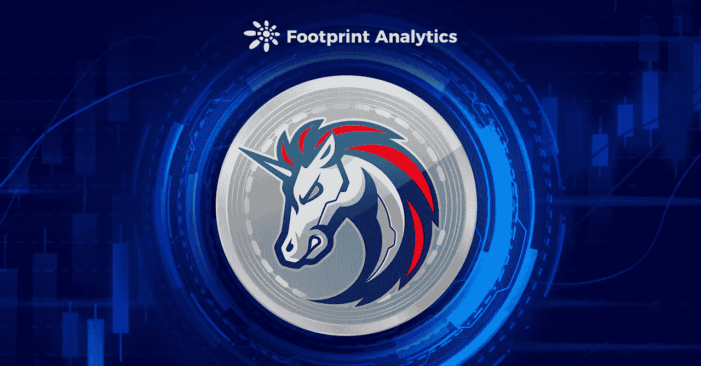
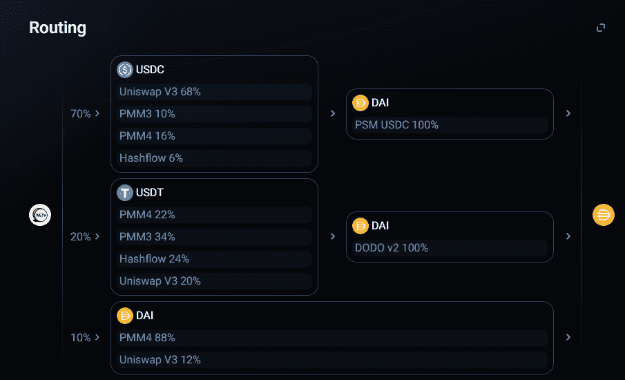
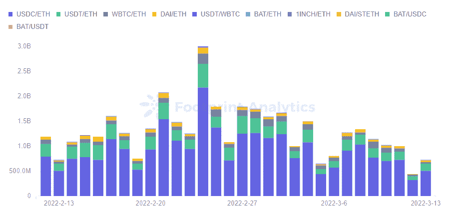
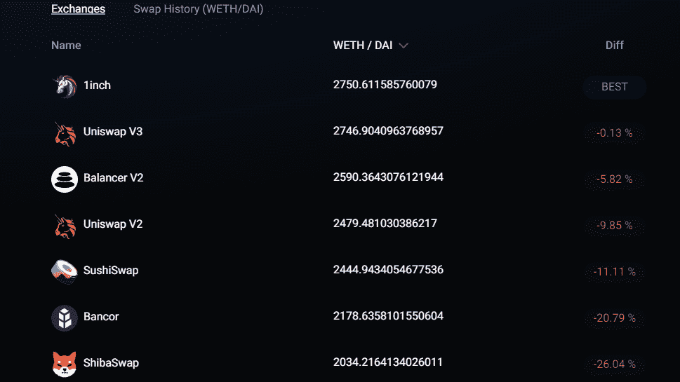
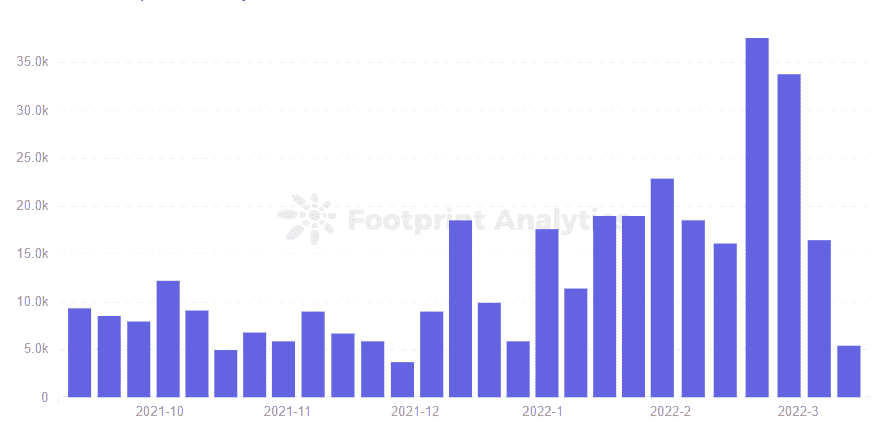
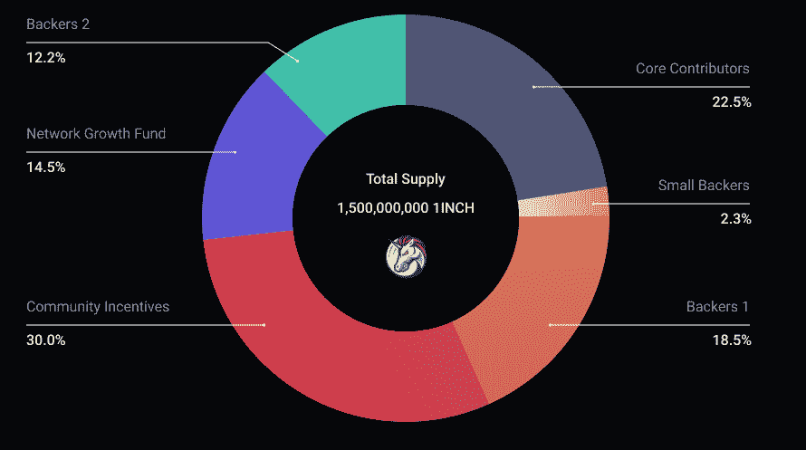
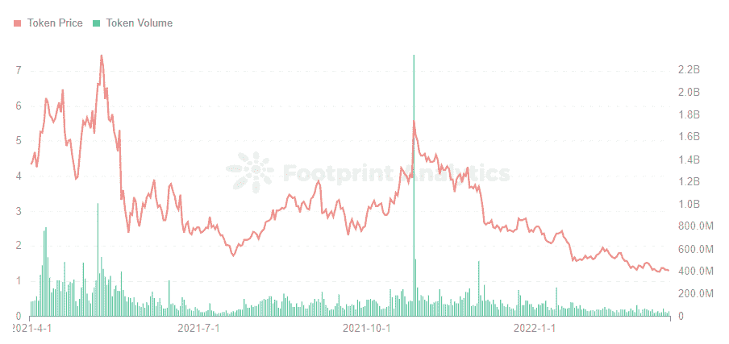

# 您应该使用 Aggregator 1inch 还是 DEX？

> 原文：<https://medium.com/coinmonks/should-you-use-aggregator-1inch-or-a-dex-68353c50a302?source=collection_archive---------33----------------------->

1inch 号称是流动性最强、滑动率最低、最好的汇率聚合器。

2022 年 3 月

数据来源:[足迹分析 1 英寸仪表盘](https://www.footprint.network/guest/dashboard/1-inch-dashboard-fp-634e2c78-2b71-41e7-a433-4a815095b5ab?days=past3months~&name=1inch-network&channel=ENG-219#secret=627FE9862E05D0D52F9EEB3C120AFFDA)

距离最近一次融资仅一年多， [1inch](https://www.footprint.network/guest/dashboard/1-inch-dashboard-fp-634e2c78-2b71-41e7-a433-4a815095b5ab?days=past3months~&name=1inch-network&channel=ENG-219#secret=627FE9862E05D0D52F9EEB3C120AFFDA) 在 2021 年 12 月筹集了 B 轮[融资](https://www.footprint.network/guest/dashboard/follow-financing-project-fp-3aff6ad6-7cd3-4bf8-9923-a99ad34682a2?channel=ENG-219#secret=AAE7A5CA5895901858EF02F0D8C90EEC)，由 Amber Group 牵头，总额为 1.75 亿美元。

1inch 作为一个 [DEX](https://www.footprint.network/guest/dashboard/dex-analysis-dashboard-fp-27cb8708-0a33-42f2-97f4-2e5903c114c2?date=past60days&name=curve&symbol=crv&token_address=0xd533a949740bb3306d119cc777fa900ba034cd52&channel=ENG-219#secret=1D628641BEE243DC98140AB0D45EA7B4) 聚合器看起来有点像[earning](https://www.footprint.network/guest/dashboard/yearn-dashboard-fp-62851bde-cc52-44a9-ae5b-5888dac32aea?days=past3months~&name=yearn-finance&date=2021-12-17&channel=ENG-219#secret=8B60B5CEC21D3A6938102538FD8A373F)。虽然 earning 聚合了主要的贷款协议来帮助用户获得有竞争力的利率，但 1inch 聚合了 DEX 协议来为用户提供最佳互换。

区块链世界不缺乏创新，乐高的属性不断堆积。本文将使用来自[足迹分析](https://www.footprint.network/?channel=ENG-219)的数据来探究是什么让 1inch 独一无二。

# 什么是 1 英寸？

1inch 主要由一个 DEX 聚合器和一个流动性协议(以前的 Mooniswap。)作为 DEX 聚合器，1inch 使用 Pathfinder 作为路由算法，旨在为用户寻找最优的交换路径。

Pathfinder 会比较不同的 DEX 平台来选择最佳的汇率，可能会将订单拆分到不同的平台进行互换，甚至多次将存放的令牌转换为目标令牌。这为用户节省了在索引之间进行比较的工作。

*Source — 1inch*

1inch 号称是流动性最强、滑点最低、汇率最优的 DeFi 聚合商，目前支持以太坊、BSC、Polygon、Avalanche、Gnosis、乐观、Arbitrum 等 7 家连锁。

1 英寸流动性协议没有那么出色，在 TVL 只有 2200 万美元，最大的资金池中的流动性不到 800 万美元。交易量最大的货币对也集中在 stablecoins、ETH 和 BTC。

*Footprint Analytics — 1inch Top 10 DEX pair by Volume*

1 英寸的差异

除了常见的 DEX 功能，1inch 还具有更多高级功能。

1.互换

由于不同 DEX 平台之间的价格差异，与直接进入单一主流 DEX 平台相比，用户通过 1inch 可能会节省 0.13%至 20%。

*Source — 1inch*

对于需要大额互换的用户，效果会更明显，因为单个平台的互换很可能滑点很高。在短时间内在不同协议之间分割 1 英寸可以最大限度地减少滑动。

用户甚至可以使用 Aave 和 Compound 之类的令牌抵押品，一步完成用户必须完成的复杂打包和解包过程。这节省了时间和汽油费用。

2.限时限价单

加密市场是 24/7 开放的，但是用户不能 24 小时等待最好的价格。1inch 的限价单允许用户在设定的时间内以设定的价格进行交易，并在市场价格符合条件时完成交易。

设定具体价格就像止损单。用户将价格设置为低于市场价格的金额，当价格低于市场价格时，订单被执行。

3.军官训练团

用户可以选择在 1 英寸进行场外交易。因为价格是预先确定的，所以不会有任何滑动。用户可以在交易前澄清价格并收到准确的金额。

4.气符气

1inch 开发了 CHI token，这是一种气体令牌，允许用户在价格低时铸造和储存，在价格高时使用，从而帮助用户节省交易费用。这有点像买了打折券，用的时候烧掉，最多能为你节省 42%的油费。

然而，由于以太坊伦敦升级导致 CHI 令牌失效，1inch 已于去年 9 月开始发放 100 万 1inch 折扣汽油费。

5.对等网络

如果能找到合适的交易对手，用户可以自定义两种货币的价格。用户只需要填写对方的地址，设置交易的时间，就可以解决两个人之间的一次安全交易。

# 用户应该了解 1inch 的哪些内容？

使用 1 英寸进行交易时，需要记住几件事情。

1.拆分导致高额燃气费

由于 1inch 为了找到最低的价格，将交易拆分为多个交易，因此不可避免地要增加气费。用户在计算收到的金额时需要将燃气费考虑在内，这对于交易量小的用户来说可能不太友好。

来自 [Footprint Analytics](https://www.footprint.network/?channel=ENG-219) 的数据还显示，最近平均交易金额呈上升趋势，越来越多的用户青睐 1 英寸的大额交易。

*Footprint Analytics — 1inch Volume per Trade by Week*

1inch 帮助用户估算燃气费用，用户还可以选择最低的燃气选项，以减少交易被过多拆分。

2.互换盈余

因为价格会在报价时间和交易挖掘时间之间波动，所以当实际价格低于报价时，1inch 不会向用户退还他们多支付的金额。这导致用户支付了比他们本想在 1 英寸内获得更好价格的价格更多的钱。

1inch 已经承认了互换盈余，并宣布将一部分盈余发送给推荐计划，一部分发送给 1inch Network DAO Treasury。

**令牌**

1inch 于 2020 年 12 月发行了令牌$1INCH，持有该令牌的用户可以在 DAO 下对协议的池治理和工厂治理的各种设置进行投票。下注 1 美元的用户也将获得掉期盈余。

在 15 亿美元的发行总额中，6%将在发行日解锁，其余部分将在 4 年内解锁，直到 2024 年 12 月 30 日。值得注意的是，10 亿美元中只有 30%将分配给社区，14.5%将分配给网络发展基金，其余部分将分配给支持者和核心贡献者。

*Source — 1inch*

顶级 DEX 平台通常将超过 50%的令牌分配给社区，例如 60%的$UNI 和 65%的$BAL。相比之下，1INCH 似乎就没那么分散了。

随着后期核心人员比例逐渐释放，有人担心更高比例的程序所有者会控制价格，因此用户应谨慎考虑购买 1INCH。如[足迹分析](https://www.footprint.network/?channel=ENG-219)所示，1 美元并不算高，最高约为 7 美元，截至 3 月 9 日为 1.37 美元。

*Footprint Analytics — Token Price and Trading Volume*

摘要

在众多 dex 中，1inch 为用户提供了更高效的解决方案。1inch 试图帮助用户节省更多的钱，但拆分太多有时会适得其反。

随着第 2 层项目的发展，DEX 聚合器可以通过降低天然气费用的价格而受益。当用户不再为高昂的汽油费烦恼时，他们会更喜欢提供更多好处的分割交换方法。

同时，在看到 1inch 优秀的获取融资能力的同时，进行交易的用户也不要忘记滑点，尤其是正滑点。对于关心去中心化的人来说，不要忘记关注令牌分发。

这篇文章由[足迹分析](https://www.footprint.network/)社区提供。

Footprint 社区是一个世界各地的数据和加密爱好者相互帮助了解和获得关于 Web3、元宇宙、DeFi、GameFi 或区块链新兴世界任何其他领域的见解的地方。在这里，你会发现活跃的、不同的声音相互支持，推动着社区向前发展。

> 加入 Coinmonks [电报频道](https://t.me/coincodecap)和 [Youtube 频道](https://www.youtube.com/c/coinmonks/videos)了解加密交易和投资

# 另外，阅读

*   [Blockfi vs 比特币基地](https://coincodecap.com/blockfi-vs-coinbase) | [BitKan 点评](https://coincodecap.com/bitkan-review) | [Bexplus 点评](https://coincodecap.com/bexplus-review)
*   [南非的加密交易所](https://coincodecap.com/crypto-exchanges-in-south-africa) | [BitMEX 加密信号](https://coincodecap.com/bitmex-crypto-signals)
*   [MoonXBT 副本交易](https://coincodecap.com/moonxbt-copy-trading) | [阿联酋的加密钱包](https://coincodecap.com/crypto-wallets-in-uae)
*   [雷米塔诺评论](https://coincodecap.com/remitano-review)|[1 英寸协议指南](https://coincodecap.com/1inch)
*   [iTop VPN 审查](https://coincodecap.com/itop-vpn-review) | [曼陀罗交易所审查](https://coincodecap.com/mandala-exchange-review)