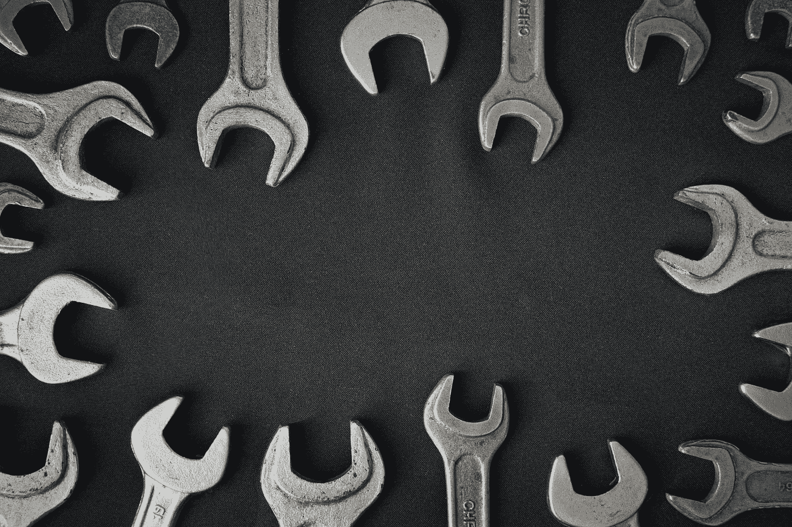
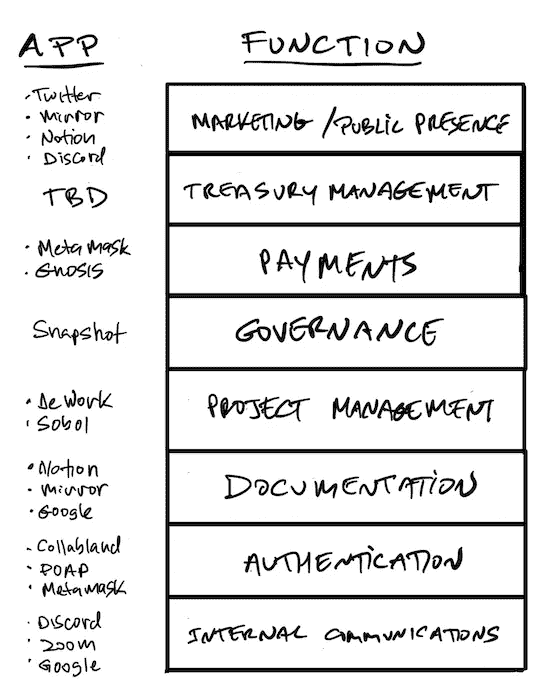
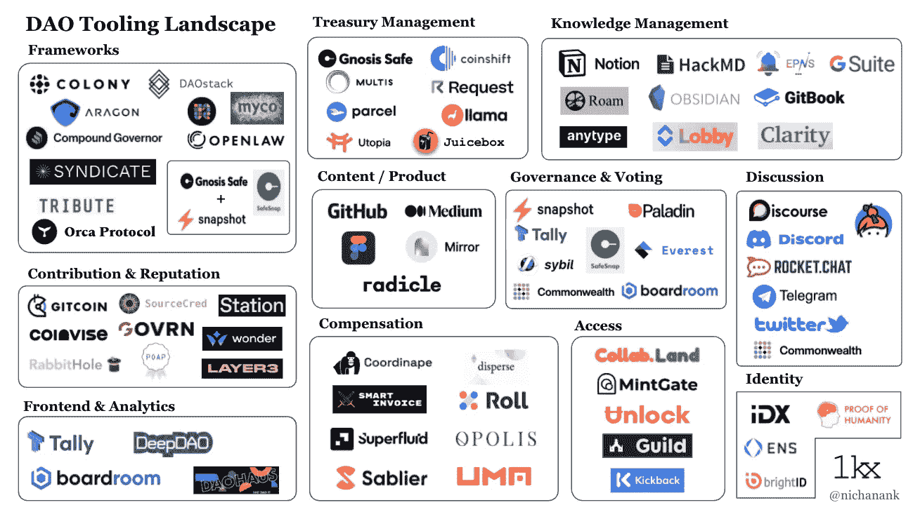

# 关于 DAO 工具的未来:你的 DAO 需要 IT 部门吗？

> 原文：<https://medium.com/coinmonks/should-your-dao-have-an-it-department-cd5eab2dc885?source=collection_archive---------17----------------------->

# **IT 部门？你说真的吗？**

看完这篇文章的标题，你可能在想，“什么一分钟。我认为 Dao 应该消除公司官僚主义。他们为什么需要 IT 部门？”

好吧，我来解释一下。我是[卡拉梅拉道](https://karameladao.com/)的创始成员。像大多数 Dao 一样，我们是一个 100%虚拟的全球组织，我们在运营的每个方面都依赖于软件。查看我们的软件堆栈，您会发现它相当复杂:

这是 19 个应用程序，不包括资金管理(我们还没有实现)。这个问题并不局限于卡拉梅拉。所有 Dao 都面临着同样的碎片化问题，面临着似乎无穷无尽的选择:

[Nichanan Kesonpat](/@nichanank?source=post_page-----f3c30bf8f08c-----------------------------------)

因为我们还处于 DAOs 生命周期的早期，这种情况一直在变化。新工具每周都会推出，而其他工具则会转向或消失。

# **为什么这很重要**

现在，对于像我们这样的 Dao 来说，这里有一个挑战:不管这些工具中的每一个在孤立的情况下多么有用，如果它们没有被仔细管理，就会导致几个问题:

*   入职摩擦——有这么多工具，hew 成员必须了解每个工具的存在、用途以及工作原理。
*   碎片化——成员必须记住哪个工具用于哪个目的以及如何使用它。
*   冗余——如果不仔细选择，工具可能会有重叠的功能，导致更多的混乱。
*   工具质量——因为市场还处于起步阶段，许多工具都处于测试阶段，有缺陷，或者缺少关键特性。
*   新工具的出现——随着新的更好的工具不断推出，我们很容易错过优化堆栈的机会。

# 解决方案

那么我们如何解决这个问题呢？是的，通过创建一个 IT 部门！或者更具体地说，指派一个人担任 IT 主管的角色。类似于企业 IT 总监，他们将负责:

*   评估当前工具集
*   建议对我们的堆栈进行更改
*   确保正确配置工具之间的集成
*   在新工具上市时对其进行评估
*   采购和管理模具预算
*   为每个工具分配管理员
*   创建和维护文档，以便成员知道哪些工具可用以及如何访问它们

这需要多长时间？我们不知道。我们是年轻的道，大家都是兼职。最初，这可能是一个沉重的负担，但随着我们的堆栈得到优化和稳定，它应该会变得更耗时。

# 未来会怎样？

那么，我们该何去何从呢？DAO 工具总是需要这么多的监督吗？不幸的是，我认为这将是未来几年的情况，直到生态系统成熟。从短期来看，我认为当前创新点解决方案的爆炸式增长将持续下去。从长远来看，这里有一些预测:

*   合并将会发生。工具会更少，但更好。
*   一组“标准”的堆栈将会出现，包括那些能够很好地协同工作的工具。
*   工具之间的集成将变得更容易配置，也更可靠。
*   集成平台将会出现，整合多层堆栈。把这些当做 DAOs 的 Salesforce 或者 SAP。这些大企业甚至可能进入市场。

你在你的刀里看到了什么？你是如何应对这些挑战的？你认为未来会怎样？