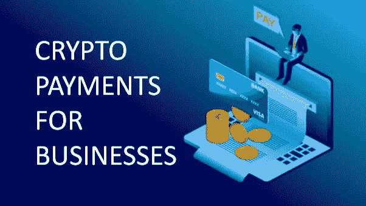

# 你的小企业和大企业应该接受加密货币吗？

> 原文：<https://medium.com/coinmonks/should-your-small-business-and-large-enterprise-accept-cryptocurrency-61377215ad98?source=collection_archive---------62----------------------->

Should Your Small Business and Large Enterprise Accept Cryptocurrency

加密货币是 [**数字货币**](https://www.elitecash.blog/post/cryptography-history-of-accounting-systems-the-rise-of-virtual-currencies) 的一种形式，其中使用加密技术来监管货币单位的生成并验证资金转移，独立于中央银行运行。

数字货币系统于 2008 年 10 月 31 日在*由*中本聪的****工作证明*** “共识”创建。用例包括实体和虚拟市场上的商品和服务支付。*

加密货币可以用作 [**投资**](https://www.elitecash.blog/post/24-golden-rules-for-long-term-investment-in-cryptocurrencies) 工具，使投资组合多样化，或者作为相对于法定货币具有高波动性的经济价值储存手段。

加密货币的价值相对于法定货币波动，但比股票、大宗商品和主权货币的波动性更高。

然而，随着时间的推移，当骗局项目被过滤掉，真正的加密公司提供了一个易于采用的生态系统时，波动性将逐渐降低。

此外，加密货币受到区块链的保护，这是一种 [**分散式分类账**](https://www.elitecash.blog/post/triple-entry-accounting-in-crypto) ，可用于以可验证和永久的方式高效记录双方之间的交易。

它独立于任何中央机构、政府或银行。

接受加密货币的公司通常更乐观，因为他们没有高额的交易费。

此外，它们提供比传统支付方式更快的交易。接受加密货币的小企业可以降低隐私、安全和透明的风险，因为银行不需要将购买的加密货币兑换成另一种货币。

# 精英现金支付处理器将如何工作？

[***精英现金***](https://elitecash.io/) 支付处理器为接受 ELC(精英现金)代币的商户处理支付。

这个支付处理器可以被任何想要从任何人那里接收 ELC 而不需要像银行或信用卡公司这样的中介的人或企业使用。

他们可以将 ELC 金额转换成他们喜欢的加密货币或法定货币。

# 精英现金会对汇款行业产生怎样的影响？

精英现金是将资金从一个国家转移到另一个国家或从一个人转移到另一个人的更便宜的方式。随着区块链技术和分散化，加密业务支付变得更加容易。

随着 [***加密业务支付***](https://www.elitecash.blog/post/crypto-payment-solutions-with-elc) 随着时间的推移而增长，高效处理它们也面临着挑战。对于需要进行国际支付的公司来说，加密业务支付的挑战尤其严峻。

区块链技术和去中心化正在帮助企业节省资金，获得更快的结算，以去中心化的方式处理交易等等。

> 加入 Coinmonks [电报频道](https://t.me/coincodecap)和 [Youtube 频道](https://www.youtube.com/c/coinmonks/videos)了解加密交易和投资

# 另外，阅读

*   [如何在 FTX 交易所交易期货](https://coincodecap.com/ftx-futures-trading) | [OKEx vs 币安](https://coincodecap.com/okex-vs-binance)
*   [OKEx vs KuCoin](https://coincodecap.com/okex-kucoin) | [摄氏替代品](https://coincodecap.com/celsius-alternatives) | [如何购买 VeChain](https://coincodecap.com/buy-vechain)
*   [ProfitFarmers 点评](https://coincodecap.com/profitfarmers-review) | [如何使用 Cornix 交易机器人](https://coincodecap.com/cornix-trading-bot)
*   [如何匿名购买比特币](https://coincodecap.com/buy-bitcoin-anonymously) | [比特币现金钱包](https://coincodecap.com/bitcoin-cash-wallets)
*   [瓦济里克斯 NFT 评论](https://coincodecap.com/wazirx-nft-review)|[Bitsgap vs Pionex](https://coincodecap.com/bitsgap-vs-pionex)|[坦吉姆评论](https://coincodecap.com/tangem-wallet-review)